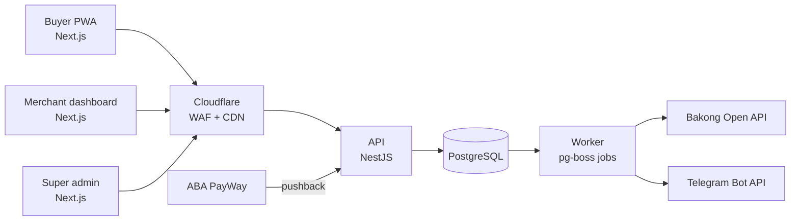
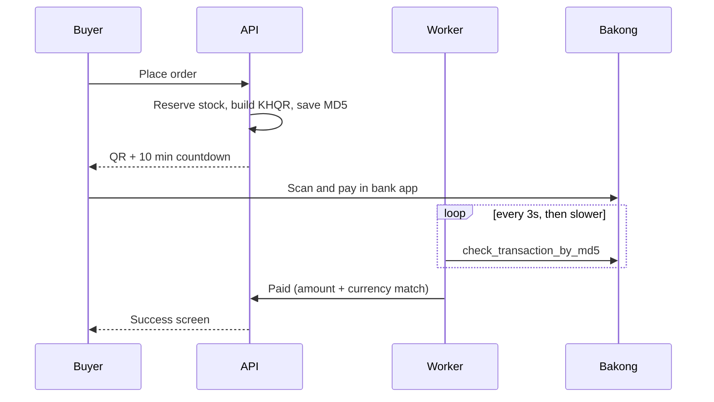
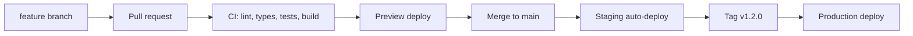
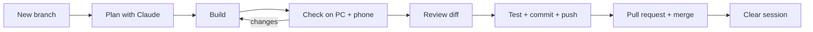

# Khmio — Project Blueprint

As of 2026-10-01 · the one document for the whole project, from the first idea to running the live platform

## How to read this blueprint

New to the project? Start with `docs/handbook.md`: it maps every document, the whole journey and how to work day to day, and points back here for the details.

This is the only plan document. Everything about the project — why it exists, how each workflow runs, how it is built, the order it is built in, and how it is run after launch — lives here. `CLAUDE.md` holds the short rules for every coding session and points back to sections of this file; `design/screens.md` holds the text spec of each screen. When a decision changes, change it here first.

The document follows the project from start to end:

| Part | Sections | Answers |
| --- | --- | --- |
| 1. Why | Overview, Market and how we win | What problem, for whom, and why sellers will choose us |
| 2. What | Subscription tiers, Workflows from start to end | What the platform does, step by step, for sellers, buyers and the admin |
| 3. How it's built | System architecture, Tech stack, UX/UI principles, User-friendly data input, Payments, Database schema, Security | The technical design every step follows |
| 4. Where it runs | Deployment, Budget | Hosting, environments, costs |
| 5. In what order | Roadmap: zero to live | Gates and steps, each with a "Done when" check and its status |
| 6. After launch | Running the platform after launch | The routine, support, incidents, numbers to watch, and what "finished" means |
| 7. How we work | Working with Claude Code, Build guide, Launch checklist | The daily method, tools and final checks |

### Where we are now

Updated at the end of every roadmap step.

| Stage | Status |
| --- | --- |
| Mockups of every screen (design/screens.md) | Done — approved, kept at `/mockup` as the reference |
| Gate G1. Save the work | Done — one branch per step, merged to `main` when its checks pass |
| Gate G2. Sellers try the mockups | Test sheet ready (`design/seller-test.md`); results not yet recorded here |
| Gate G3. Bakong from the real host | Open — must pass before step 5 (KHQR) |
| Step 1. Foundations | Done — CI runs lint, typecheck, tests, build and a built-API health check. Staging and preview links move to step 8, when hosting is bought |
| Step 2. Data and login | Done — schema, row-level security with two database users, Telegram login, 2-question onboarding |
| Step 3. Catalog | Done — products with options and photos, shop details, setup checklist, read-only shop page |
| Step 4. Shop and checkout | Done — delivery and store settings, cart, one-page checkout, cash orders priced by the API, buyer order page, seller order list (read-only) |
| Step 5. KHQR | **Postponed** — no Bakong Open API token yet. Built as soon as there is one and gate G3 passes. Decided 2026-10-02: the beta may go live with cash on delivery only, and KHQR is switched on when it's ready (its launch-checklist items then apply) |
| Step 6. Orders and Telegram | Done — order actions (confirm → pack → send by driver, bus or pickup → delivered → cash collected; failed, rebook, cancel), the buyer cancels while allowed and their page refreshes itself, Telegram alerts through an outbox with a Confirm button. Telegram runs in dry run until a bot token is set: send one real alert then |
| Step 7. Admin, the minimum | Done — admin login with Telegram + authenticator code (2FA, backup codes, lockout), roles enforced by the API, overview, merchants with extend/unblock and change plan, audit log, platform settings, admin alerts to Telegram. First owner by `pnpm admin:add-owner` |
| **Now: Step 8. Security and go live** | In progress, done in parts so that buying hosting is the last step. B1 security hardening done: rate limits (PostgreSQL counters), Turnstile on checkout, security headers on API and web, production start-up checks, order tokens kept out of logs, Telegram login in redirect mode (no eval under the CSP). B2 photo storage done: one S3 adapter for Cloudflare R2 (production, required there) and a local SeaweedFS (`pnpm s3:up`; MinIO no longer ships Windows downloads), `pnpm files:setup`, `files:check`, `files:copy-to-s3`. B3 done: nightly backup (worker, 03:00 Phnom Penh, pg_dump into a private bucket, kept 14 days, the newest 3 always; failures alert the admins), `pnpm db:backup` and `pnpm db:restore` (into a new database only; rehearsed: the restored copy ran the API with the same rows, row-level security and migrations), Dockerfiles for the API and worker (`infra/docker`, built and run by CI), `railway.json` for both (migrations before each API release, health check, worker never overlaps itself), `apps/web/vercel.json`, and Kantumruy Pro bundled with the web app. B4a done (from the 2026-10-02 structure review): web functions in Singapore (`sin1`), photo thumbnails (~400 px, made in the browser) for the shop grid, cart and product list, the end-to-end checks moved into the repo (`pnpm test:e2e`, run by CI with a stand-in for Telegram), Dependabot; photo upload fixed under the CSP. Next: B4b production rehearsal and `docs/go-live.md` |

## Overview

Khmio lets a Telegram or Facebook seller open a mobile shop in under 10 minutes, get paid by KHQR or ABA PayWay, and manage every order from Telegram. Money goes straight to the merchant's own account; the platform earns from subscriptions.

**Brand.** Sellers and buyers know the platform as **Khmio** (`khmio.com`); this store is its first product, **Khmio Shop**. Khmio is also the project's name in the code (`@khmio/*` packages) since 2026-10-06; it was "Khmer Micro-Store" before, and the database names and users still say `khmer_micro_store` on purpose (old migrations are never edited). Brand details and the names to reserve: `docs/platform-launch-plan.md`, Stage 1.

**Problem.** Small sellers take orders in chat, check payment screenshots by hand, and copy addresses to drivers one by one. This wastes hours and invites fake-payment fraud.

**Users.**

| User | Main job | Device |
| --- | --- | --- |
| Buyer | Browse, order, pay in under 1 minute | Phone, inside Telegram/Facebook browser |
| Merchant (owner) | Add products, see paid orders, dispatch | Phone first, laptop sometimes |
| Merchant staff | Pack and dispatch orders | Phone |
| Super admin (you) | Approve merchants, watch payments and health | Laptop |

**MVP goals.**

1. A buyer can pay by KHQR and the order is marked paid automatically, with no screenshot.
2. The merchant gets a Telegram alert within 10 seconds of payment.
3. 5–10 real Phnom Penh merchants use it for two weeks during beta.

**Not in the MVP:** native iOS/Android apps, delivery-company APIs, marketplace search across stores, loyalty points.

## Market and how we win

Vendra and Angkoro already sell the same core — a shop link, KHQR, cash on delivery and an order dashboard — for $10–15 a month. Matching them is the entry ticket, not a reason to switch. We win by owning the step after payment, **delivery**, and by **proving payment** without screenshots.

- **Match** their core at launch, with no product limit on paid plans and a lower entry price.
- **Beat** them on delivery (send an order to a driver, bus or pickup from the order itself) and on payment proof (the system confirms every KHQR payment with Bakong).
- **Remove switching pain:** we import their catalog, set the shop up for free, and run alongside their old shop while they test.
- **Keep them** with things that grow in value: the customer list, repeat-buyer tools and sales history.

In one line to sellers: *"Same price or less, Khmer first, and we confirm every payment and help send every order."*

### Competitors

Taken from their own feature and pricing pages on 2026-09-30. "Not described" means their pages don't mention it, not that it is proven missing.

| | [Vendra](https://www.vendra.app/features) | [Angkoro](https://angkoro.com/features) | [KHQRPay](https://khqr.cc/) | Marketplaces (Khmer Mart, Niront) |
| --- | --- | --- | --- | --- |
| Shop | One link, Telegram mini app | Telegram mini app, subdomain or own domain | None | A page inside the marketplace |
| Payments | KHQR, ABA PayWay, cards, COD | KHQR, ABA Pay, Wing, Pi Pay, COD | KHQR + ABA Pay, checked with Bakong | Khmer Mart none; Niront KHQR, Wing, COD |
| Orders | Dashboard, statuses | Dashboard, statuses, notifications | A Telegram alert per payment | Basic |
| Delivery | Delivery or pickup at checkout | Zones and fees, "coordinate with partners" | None | Khmer Mart none |
| Catalog | Unlimited, variants, Google Sheets sync | Variants, bulk import; 400 / 1,000 / unlimited by plan | None | Listings |
| Stock, team, reports | Roles; others not described | Stock alerts, roles, analytics | Merchant slots | None |
| Language | Mostly English | Khmer option | English | Varies |
| Price | $15/month | $10 / $29 / $69 a month | $3–5/month | Free or by approval |

### Where they are weak, and what we do about it

| Weakness | Who | What we do |
| --- | --- | --- |
| Delivery stops at settings; sellers still message drivers one by one | Vendra, Angkoro | Send to driver, bus or pickup from the order, with the buyer's status page updated (step 6); delivery-company APIs later |
| Telegram-first, while most buyers find products on Facebook and TikTok | Vendra, Angkoro | A web shop link that works best in the Facebook and TikTok in-app browsers |
| Price rises with staff and product count | Angkoro | No product limit on paid plans; staff included |
| English-heavy sign-up | Vendra | Khmer by default; sign up with one Telegram tap and two questions |
| A payment tool with no shop | KHQRPay | Verified KHQR built into the shop |
| No payment or delivery at all | Khmer Mart | Full checkout, then delivery |
| Weak proof (reused testimonials) | Angkoro | Real named shops from our beta, Khmer video demos |

### Winning sellers from competitors

Only after Release 2's launch, when the platform takes money:

1. **Find them:** shop links on Vendra and Angkoro domains in Facebook and Telegram seller groups.
2. **Offer a switch deal:** show a competitor invoice and get the months left on it free (up to 3), plus free setup.
3. **Move their shop for them:** we import products, photos and prices within 24 hours; the seller checks and approves.
4. **Run both side by side** for 1–2 weeks, so no order is lost.
5. **Prove the win in week one:** their first orders confirmed and sent through us.
6. **Keep them:** a monthly Telegram report of sales and repeat buyers; one free month for each seller they refer.

The switch offers and prices are proposals to test with real sellers, not research findings. Later ideas from this analysis (the fake-slip checker, comment-to-order for Facebook lives, cash owed per driver, catalog import) are in Release 3 of the roadmap.

## Subscription tiers

The platform earns from subscriptions (see Overview above), and four tiers gate which merchant features a store can use. A store's tier lives on `subscriptions.plan` and nowhere else (see Database schema). This project builds every merchant screen at full (Advance) capability first — locking/hiding features per plan and upgrade prompts are a separate pass, added once all tiers' features exist in the UI.

| Tier | Business use | Products & pricing | Stock | Wholesale price | Warehouse / branch |
| --- | --- | --- | --- | --- | --- |
| Free | Trial/evaluation | Limited product count, single price | No | No | No |
| Basic | Any business — shop, restaurant, other | Full catalog, single price | No | No | No |
| Pro | Same, ready to scale | Full catalog | Single stock number per product/variant | Yes | No |
| Advance | Multi-location | Full catalog | Location-tracked, per branch/warehouse | Yes | Yes — plus purchase (stock in) and sale (stock out) transactions |

- **Free and Basic never show a stock number.** The buyer-facing storefront always allows ordering — there is no "sold out" state at these tiers. The buyer reaches the storefront via the seller's own shop link.
- **Pro and Advance storefronts follow stock** (`getBuyerStockState` in `packages/shared/stock.ts`): "Sold out" at 0, "Only N left" at 5 or fewer, and the buyer can't put more in the cart than is on hand. A cart that no longer fits (stock ran out meanwhile) is reduced with a notice. Online orders take stock from one location: the main branch on Pro, or the location chosen in Store settings on Advance. A paid order writes a `sale` movement there, in the same transaction that marks it paid.
- **Wholesale pricing** (a second price alongside retail, on the product form) is a **Pro+** feature.
- **Warehouse/branch stock tracking and the purchase/sale transaction ledger** are **Advance-only**.

### Plan rules live in one place

Every plan's limits and features are defined once, in `packages/shared/plans.ts`, and nothing else decides what a plan allows:

- The **merchant dashboard** reads it to hide or lock features and show an upgrade prompt.
- The **API** enforces the same rule on every request — a locked feature is rejected server-side even if someone calls the API directly. The screen is never the only check.
- The **buyer storefront** reads the store's plan to decide what buyers see (for example, "Sold out" appears only on Pro and Advance stores).
- The **admin panel** changes a store's plan; all three sides pick it up immediately.

Adding a plan or changing a limit means editing that one file (plus a migration only if a new plan name is added).

### Prices (proposed — adjust before launch)

Prices are set by the platform in **both currencies as fixed integers** (not converted at runtime), so an invoice never has rounding surprises. The seller pays in whichever one they choose.

| Plan | Monthly USD | Monthly KHR | Product limit | Length |
| --- | --- | --- | --- | --- |
| Free | $0 | 0៛ | 10 products | 14-day trial, once per store |
| Basic | $5 | 20,000៛ | Unlimited | Monthly |
| Pro | $12 | 48,000៛ | Unlimited | Monthly |
| Advance | $29 | 116,000៛ | Unlimited | Monthly |

### Subscription life cycle

```
New store → Free trial (14 days) → Active (paid plan) → Payment due → Grace (7 days) → Paused
```

- **New store:** starts on Free — up to 10 products, 14 days. It can upgrade to any paid plan at any time.
- **Trial ends without a paid plan:** the store is **paused**. Buyers opening the shop link see "This shop is temporarily closed"; the merchant can still log in, see all their data, and upgrade. Free cannot be restarted.
- **Billing:** monthly. The platform creates an invoice 7 days before the period ends and sends it to the merchant's Telegram. The merchant pays by **KHQR** into the platform's own Bakong account, confirmed the same way as buyer payments (worker checks the MD5, exact amount and currency — see Payments). No card billing at launch.
- **Payment due, not paid:** a **7-day grace period** — everything keeps working, with a dashboard banner and a daily Telegram reminder. After 7 days unpaid, the store is paused exactly like an expired trial. Paying the invoice reactivates it immediately.
- **Leaving the Free trial:** the first payment is the full monthly price of the chosen plan (there's no paid period to prorate against); the plan and a new 30-day period start once it's paid.
- **Upgrade:** takes effect immediately. The merchant pays the difference for the days left in the current period (`(new price − old price) × days left ÷ 30`, rounded to a whole cent or riel).
- **Downgrade:** takes effect at the end of the current paid period, never mid-period. Paid stores can't downgrade to Free; Basic is the lowest paid plan.
- **Never delete on downgrade or pause — lock instead.** Warehouses, branches, stock history and wholesale prices stay in the database, hidden and read-only. Upgrading again brings them all back exactly as they were.
- **Admin override:** the super admin can change any store's plan or extend its period (for example, a free month for beta merchants). No invoice is created, and every change is written to `audit_logs`. Changing plan: paid plans only; a trialing or paused store starts a fresh 30-day period on the new plan, while an active or overdue store keeps its current period and status. Extending: adds 1–365 days; a paused or overdue store reopens for exactly the added days.

### Business types

The platform serves any business with **one** product model (categories, variants, unit of measure, brand) — there is no separate code path for a café, a shop or a restaurant. During onboarding the merchant picks a business type (`shop`, `restaurant`, `service`, `other`), stored on `stores.business_type`. It only pre-fills starting defaults — for example, the default unit of measure (Piece for a shop, Cup/Plate for a restaurant) and suggested first categories. The merchant can change any of these afterwards, and every feature works the same way for every business type.

## Workflows from start to end

Everything the platform does is one of six workflows. Each one names the roadmap step that builds it; the screens for all of them already exist as approved mockups.

| # | Workflow | Who starts it | Ends when | Built in |
| --- | --- | --- | --- | --- |
| 1 | Seller sign-up and shop setup | Seller | The shop link is shared | Steps 2–3 (done), 4 (delivery), 6 (alerts) |
| 2 | Buyer order and payment | Buyer | Paid by KHQR, or cash order placed | Steps 4–5 |
| 3 | Fulfilment and delivery | Seller | Delivered, and any cash collected | Step 6 |
| 4 | Order statuses and messages | The system, on every change | Completed or cancelled | Step 6 |
| 5 | Subscription billing | The system, monthly | Renewed, or paused until paid | Step 10 (Release 2) |
| 6 | Platform admin | The super admin | — (ongoing) | Steps 7 and 11 |

Neither side should have to chat to know what happens next: every change shows on the seller's dashboard and the buyer's order page, and the seller gets a Telegram message for anything that needs them.

### 1. Seller sign-up and shop setup

Goal: from first tap to a shop link worth sharing in under 15 minutes, in Khmer by default.

1. **Sign in** with one Telegram tap (phone number by SMS code joins in Release 2). The first sign-in creates the account; Telegram sign-in also turns on order alerts in the seller's private chat with the bot.
2. **Two questions:** business type, then shop name and link (suggested from the name, checked live). The shop exists from this moment, on the Free trial — during the beta every shop counts as Basic and nobody is charged (`platform_settings.beta_all_basic`).
3. **"Your shop is ready"** shows the link and QR code, and lists what is still missing before sharing.
4. **Required before the link is shared** (one rule, `getMissingForSharing` in `packages/shared/shop-readiness.ts`, used by the dashboard checklist, the ready screen and the API):
   - at least one visible product with a photo and a price (a service shop needs a price, not a photo);
   - the shop's phone number;
   - delivery settings saved at least once (zones and fees, pickup, provinces — step 4);
   - a way to get paid: cash on delivery on, or a Bakong ID for KHQR. A Bakong ID is never forced.
5. **Good to have:** a Bakong ID, a logo, identity verification (Release 2), a Telegram group for staff.
6. **Test order:** the seller orders from their own shop and sees the alert arrive (after step 6).
7. **Share** the link on Facebook, TikTok and Telegram, and print the QR code. Sharing unlocks only when step 4 above is complete.

### 2. Buyer order and payment

The buyer never has to message the seller: they order and pay on the shop page, and a KHQR order reaches the seller only once Bakong confirms the money.

1. The buyer opens the shop link (usually inside Facebook, TikTok or Telegram), browses, and opens a product for photos, description and options.
2. **Cart**, then **one-page checkout**: name, phone, delivery or pickup, area (Phnom Penh district or province) and landmark, the order currency (USD or KHR, for the whole order), and the payment method.
3. The API creates the order in one transaction: totals rounded per line then summed, the exchange rate frozen on the order, an idempotency key so a double tap makes one order, and stock reserved on Pro and Advance (see "Multi-currency pricing and totals" and "Stock without overselling").
4. **Paying by KHQR:** the buyer sees the QR with the amount and a 10-minute countdown. The worker checks Bakong by MD5 every 5 seconds and marks the order **Paid** only on an exact match of currency and amount. Unpaid after 10 minutes → **Cancelled** (`payment_timeout`) and any reserved stock is released.
5. **Cash on delivery:** available for pickup and Phnom Penh delivery when the shop allows it (`isCodAvailable`); provinces always prepay. The order goes straight to the seller as **COD pending**.
6. The buyer lands on the order page, which shows the status from then on. ABA PayWay joins in Release 3, behind the same payment adapter.

### 3. Fulfilment and delivery

The route is decided by the buyer's choice at checkout (`getDispatchRoute`), not picked again by the seller:

| Route | When | After packing | Then |
| --- | --- | --- | --- |
| Driver | Phnom Penh delivery | **Waiting for driver** (the seller's own or a partner driver) | Driver picks up → **Out for delivery** |
| Bus | Province delivery | Bus company and ticket number recorded → **Out for delivery** | The buyer sees the ticket number |
| Pickup | Buyer collects | **Out for delivery** (ready to collect) | The buyer collects it |

- Marked delivered: an order paid online is **Completed** at once; a cash order stays **Delivered** until the seller has the cash from the driver, then **Completed**.
- Buyer unreachable or refused the cash: **Failed delivery**. The seller rebooks it (back to Packing) or cancels it.
- Partner drivers start as people the seller messages through our Telegram bot; delivery-company APIs replace that in Release 3, where companies offer them.

### 4. Order statuses and messages

Every order moves through these 11 statuses, and only through `applyOrderAction` in `packages/shared/src/orders.ts`. Every change is written to `order_status_events`.

| Status | Reached when | Seller | Buyer |
| --- | --- | --- | --- |
| Awaiting payment | Buyer chose KHQR; QR shown | — | QR and pay-by time |
| Paid | Bakong confirms the exact amount | Telegram alert with Confirm / Open | Receipt |
| COD pending | Buyer chose cash on delivery | Telegram alert with Confirm / Open | Order summary |
| Confirmed | Seller accepts | — | "Confirmed" |
| Packing | Seller starts packing | — | "Packing" |
| Waiting for driver | Seller sends it by driver | Reminder until picked up | — |
| Out for delivery | Driver picked up, bus parcel handed over, or pickup ready | — | Driver, ticket number or pickup address |
| Delivered | Cash order handed over, cash not yet settled | Reminder to settle the cash | Thank-you, reorder link |
| Completed | Delivered and paid (online, or cash settled) | — | — |
| Cancelled | Payment timed out, buyer or seller cancelled (with a reason) | Telegram message | Reason |
| Failed delivery | Buyer unreachable or refused | Telegram message | Rebook notice |

The buyer always sees the status on their order page; a Telegram message goes to buyers who opened the shop from the bot. A buyer may cancel alone only while no money has moved and nothing is packed (`canBuyerCancel`); after paying online they ask the shop.

### 5. Subscription billing (Release 2)

Sellers renew by paying a KHQR code each month — nothing is charged automatically, because card auto-billing doesn't fit how Cambodians pay. The full rules are in "Subscription life cycle" above; in short:

1. Free trial (14 days) → the seller picks a plan and pays its first invoice.
2. 7 days before the period ends, an invoice arrives in Telegram; paying moves the period 30 days.
3. Unpaid at the end: 7 days of grace with a banner and a daily reminder.
4. Still unpaid: the shop **pauses** — buyers see "temporarily closed", the seller still sees everything. Paying at any time reopens it with every product, order and customer intact. Nothing is ever deleted.

### 6. Platform admin

The super admin (you, later with support and finance staff) keeps the platform healthy:

- **Every day:** look at failed payment checks and new shops; answer seller questions in the support Telegram.
- **Merchants:** see every shop, extend a trial or a period, change a plan by hand — every change in the audit log (step 7).
- **Money (Release 2):** subscriptions, invoices (mark paid by hand with a bank reference, or void), buyer payments, identity checks.
- **Platform settings:** the allowed exchange-rate band, the support contact, the beta "every shop counts as Basic" switch.

## System architecture

One web app, one API, one background worker, one database. This is a modular monolith: simple to run alone, and each module can be split out later if it needs to scale.



The web app, API and worker are three processes from one Git repo. The worker does everything slow or repeated: checking KHQR payments, renewing the Bakong token, sending Telegram messages, and expiring unpaid orders.

**Order flow in one line:** buyer checks out → API reserves stock and creates a payment → buyer pays → worker (KHQR) or PayWay callback confirms → order becomes Paid → Telegram alert → merchant packs and dispatches.

**Growing beyond the store:** how this monolith can later become a platform with one login for several products (and when, if ever, to split into services) is in `docs/platform-roadmap.md`. The order of work for that growth — brand, platform website, social media, and choosing and building the second product — is in `docs/platform-launch-plan.md`.

## Tech stack and repo structure

TypeScript everywhere, one monorepo. One language for frontend, backend and shared rules keeps the project easy to customize for years, and AI coding tools handle it very well.

| Layer | Choice | Why |
| --- | --- | --- |
| Repo | pnpm workspaces + Turborepo | Web, API, worker and shared code in one place |
| Web (buyer + merchant + admin) | Next.js App Router + Tailwind + shadcn/ui | Fast in in-app browsers, ready-made accessible components |
| API | NestJS | Clear modules, built on Express, easy to extend |
| Worker | pg-boss (jobs kept in PostgreSQL) | Retries, schedules, never blocks checkout — and no extra service to run or pay for |
| Database | PostgreSQL + Prisma | Typed queries, safe migrations |
| Validation | Zod, shared by web and API | One rule set for every form field |
| Forms | React Hook Form + Zod | Instant field errors, little re-rendering on cheap phones |
| Language | next-intl (km, en) | All text in translation files |
| Errors/logs | Sentry + pino | See problems before merchants do |

```
khmio/
├── apps/
│   ├── web/        # Next.js: /s/[slug] storefront, /m merchant, /admin
│   ├── api/        # NestJS: modules below
│   └── worker/     # pg-boss jobs
├── packages/
│   ├── shared/     # Zod schemas, money + phone helpers, types
│   ├── payments/   # provider adapters: bakong-khqr, aba-payway
│   ├── db/         # Prisma schema, migrations, seed
│   └── ui/         # shared components + Khmer font setup
├── infra/          # docker-compose, local database and local S3 (SeaweedFS) scripts, backup scripts
├── .github/workflows/ci.yml
└── CLAUDE.md
```

**API modules:** auth, merchants, stores, catalog, orders, payments, delivery, notifications, admin.

**Coding rules (put these in CLAUDE.md):**

- Every price is saved as a whole number: USD in cents ($8.50 is saved as 850), KHR in riel (34,850 is saved as 34850). A product can have a USD price, a KHR price, or both.
- Every merchant query filters by `store_id`; PostgreSQL Row-Level Security backs this up.
- No `any`. Every API input is parsed with a Zod schema from `packages/shared`.
- No text in components; every label lives in `messages/km.json` and `messages/en.json`.
- Payment providers are only called through the adapter interface in `packages/payments`.

## UX/UI principles

Design for a cheap Android phone, one thumb, inside the Telegram or Facebook in-app browser, on 4G that drops sometimes. If it works there, it works everywhere.

**Layout and touch**

- Design at 360 px wide first; desktop is the bonus.
- Tap targets at least 44 × 44 px; the main button is full-width and sticks to the bottom of the screen.
- One main action per screen. Checkout is one page, never a multi-step wizard.
- Icons always have a text label under them; icons alone confuse first-time users.

**Khmer and English**

- Khmer is the default for buyers; the toggle (ខ្មែរ / EN) sits in the header and is remembered.
- Load a Khmer web font (Kantumruy Pro or Noto Sans Khmer) with a system fallback. Khmer script needs about 1.5× line height and 16 px minimum, or vowels above and below get cut off.
- Numbers and prices use Western digits by default (most sellers already do); allow Khmer digits as a store setting.
- Leave 30–40% extra space in buttons: Khmer labels are often longer than English.

**Speed**

- Storefront first load under 150 KB of JavaScript; images served as WebP, resized to 800 px.
- Show skeleton placeholders, not spinners. Cache the catalog so a refresh is instant.
- Every button shows a loading state and cannot be double-tapped (prevents double orders).

**Trust**

- Show store logo, name, phone and a "Verified merchant" badge after KYC.
- The KHQR screen follows the official NBC KHQR card design and shows amount, merchant name and a countdown.
- Error messages say what to do: "Phone number needs 9–10 digits", never "Invalid input".

**Design system:** one brand colour, one accent for success (paid), one for danger; 8 px spacing grid; 12 px rounded corners; built from shadcn/ui so every screen looks consistent. Support dark mode from the start using colour tokens.

### Admin area standards

The super-admin area (laptop-first, still usable on a phone) grows by adding pages, so every page follows the same frame:

- **Menu:** defined once in `admin/admin-nav.ts` — grouped sections, each item a label, icon, route and optional badge count. Adding a page = one entry there plus the page folder. Unbuilt entries set `comingSoon` and show a standard placeholder until built. Laptop: a sidebar that collapses to icons; phone/tablet: the same menu in a drawer (a bottom tab bar can't hold 10+ items). Groups fold open/closed (remembered per viewer; the group holding the current page always opens), one highlight slides to the current page, only the menu scrolls (logo and collapse button stay put) and keeps the current page in view, and pages fade in on change. All motion is off for viewers who ask for reduced motion.
- **Every page** starts with a page header (title, one-line description, actions) and uses the shared blocks in `admin/admin-ui.tsx`: stat cards, status pills, data toolbar (search + filter chips), table on laptop / cards below, empty state, pagination, side detail panel, and a confirm dialog for risky actions.
- **Every form** — admin, merchant and buyer — follows one standard (`apps/web/components/form-ui.tsx`): form sections (title and help beside the fields on laptop, above them on narrow merchant forms), edits kept in a draft until Save, a sticky Save/Cancel bar that's only active once something changed, and a Zod schema from `packages/shared` (`product.ts`, `store.ts`, `checkout.ts`, `stock.ts`, `admin-settings.ts`) — the same schema the API validates with. Schemas report problems as error codes (`form-errors.ts`), never English text; the screen shows each code in the viewer's language from the `FormErrors` messages, and the API returns the same codes per field. Price and quantity boxes are read with `parseUsdInput` / `parseKhrInput` / `parseQuantityInput`, so a typo is rejected, never silently rounded. Values owned by code (like plan rules) are shown read-only, never edited in the UI.
- **Every admin change** is written to the audit log.

### Theme and lists (all screens)

- **Colours only through tokens** (`brand`, `on-brand`, `success`, `warning`, `info`, `danger`, `bg`, `canvas`, `fg`, `muted`, `border`, `nav-*` in `packages/ui/src/globals.css`) — never raw Tailwind colours like `amber-500` or `text-white` on a brand background. That's what lets every viewer switch Light / Dark / Device mode and one of 5 accent colours (the palette button on every screen), saved per viewer and applied before first paint.
- **Every list uses the shared data grid** (`apps/web/components/data-grid.tsx`): search, quick-filter chips with counts, a filter panel, sortable columns, row selection with bulk actions, CSV export (UTF-8 with BOM so Excel reads Khmer), show/hide columns, row density and page size remembered per viewer. Laptop shows a table; phones and tablets show cards with a sort menu. Risky bulk actions go through the shared confirm dialog.

## User-friendly data input

Ask for the fewest fields possible, fill in everything you can guess, and check each field the moment the user leaves it. The same Zod schema checks the field in the browser and again on the server.

### Buyer checkout (one page, 3 required fields)

| Field | Input style | Rule | Friendly help |
| --- | --- | --- | --- |
| Name | Text, autofill on | 2–60 characters, Khmer or Latin | "Name for the delivery driver" |
| Phone | Fixed `+855` prefix, number keypad (`inputmode="tel"`) | Accept any of: `097 123 4567`, `012 345 678`, `+855 97 123 4567`, `855971234567`. Remove spaces, dashes, `+855`/`855` and the first `0`; the rest must be 8 or 9 digits. Save as `855971234567` | Auto-format while typing: 9-digit numbers as `012 345 678`, 10-digit numbers as `097 123 4567` |
| Pay in | Two toggle buttons: USD ($) or KHR (៛) | Only currencies the product has a price in; default = store default | Total updates instantly when switched |
| Delivery location | Map pin ("Use my location" button) + Province → Khan → Sangkat dropdowns | Pin inside Cambodia; province required | Many streets have no numbers, so the pin matters most |
| Landmark / note | Optional text | Max 200 characters | Example: "Opposite Wat Phnom, blue gate" |
| Delivery or pickup | Two large toggle cards | One required | Shows fee next to each option |
| Payment method | Cards: KHQR, ABA PayWay, Cash on delivery (if merchant allows) | One required | Logos with names |

After the first order, save name, phone and address on the device (with the buyer's consent) so the next checkout is one tap. Buyers who open the shop from the Telegram bot can share their contact with one button, which fills the phone number for them.

### Merchant sign-up and login (one screen, no password)

Sign-up and login are the same flow: the first verified login creates the account; returning merchants go to the dashboard, new ones to onboarding. Rules live in `packages/shared/auth.ts`.

| Method | Status | Notes |
| --- | --- | --- |
| **Continue with Telegram** (main button) | Release 1 (built in step 2) | One tap via the Telegram Login Widget (hash checked with the bot token, rejected if older than 24 hours). Also turns on order alerts in the merchant's private chat with the bot — no setup. |
| **Continue with phone** (SMS code) | Release 2 (step 12) | For sellers without Telegram. 6-digit code, valid 5 minutes, 5 wrong tries then a new code is needed, resend after 60 seconds, limits per phone and per device, bot check (Turnstile) before any SMS is sent to stop SMS-pumping fraud. One code box with `autocomplete="one-time-code"` so phones fill it from the SMS. |
| Continue with Google | Later | Free; handy on laptops. Add to `ENABLED_LOGIN_METHODS` when it ships. |
| Facebook, email + password | Not planned | Facebook Login needs Meta business verification and app review; passwords mean forgotten passwords and reset emails. |

- **One account, several ways in** (`merchant_identities`: `merchant_id`, `method`, `provider_account_id`, `verified_at`). A merchant can link Telegram and phone in Profile → Login methods; the last method can't be removed, and adding a phone needs its SMS code, exactly like logging in.
- **Staff** are invited by phone number and log in with an SMS code.
- Sessions as in Security below: stay signed in for 30 days on that device; logging out ends it.

### Merchant onboarding (2 quick questions, then the shop is live)

1. **Business type** — only pre-fills defaults (units, starting categories).
2. **Shop name and link**, with an optional logo on the same screen — the link slug is suggested automatically (`sokha-coffee`) and checked live for availability.

Then the "Your shop is ready" screen: shop QR code, copy/share link, and what is still missing before the link should be shared. Nothing blocks a new seller from reaching the dashboard:

- **Getting paid** (Bakong account ID, checked with Bakong's account-check API from step 5) is added from the dashboard and is optional: cash on delivery alone lets a shop take orders. Checkout offers only the payment methods the shop has set up (`getAvailablePaymentMethods`): no KHQR without a Bakong ID, no ABA PayWay without PayWay keys; if cash on delivery isn't possible either, buyers see "This shop isn't taking orders online yet".
- **Order alerts** already work for Telegram sign-ins (private chat). Adding the bot to a staff group is optional, from Profile.
- A **setup checklist** on the dashboard home shows the four things a buyer needs before the link is shared — a product, the shop's phone, delivery, a way to get paid (`getMissingForSharing`) — then "Share your shop link", which unlocks once they're done. Bakong ID, logo and identity verification sit underneath as "Good to have". The checklist disappears when everything is done. Full flow: "Workflows from start to end", workflow 1.

### Adding a product (target: under 60 seconds)

- Photos first: take or pick up to 6, shrunk in the browser (longest side 1,600 px, JPEG) and uploaded in the background while the seller types. The API checks each file's bytes (JPEG, PNG or WebP only, 2 MB at most) and stores it under the shop's own folder; the database keeps only its key.
- Title in Khmer; English optional (blank = the Khmer title is used). An "Auto-translate" button comes with the AI product writer (Release 3).
- Two price boxes side by side: USD and KHR. The merchant can fill one or both. If only one is filled, the "Auto-fill" button suggests the other from the store's exchange rate, and the merchant can change it. Each variant (size, colour) has its own two prices.
- Stock: a − / + stepper, not a blank box.
- Variants hidden behind "Add sizes or colours"; when opened, type values as chips (S, M, L) and a price/stock grid is generated.
- A new product being typed is saved on the phone a moment after each change (photos included, as their uploaded keys), so a phone call or a closed tab loses nothing; reopening the form offers to continue or discard it.
- New categories, brands and units are added from the form itself and saved at once. SKUs left blank are made from the title (`ICED-COFFEE-LARGE`), unique per store.
- On a plan without wholesale prices the wholesale boxes are hidden; prices saved earlier stay untouched on the server and come back after an upgrade.

### Validation behaviour

- Check when the field loses focus, not on every keystroke; clear the error as soon as it is fixed.
- Show the error under the field in red text plus an icon (not colour alone).
- On submit, scroll to the first error and focus it.
- Server errors come back as field-level messages in the user's language, using the same error codes as the browser.

## Payments

Launch with Bakong KHQR for every merchant, then add ABA PayWay as an upgrade for merchants who have a PayWay account. Every provider sits behind one adapter interface, so adding Wing, ACLEDA or cards later means one new file, not a rewrite.

### Options compared

| Option | Buyer can pay with | How you learn it's paid | Merchant needs | When to use |
| --- | --- | --- | --- | --- |
| Bakong KHQR (dynamic) | Any KHQR bank app (ABA, ACLEDA, Wing, Canadia…) | Your worker polls Bakong by MD5; no callback | A Bakong account ID; you need a Bakong Open API token | MVP, every merchant |
| ABA PayWay eCommerce Checkout | Cards, ABA Pay, KHQR, WeChat Pay, Alipay, Google Pay | Signed callback + Check Transaction API | Own PayWay merchant ID and API key from ABA | Merchants selling to tourists or wanting card payments |
| ABA PayWay Payment Link | Same as checkout | Callback + status API | PayWay account | Sending a pay link inside Telegram chat |
| Cash on delivery | Cash | Driver/merchant marks it collected | Nothing | Merchant setting, off by default |

Sources: [PayWay eCommerce Checkout](https://developer.payway.com.kh/ecommerce-checkout-3158159f0), [NBC QR Payment Integration](https://bakong.nbc.gov.kh/download/QR%20Payment%20Integration.pdf), [Bakong Open API document](https://bakong.nbc.gov.kh/download/KHQR/integration/Bakong%20Open%20API%20Document.pdf).

### The adapter interface

```ts
// packages/payments/src/provider.ts
export interface PaymentProvider {
  code: 'bakong_khqr' | 'aba_payway' | 'cod';
  createPayment(input: { orderId: string; amountMinor: number;
    currency: 'USD' | 'KHR'; store: StorePaymentConfig }): Promise<CreatedPayment>;
  checkStatus(ref: string, store: StorePaymentConfig): Promise<'pending' | 'paid' | 'failed' | 'expired'>;
  verifyCallback?(headers: Record<string, string>, body: unknown,
    store: StorePaymentConfig): boolean; // PayWay only
}
```

The orders module only calls this interface. It never knows which bank is behind it.

### Flow A: Bakong KHQR



- QR expires after 10 minutes (NBC's maximum); expired orders release stock.
- The worker renews the Bakong token on a schedule and alerts you if renewal fails.
- Test Bakong API access from your real server in week 1: servers outside Cambodia often get HTTP 403.

### Flow B: ABA PayWay

1. Buyer picks "ABA PayWay"; the API creates a PayWay purchase using **that merchant's** PayWay keys and a unique `tran_id`.
2. The PayWay checkout opens as a bottom sheet on mobile.
3. PayWay posts the result to your callback URL. The domain must be whitelisted in the merchant's PayWay profile.
4. Verify the `X-PayWay-HMAC-SHA512` header signature. Reject if wrong.
5. Always confirm with the Check Transaction API before marking the order paid; a callback alone is never trusted. The worker also runs Check Transaction for any PayWay order still pending after a few minutes, in case the callback was lost.

### Rules for every provider

- One order can have several payment attempts; only one can become `paid`.
- Mark paid only if provider amount and currency are an **exact integer match** to the order's stored `total_minor` and `currency` — never re-convert currency to compare (see "Multi-currency pricing and totals" above).
- Processing is idempotent: the same callback or poll result twice changes nothing.
- Merchant PayWay API keys are encrypted in the database (AES-256-GCM, key held outside the database) and never sent to the browser.
- Money goes straight to the merchant. The platform never holds buyer funds, which keeps licensing simple.

## Database schema

The tables below are what the approved mockups need (design/screens.md). Value lists in brackets — statuses, reasons, roles — are defined once in `packages/shared` and the database uses the same names. Every table has `id`, `created_at` and `updated_at`; they're left out of the lists. Money columns are whole numbers: `_usd_cents`, `_khr`, or `_minor` next to a `currency` column.

**People and login**

| Table | Purpose | Columns |
| --- | --- | --- |
| merchants | A person who owns or works in stores | `first_name`, `last_name`, `kyc_status` (not_submitted, pending, approved, rejected) |
| merchant_identities | How a merchant logs in — one row per method | `merchant_id`, `method` (telegram, phone; google later), `provider_user_id` (Telegram ID or 855… phone), `telegram_username`, `verified_at`. Unique on `method` + `provider_user_id`. A merchant always keeps at least one |
| store_members | Who can manage a store | `store_id`, `merchant_id`, `role` (owner, staff) |
| kyc_submissions | An identity check, one row per attempt | `merchant_id`, `id_type` (national_id, passport), `full_name`, `id_number`, `front_photo_key`, `back_photo_key` (ID card only), `status` (pending, approved, rejected), `reject_reason` (photo_unclear, name_mismatch, document_expired, wrong_document, other), `reject_note`, `reviewed_by` (admin user), `reviewed_at` |

KYC belongs to the person, not the shop: the ID is the owner's. A shop shows "Verified" when its owner's `kyc_status` is approved. Photos are stored in private file storage; the table holds only their keys.

**Shop**

| Table | Purpose | Columns |
| --- | --- | --- |
| stores | A shop | `slug` (unique), `name`, `business_type` (shop, restaurant, service, other), `phone`, `area` (phnom_penh, province), `description`, `logo_key`, `languages`, `default_currency`, `usd_to_khr_rate`, `allow_cod`, `vat_percent` (0–20), `online_stock_location_id` (Advance; empty = main branch), `pickup_enabled`, `pickup_address`, `pickup_hours`, `province_delivery_enabled`, `province_fee_usd_cents`, `province_fee_khr`, `province_note`, `delivery_configured_at`, `link_shared_at` |
| store_payment_configs | Provider settings per store | `store_id`, `provider` (bakong_khqr, aba_payway), `bakong_account_id`, encrypted PayWay keys, `enabled` |

`delivery_configured_at` and `link_shared_at` exist for the setup checklist ("Set your delivery", "Share your shop link"). The plan is **not** on `stores` — see the next table.

**Plan and billing**

| Table | Purpose | Columns |
| --- | --- | --- |
| subscriptions | A store's current plan and period — the only place the plan is stored | `store_id` (unique), `plan` (free, basic, pro, advance), `status` (trialing, active, grace, paused), `current_period_start`, `current_period_end`, `trial_ends_at`, `pending_plan` (downgrade waiting for period end), `billing_currency` |
| subscription_invoices | What a store owes the platform | `store_id`, `number` (INV-1058, unique), `plan`, `reason` (new, renewal, upgrade), `period_start`, `period_end`, `currency`, `amount_minor`, `status` (open, paid, void), `due_at`, `paid_at`, `payment_ref` (KHQR MD5), `manual_bank_reference`, `manual_note`, `marked_paid_by` (admin user), `void_reason`, `voided_by` |

"Overdue" is never stored: it is an open invoice whose `due_at` has passed. An invoice is paid either by KHQR (`payment_ref`) or by hand (`manual_bank_reference`), never both.

**Catalog**

| Table | Purpose | Columns |
| --- | --- | --- |
| categories | A store's product groups | `store_id`, `name_km`, `name_en`, `sort_order` |
| brands | A store's brands | `store_id`, `name_km`, `name_en` |
| units | Units of measure (piece, cup, kg) | `store_id`, `name_km`, `name_en` |
| products | What the shop sells | `store_id`, `category_id`, `brand_id`, `unit_id`, `title_km`, `title_en`, `description_km`, `description_en` (up to 1,000 characters each), `discount_percent` (0–90), `is_visible`, `deleted_at` (soft delete) |
| product_variants | The thing that is priced, stocked and ordered | `store_id`, `product_id`, `sku` (unique per store), `label_km`, `label_en`, `is_default`, `price_usd_cents`, `price_khr` (either can be empty, never both), `wholesale_price_usd_cents`, `wholesale_price_khr` (Pro and Advance), `sort_order`, `deleted_at` |
| product_photos | Up to 6 per product | `store_id`, `product_id`, `file_key`, `sort_order` |

**Every product has at least one variant.** A product with no options gets one default variant (`is_default`, blank label) that the seller never sees. Prices, stock and order lines then always point at a variant — there is no "product or variant" special case anywhere in the code. A hidden product (`is_visible` false) stays in the dashboard, leaves the shop, and is dropped from carts; nothing is deleted.

Promo codes are sample data in the mockups. Their table comes with the Discounts screen (phase 3).

**Stock (Pro and Advance)**

| Table | Purpose | Columns |
| --- | --- | --- |
| stock_locations | A warehouse or a branch | `store_id`, `type` (warehouse, branch), `name_km`, `name_en`, `supplied_by_location_id` (a branch's warehouse), `is_main` |
| stock_levels | How many are there now — one row per variant and location | `store_id`, `variant_id`, `location_id`, `on_hand`, `reserved`. Unique on `variant_id` + `location_id` |
| stock_movements | The history: every change, never edited | `store_id`, `variant_id`, `location_id`, `type` (purchase, sale, transfer_out, transfer_in, adjust_in, adjust_out), `quantity` (always positive), `reason` (count_correction, damaged, lost, returned, other — adjustments only), `transfer_id` (links the out and in halves), `order_id` (sales and returns), `note`, `actor_merchant_id` |

`stock_levels` is the fast number checkout reads; `stock_movements` is the record of why it is what it is. Both are written in the same transaction, so they can't drift apart. A transfer is always two movements with one `transfer_id`, so moving stock never changes the store's total. Pro has one location (the main branch); Advance has several and chooses which one the online shop sells from. Free and Basic don't track stock: no rows, and the shop never shows "Sold out".

**Delivery**

| Table | Purpose | Columns |
| --- | --- | --- |
| delivery_zones | A group of Phnom Penh districts with one fee | `store_id`, `name` (the seller's own label), `fee_usd_cents`, `fee_khr` (both empty = free) |
| delivery_zone_districts | Which districts a zone covers | `zone_id`, `store_id`, `district_id`. Unique on `store_id` + `district_id`, so a district is in one zone only |
| store_drivers | Drivers an order can be handed to | `store_id`, `name`, `phone`, `kind` (own, partner) |
| delivery_dispatches | How one order was sent | `store_id`, `order_id`, `route` (driver, bus, pickup), `driver_id`, `driver_name`, `driver_phone` (copied, so the order keeps them if the driver is removed), `bus_company`, `ticket_number`, `dispatched_at`, `picked_up_at`, `delivered_at`, `failed_at` |

Districts and provinces are fixed lists in `packages/shared/src/locations.ts`, not tables. A district in no zone isn't delivered to. Pickup and province delivery are columns on `stores`.

**Orders and payments**

| Table | Purpose | Columns |
| --- | --- | --- |
| customers | A buyer, per store | `store_id`, `phone` (855…), `name`, `telegram_id`, last delivery choice (`area`, `district_id`, `province_id`, `landmark`) |
| orders | An order | `store_id`, `customer_id`, `order_number` (unique per store), `status` (awaiting_payment, paid, cod_pending, confirmed, packing, waiting_for_driver, out_for_delivery, delivered, completed, cancelled, failed_delivery), `payment_method` (khqr, aba_payway, cod), `currency` chosen by the buyer, `subtotal_minor`, `discount_minor`, `delivery_fee_minor`, `vat_percent`, `vat_minor`, `total_minor`, `exchange_rate_used`, `fulfilment` (delivery, pickup), `area`, `district_id`, `province_id`, `landmark`, `pickup_address`, `pickup_hours` (copied at order time), buyer `name` and `phone` (copied), `cancel_reason` (payment_timeout, buyer_cancelled, out_of_stock, cannot_deliver, other), `cancel_note`, `stock_taken`, `idempotency_key` |
| order_items | Lines | `store_id`, `order_id`, `variant_id`, `title_km`, `title_en`, `variant_label_km`, `variant_label_en`, `unit_price_minor`, `quantity`, `line_total_minor` — a snapshot, so a later rename or price change never alters an old order |
| order_status_events | The order's history | `store_id`, `order_id`, `status`, `actor` (buyer, merchant, system), `actor_merchant_id`, `at` |
| payment_attempts | Every try to pay | `order_id`, `store_id`, `provider`, `provider_ref` (MD5 or tran_id), `amount_minor`, `currency`, `status` (pending, paid, expired, failed), `expires_at`, `check_count`, `raw_response`, `issue` (provider_unreachable, amount_mismatch, currency_mismatch, paid_after_expiry), `issue_status` (open, confirmed, closed), `issue_note`, `issue_closed_by` (admin user) |

Which status may follow which is decided by `applyOrderAction` in `packages/shared/src/orders.ts`; the API runs every change through it. A failed check is a state of a payment attempt, not a table of its own: an attempt with an open `issue` is what the admin's "Failed checks" screen lists. An admin can ask the provider again or close the issue with a note — there is no column an admin can set to make an attempt `paid`.

**Platform**

| Table | Purpose | Columns |
| --- | --- | --- |
| admin_users | Who can use the admin area | `name`, `telegram_id`, `telegram_username` (unique), `role` (owner, support, finance), `disabled_at`, `last_active_at`, `invited_by` |
| platform_settings | One row of platform-wide settings | `platform_name`, `support_telegram`, `usd_to_khr_min`, `usd_to_khr_max` (the band a store's rate must sit in), `alert_chat_id` |
| audit_logs | Who changed what | `actor_type` (admin, merchant, system), `actor_id`, `store_id` (when it concerns one), `action`, `entity`, `entity_id`, `before`, `after` (JSON), `at` |
| outbox_events | Reliable messages | Events written in the same transaction, sent by the worker |

What each admin role may do is in `packages/shared/src/admin-roles.ts` and is enforced by the API on every admin request. Admins are disabled, never deleted, and there is always at least one active owner.

**Money:** save prices as whole numbers so sums are always exact (computers make small mistakes with decimals, like 0.1 + 0.2 = 0.30000000000000004). USD is saved in cents (`$8.50` → `850`), KHR in riel (`៛34,850` → `34850`). The screen still shows $8.50 and 34,850៛. An order uses one currency, picked by the buyer; KHQR and PayWay both accept USD and KHR.

**Multi-currency pricing and totals.** A product must have at least one of `price_usd_cents` / `price_khr` set; either can be empty, never both. The buyer's checkout picks **one currency for the whole order**, never per item — a KHQR or PayWay payment request is always exactly one currency and one amount.

- If a cart line's product has no price in the chosen order currency, convert that line using the store's `usd_to_khr_rate` at checkout time.
- **Round each line first, then sum the rounded lines for the order total** — never convert-then-round the grand total alone. This keeps the receipt honest: the total on screen always equals the sum of the visible lines, even though it may differ from a raw currency conversion by a riel or two. That tiny difference is expected and standard practice; do not "fix" it by rounding the total separately.
- Freeze the rate actually used onto the order (`exchange_rate_used`) at the moment the order is created. The order stays reproducible and auditable even after the store's rate changes later; never recompute an old order with today's rate.
- Show both currencies wherever a price appears: the buyer's chosen currency large/primary, the other currency as a small "≈" reference, computed with the same rate and the same round-then-sum rule everywhere it's shown (cart, checkout, KHQR screen, order success) so the numbers never disagree with each other.
- The merchant sets `usd_to_khr_rate` in Settings; the platform clamps it to a sane band around the market rate (for example ±5%, exact band TBD) so a mistyped rate can't badly misprice an order. Reject or clamp on save, not silently at checkout.
- **Payment verification never re-converts currency.** The order is created with one fixed `currency` and `total_minor`; the provider (Bakong or PayWay) is asked for exactly that currency and amount; a callback or poll result is accepted only when the provider's reported currency *and* amount are an exact integer match to the order's stored total. Cross-currency comparison must never happen at this layer — a rate change or rounding difference must never be able to mark the wrong amount as paid. (This sharpens the existing "Rules for every provider" rule below — it's the same rule, stated precisely for the multi-currency case.)

**Stock without overselling (Pro and Advance):** at checkout, one statement reserves stock at the shop's online location only if enough is free:

```sql
UPDATE stock_levels
SET reserved = reserved + $1
WHERE variant_id = $2 AND location_id = $3 AND on_hand - reserved >= $1;
-- 0 rows updated = sold out, tell the buyer
```

On payment (or when a cash order is placed), take the reserved amount out of `on_hand` and write a `sale` movement; on expiry, release the reservation; on cancel after payment, put it back with an `adjust_in` movement, reason `returned`.

**Multi-tenant safety:** every tenant table carries `store_id`, and PostgreSQL Row-Level Security allows a query only for stores the logged-in merchant belongs to. A test in CI proves merchant A cannot read merchant B's orders.

How it's built (packages/db): the API reads shop data as `khmer_micro_store_app`, a database user that doesn't own the tables and can't bypass the rules. Each request sets who it acts for inside its own transaction (`withContext`): the merchant, and the store — honoured only if the merchant is a member. The shop page reads as a buyer (`withPublicStore`): one store's name, categories and **visible, not-deleted** products, and nothing else. The owner user (`khmer_micro_store`) runs migrations, the worker, login and sign-up. Every new table with `store_id` turns on RLS in its own migration; CI checks none is missed.

## Security

The three things that matter most: nobody can fake a payment, no merchant can see another's data, and you can restore the database if something breaks.

| Area | Rule |
| --- | --- |
| Merchant login | Telegram Login Widget; verify its hash with the bot token on the server and reject logins older than 24 hours |
| Sessions | A random session token in an HttpOnly, SameSite=Lax cookie (Secure in production), valid 30 days on that device; the database stores only its SHA-256 hash, so a leaked table can't sign anyone in; logout deletes it |
| Super admin | Separate login with 2FA (TOTP); admin routes on their own path, IP-limited if possible |
| Roles | Owner and staff per store; staff cannot change payment settings or delete products |
| Payments | KHQR: trust only your own MD5 poll. PayWay: verify HMAC-SHA512 header, then Check Transaction API. Match amount and currency. Idempotent processing |
| Telegram updates | The worker long-polls getUpdates (one worker, no public URL needed; decided 2026-10-02 for the beta). If it ever moves to a webhook: `secret_token` header checked on every request. Button presses are checked against store membership either way |
| Input | Zod on every endpoint; Prisma parameterised queries; image uploads checked by their bytes (JPEG/PNG/WebP only, whatever the file name says), 2 MB at most after the browser shrinks them, stored per shop under keys only the API makes (`stores/<store>/<uuid>.jpg`). In production they live in R2: anyone may read them through the bucket's custom domain, nobody may list or write without the API's token (Object Read & Write, that bucket only); a Cloudflare rule adds `nosniff` there. Locally the API's `/files` adds it |
| Abuse | Cloudflare WAF + Turnstile on checkout (checked by the API; if Cloudflare can't be reached the order goes through and Sentry is told). Rate limits counted in PostgreSQL (`app_rate_limit_hit`, keys hashed): seller login 20 / 10 min and admin login 10 / 10 min per address, admin codes 20 / 10 min, checkout 60 / hour per address and 10 / hour per phone, buyer links and cancels 30 / hour, staff-group links 10 / hour and photo uploads 120 / hour per shop. Address limits are generous because mobile users share addresses; `TRUST_PROXY_HOPS` must match the proxies in front of the API |
| Secrets | Only in the hosting provider's environment settings; `.env` never in Git; PayWay keys encrypted at rest. Settings are checked at start-up (`packages/shared/env.ts`), and an error names the missing setting, never its value |
| Development login | A "test merchant" login exists only in development and is refused in production |
| Headers | HTTPS only, HSTS, CSP, no framing. Web: CSP allowing only the API, photos, Telegram's login button and Turnstile (inline scripts allowed for Next.js, no eval); the Telegram button uses redirect mode for that reason. API: `default-src 'none'`, nosniff, no framing, no `X-Powered-By`. Production refuses to start without https origins, the bot token, the admin key and the Turnstile secret, or with rate limits off |
| Privacy | Buyer phone and address visible only to that store; masked in logs |
| Backups | Nightly `pg_dump` by the worker into a private R2 bucket of its own (never the photos bucket; the settings refuse it), kept 14 days with the newest 3 always kept; a failure alerts the admins' Telegram. Production refuses to start the worker with backups off. Plus Railway's own backups, and a monthly restore test with `pnpm db:restore` into a new database |
| Dependencies | Dependabot (`.github/dependabot.yml`): weekly grouped library updates, monthly GitHub Actions and Docker base images, each through CI before merging; the lockfile pins versions |

## Deployment

Recommended: Next.js on Vercel Pro, and the API, worker and PostgreSQL on Railway. Both deploy automatically on every `git push`. Ready in the repo: `infra/docker/api.Dockerfile` and `worker.Dockerfile` (CI builds both and starts the API image), `apps/api/railway.json` and `apps/worker/railway.json`, `apps/web/vercel.json`; the click-by-click steps are in `docs/go-live.md`. Decide this finally after the Bakong test in roadmap gate G3: if Bakong blocks your server's location, use Option B.

Vercel alone cannot run the whole system. Its functions start per request and stop, so it cannot keep the job worker running to poll Bakong every few seconds. The worker needs an always-on host.

### Options compared

| Option | Where things run | Update method | Approx. cost/month | Good | Watch out |
| --- | --- | --- | --- | --- | --- |
| A. Vercel + Railway (recommended) | Web on Vercel; API, worker, Postgres on Railway | Push to GitHub → both redeploy; preview link per pull request | Vercel Pro $20 + Railway ~$20–40 | Easiest, instant rollback, no server to maintain | Two dashboards; servers are outside Cambodia |
| B. One VPS + Coolify | Everything in Docker on one server (Cambodian provider or Singapore) | Coolify watches GitHub and redeploys on push | ~$12–30 | Cheapest, Cambodian IP works with Bakong, full control | You handle updates, backups, monitoring |
| C. Render or DigitalOcean App Platform | Web, API, worker, managed DB in one place (Singapore region) | Push to GitHub | ~$40–70 | One dashboard | Fewer Next.js extras than Vercel |

Vercel's free Hobby plan is for personal, non-commercial use only, so a business platform needs Pro; Pro developer seats cost $20 per user per month ([Vercel Hobby plan docs](https://vercel.com/docs/plans/hobby)). Costs for Railway, Render, DigitalOcean and VPS are approximate; check each pricing page before signing up.

**If Bakong blocks Option A's servers:** keep A, and add a tiny "payment checker" service on a Cambodian VPS that only calls Bakong and reports back to the API over an authenticated private connection. Or move everything to Option B.

### Environments

| Environment | Branch | Payments | Purpose |
| --- | --- | --- | --- |
| Local | any | Sandbox | Your PC: PostgreSQL 16 installed on Windows (`infra/setup-local-db.cmd`), or Docker Compose |
| Preview | each pull request | Sandbox | Check a feature on your phone before merging |
| Staging | `main` before release | Sandbox | Final test with real Telegram bot (test bot) |
| Production | release tag or `main` | Live | Real merchants |

Each environment has its own database, Telegram bot token and payment keys. Never share keys between staging and production.

### Git workflow for easy, safe updates



One feature per branch (`feat/payway-checkout`). CI must pass before merge. Database migrations run automatically at deploy with `prisma migrate deploy`; only ever add columns first and remove old ones in a later release, so a rollback never breaks. To undo a bad release, use Vercel's instant rollback and redeploy the previous tag on Railway.

## Budget

Expect about **$41–45 per month** with the recommended setup (Option A) from the beta up to about 100 shops, and about **$50–65** at 500 shops; or **$15–35 per month** with one VPS (Option B). Most other tools you need are free at this size. All prices in USD, before tax. How the numbers are worked out is under "How Railway usage adds up" below.

### Monthly costs (development, beta, up to about 50 merchants)

| Item | Option A: Vercel + Railway | Option B: One VPS + Coolify | Notes |
| --- | --- | --- | --- |
| Web hosting (Next.js) | $20 (Vercel Pro, 1 seat) | included in VPS | Vercel Hobby is not allowed for business use |
| API + worker + PostgreSQL | $20 up to ~100–200 shops (Railway Pro: the $20 fee includes $20 of usage) | $12–30 (one 4 GB VPS) | 3 small always-on services use ~$7–8; see "How Railway usage adds up" |
| Staging environment | $5–10 extra Railway usage | $0 (same VPS) | Can turn off staging when not testing |
| Database backups storage | included in Railway | $0–2 (Cloudflare R2 or similar) | |
| Cloudflare (DNS, WAF, Turnstile) | $0 (free plan) | $0 | Upgrade to Pro ($25) only if attacked often |
| Image storage | $0 (Cloudflare R2 free tier) | $0 | Paid only after ~10 GB of photos |
| Maps | $0 (OpenStreetMap + Leaflet) | $0 | Google Maps has a free monthly allowance if you prefer it |
| Error tracking (Sentry) | $0 (free tier) | $0 | |
| Telegram Bot API | $0 | $0 | Free |
| Bakong Open API | $0 | $0 | No fee known; confirm when you register |
| **Total per month** | **~$41–45** (+$5–10 with staging) | **~$15–35** | |

### One-time and yearly costs

| Item | Cost | Notes |
| --- | --- | --- |
| Domain name (.com) | ~$10–15 per year | Buy through Cloudflare for no mark-up |
| Company registration + e-commerce permit | Ask a local advisor | Depends on company type |
| Design (Figma) | $0 | Free plan is enough for one designer |
| App store accounts | $0 | Not needed: it is a PWA |
| Claude plan for Claude Code | Your current Claude subscription | Check the current price on Anthropic's pricing page |

### Costs you do not pay

- **ABA PayWay fees** are charged by ABA to each merchant per transaction; confirm the rate with ABA.
- **Buyer KHQR transfers** between Cambodian banks are normally free for the buyer.

### How Railway usage adds up

Railway charges a plan fee that **includes the same amount of usage** ($20 on Pro), then counts usage **per minute each service runs**: memory, CPU, outgoing data and database storage. Our API, worker and database run all day even with no customers (the worker listens to Telegram and makes the 03:00 backup; the API must answer at once), so most of the cost is running time, not visitors. Vercel works the other way: pages run only when visited, inside Pro's large included allowance.

Rates used (Railway, checked 2026-10-02; confirm before signing up): about **$10 per GB of memory per month**, **$20 per CPU per month**, **$0.05 per GB of outgoing data**, **$0.15 per GB of storage per month**.

Most traffic never reaches Railway: **photos come from Cloudflare R2** (free downloads) and **pages from Vercel**. Railway only sends small text answers (shop data, orders).

**Base, with zero customers:**

| Service | Memory | Per month |
| --- | --- | --- |
| API (NestJS) | ~200 MB | ~$2 |
| Worker | ~150 MB | ~$1.50 |
| PostgreSQL | ~250 MB | ~$2.50 |
| CPU while mostly idle | ~5% of one CPU | ~$1 |
| Database storage | ~1 GB | ~$0.15 |
| **Base** | | **~$7–8** |

**Added by shops.** A typical small shop is taken as **100 visits and 5 orders a day** (links from Facebook and TikTok): about 550 small API requests a day and 135 MB of outgoing data a month. 100 such shops average 0.6 requests a second, light work for one server, and add roughly **$3 a month**. A **busy shop** (1,000 visits and 50 orders a day) counts as about ten typical ones. Bursts, such as a live-selling session, briefly use more power and cost cents for those minutes.

| Active shops | Railway usage | Railway bill | Platform total* |
| --- | --- | --- | --- |
| 10 (beta) | ~$8 | $20 (the plan fee covers it) | ~$41 |
| 50 | ~$9–10 | $20 | ~$41 |
| 100 | ~$11–14 | $20 | ~$41–45 |
| 300 | ~$18–25 | $20–25 | ~$45–50 |
| 500 | ~$25–40 (a second API copy for busy hours) | $25–40 | ~$50–65 |
| 100 busy shops | ~$35–40 | $35–40 | ~$60 |

*Vercel Pro $20 + Railway + about $1 a month for the domain. Cloudflare (DNS, Turnstile, R2 up to ~10 GB of photos, about 400 shops at 50 products × 3 photos) and Sentry stay free at these sizes; R2 beyond that is about $0.015 per GB per month.

Not counted: Cloudflare Pro (~$25, only if attacked often), paid Sentry when errors outgrow the free tier, SMS codes if phone login is added (Release 2, charged per message), your time and company costs.

**Keeping the bill safe:** set a spending limit on Railway (e.g. $40 to start) and on Vercel at go-live (docs/go-live.md), and read Railway's usage page monthly: it shows each service's real memory and CPU, which replace these estimates.

### Seller prices against these costs

With the plans in `packages/shared/plans.ts` (Free 14-day trial; Basic $5 / 20,000៛; Pro $12 / 48,000៛; Advance $29 / 116,000៛):

- **Break-even:** ~$45 a month of hosting = **9 Basic sellers**.
- **Hosting per seller** at 100 shops: about **$0.40–0.50 a month**, so the price is set by the market and the value to sellers, not by hosting.
- **Example, 100 paying shops** (60% Basic, 30% Pro, 10% Advance): 60 × $5 + 30 × $12 + 10 × $29 = **$950 a month** against **$45–60** of hosting, about 5–6%.
- Trial shops cost almost nothing, and the trial is once per store.

Plan your subscription price so that **about 10 paying merchants cover all hosting**: at $5 per merchant per month, 9 merchants pay for Option A.

Prices checked on 2026-09-23 (Railway usage rates on 2026-10-02): [Vercel Hobby plan](https://vercel.com/docs/plans/hobby), [Railway pricing plans](https://docs.railway.com/pricing/plans). VPS, domain, usage and growth figures are estimates from the assumptions above; replace them with Railway's usage page once live.

## Roadmap: zero to live

One list, in order. Do not start a step until the one before it is "Done when" true. There are no week numbers: a solo build slips, and a date that is already wrong helps nobody — the checks are what matter.

The screens are designed first as working mockups (design/screens.md). That part is finished for every release below, so each backend step replaces a mockup's sample data with the real thing; it does not design anything new.

### Before any backend: three gates

These cost days, not weeks, and each one can change what gets built.

| Gate | Do | Done when | Status |
| --- | --- | --- | --- |
| G1. Save the work | Commit the mockups; from here on, one branch per step, merged when its check passes | Nothing uncommitted on `main` at the end of any day | Done |
| G2. Sellers try the mockups | Sit with 3–5 real sellers. On their own phone, each one: sets up a shop, adds a product, places an order as a buyer, then handles it as the seller. Watch; don't help (`design/seller-test.md`) | Every one finishes without getting stuck. Anything that stopped two or more of them is fixed in the mockup first | Sheet ready; record the results here |
| G3. Bakong from the real host | Register the Bakong Open API token. From the server you plan to host on, create one KHQR and check it by MD5 after paying 100៛ | The check returns "paid" from that host. If Bakong refuses the host, choose Deployment Option B (or the small Cambodian checker) **now**, before payment code exists | Open — required before step 5 |

### Release 1 — First orders (free beta, 5–10 sellers)

A seller opens a shop, a buyer orders and pays by KHQR or cash, the seller gets a Telegram alert and moves the order to delivered. Every shop has the same features (the Basic plan's) and nobody is charged yet.

| Step | Build | Done when | Status |
| --- | --- | --- | --- |
| 1. Foundations | CI (lint, types, tests, build) on every pull request; staging environment; error tracking | A pull request shows a preview link and CI is green | Done: CI green, plus a built-API health check. Preview links and staging move to step 8 (no hosting bought yet) |
| 2. Data and login | Prisma schema and first migration from "Database schema" (Release 1 tables only), Row-Level Security, Telegram login, 2-question onboarding | A test proves merchant A cannot read merchant B's data; you can sign up and reach the dashboard | Done |
| 3. Catalog | Categories, products with options, photos, description, show/hide; shop details; the setup checklist; a read-only shop page | On a phone, a product with 3 photos is added in under a minute and appears in the shop | Done: 44 seconds measured at 360 px |
| 4. Shop and checkout | Shop page, product page, cart, one-page checkout; delivery zones, pickup and province settings; orders created with frozen totals and an idempotency key | A cash order lands with the right total in the buyer's currency; sending the same checkout twice makes one order | Done: three copies sent at once made one order; totals recalculated by the API |
| 5. KHQR | `BakongKhqrProvider` in `packages/payments`; worker checks the MD5 every 5 seconds, confirms exact amount and currency, expires after 10 minutes; token renewal | Real 100៛ and $0.01 payments confirm by themselves; an unpaid code cancels the order; a wrong amount is not accepted | Postponed until a Bakong token and gate G3; required before step 8 |
| 6. Orders and Telegram | Seller order list and detail with the 11 statuses; buyer order page; Telegram alerts to the seller with Confirm / Open buttons; status messages to the buyer; send by driver, bus or pickup | A seller runs a full day of test orders from their phone; every status change reaches the buyer's page | Done (Telegram in dry run until a bot token is set) |
| 7. Admin, the minimum | Merchant list, extend a trial, audit log; failed payment checks alert the admin's Telegram | You can see every shop and unblock one without touching the database | Done (2FA built here rather than in step 8) |
| 8. Security and go live | Cloudflare WAF and Turnstile, rate limits on login and checkout, security headers, backups and one restore test; buy the domain and hosting; staging and preview links; photo storage moves to Cloudflare R2; deploy | The launch checklist below is ticked; a real KHQR order completes on the live site | — |
| 9. Beta | 5–10 sellers you onboard yourself; a Telegram group; fix the top three complaints each week | Two weeks of real orders, and sellers say they would pay | — |

Every step ends the same way before it is merged: lint, typecheck and all tests pass; a fresh database built from the migrations matches the schema and every `store_id` table has row-level security; the built API passes every end-to-end check (`pnpm test:e2e`, in `tests/e2e`, also run by CI); the pages are checked on a 360 px phone in Khmer and English; and logs hold no secrets or phone numbers.

Left out of Release 1 on purpose, although their screens exist: subscription billing, plan limits, KYC, stock, wholesale prices, ABA PayWay, phone-number login, admin roles.

**Who Release 1 is for:** shops that sell physical goods (business types `shop` and `other`). A restaurant or a service business can open a shop, but the product model doesn't fit them yet — see step 14.

### Release 2 — Getting paid (public launch)

| Step | Build | Done when |
| --- | --- | --- |
| 10. Plans and billing | Subscriptions, invoices paid by KHQR to the platform's account, grace and pause, plan limits enforced in the API | A shop pays, its period moves 30 days; an unpaid shop pauses after grace and reopens the moment it pays |
| 11. Admin for money | Subscriptions, invoices (mark paid by hand, void), buyer payments, failed checks | Every screen in the admin "Revenue" and "Payments" groups runs on real data |
| 12. Trust | KYC submission and review, the Verified badge; phone-number login by SMS code | A seller is verified end to end; a seller without Telegram can log in |
| 13. Launch | Terms and privacy in Khmer and English, status page, Khmer video tutorials | First paying merchants |
| 14. Restaurants and services | Up to 3 groups of choices per product ("pick one" or "pick any", each with an optional extra price) for size × colour, sugar and ice levels, add-ons; a note per cart item; a product marked as an item or a service — services have no stock or delivery, and a cart of only services asks for a preferred date and time and "at the shop / at my place" | A café sells an iced coffee with "less sugar, +1 shot"; a salon takes a booking for a haircut without any delivery question |

### Release 3 — Bigger shops

Build in the order sellers ask for them, one at a time: stock with "Sold out" (Pro); wholesale prices; warehouses and branches (Advance); ABA PayWay; admin users and roles with 2FA; customers, discounts, staff and reports (screens S14–S17); link previews for Facebook and TikTok; CSV product import; cash owed per driver; delivery-company APIs; the AI product writer.

Ideas from "Market and how we win", to test with sellers before building:

| Idea | What it does | Why |
| --- | --- | --- |
| Fake-slip checker | A seller pastes payment details; the system asks Bakong whether it was really paid. A free stand-alone version brings sellers in | Fake payment screenshots are a daily pain no competitor solves |
| Comment-to-order for Facebook lives | A buyer comments a product code during a live and gets a checkout link | Confirm first how common "CF" comments are in Cambodian lives |
| Catalog import and "copy my shop" | From Google Sheets, Excel or a Vendra/Angkoro/Facebook shop | Removes the effort of switching |
| Customer list and broadcasts | Buyer history; tell past buyers about new stock on Telegram | Grows repeat sales and keeps sellers with us |
| Pre-orders and group buys | KHQR deposits for imported goods, sent when the batch arrives | Common for imported clothes and cosmetics |
| Paid add-ons | Own domain, extra staff, SMS alerts, AI photo tools | Revenue beyond the plans |
| Agent programme | Students or freelancers in provinces onboard sellers for a commission | Reach outside Phnom Penh |

**After launch:** see "Running the platform after launch" for the routine, incidents, numbers to watch and when to scale.

## Running the platform after launch

Going live is the middle of the project, not the end. From step 8 on, the platform holds other people's shops and buyers' money moves through it every minute, so running it well matters as much as building it.

### The routine

| When | Do | Takes |
| --- | --- | --- |
| Every day | Read the admin alerts chat: failed payment checks, Bakong token renewal, errors from Sentry. Answer the seller support Telegram. Look at new shops and help any stuck on the setup checklist | 15–30 min |
| Every week | Fix the top three seller complaints (one branch each). Check that the daily backup ran. Read the numbers below. Ship the week's changes to production | 2–4 hours |
| Every month | Restore last night's backup into a fresh database and open a shop from it. Update dependencies (`pnpm audit`, Dependabot) on a branch. Check hosting costs against "Budget". Send sellers their monthly report (Release 3) | Half a day |
| Every quarter | Review the Security section line by line against the code; renew anything that expires (domain, tokens); revisit prices and plans with real numbers | A day |

### Support

- One support Telegram for sellers (`platform_settings.support_telegram`), answered within the working day; a pinned message with Khmer video guides for the first steps.
- Fix data through the admin panel, never by editing the database by hand. If the admin panel can't do something you need twice, it becomes a roadmap item.
- Buyers contact the shop, not us; the shop's phone is on its page and the order page.

### When something breaks

| Problem | First move | Then |
| --- | --- | --- |
| A release broke something | Roll back: Vercel instant rollback, redeploy the previous tag on Railway | Fix on a branch, with a test that would have caught it |
| Bakong unreachable or token renewal failed | Admin alert fires; orders keep waiting, nothing is marked paid by guesswork | Renew the token by hand; checks resume and catch up, because every pending MD5 is still checked until it expires |
| A payment was taken but the order says unpaid | Find it in "Failed checks"; ask Bakong again from there | Never set an attempt to paid by hand. If the money truly arrived, Bakong's answer confirms it |
| Database down or corrupted | Restore the latest backup into a new database (`RESTORE_DATABASE_URL=… pnpm db:restore -- --from latest`, which refuses the database in use and prints the restored counts) and point the API and worker at it | Write down what was lost and tell affected sellers the same day |
| A seller reports someone else's data | Treat as a security incident: take the affected route offline | Find the missing `store_id` / row-level security gap; add a test; tell the seller |

### Numbers to watch

| Number | Healthy | Where |
| --- | --- | --- |
| Shops that finish the setup checklist within a day | More than half | Admin merchants |
| Orders per active shop per week | Rising | Admin overview |
| KHQR orders paid before the 10 minutes run out | Above 80% | Payments |
| Failed payment checks | Near zero; every one explained | Failed checks |
| Paying shops vs hosting cost | 10–15 paying shops cover hosting ("Budget") | Subscriptions |
| Shops that pay again the next month | Above 80% | Subscriptions |

Scale only when the numbers say so: add PgBouncer or a read replica when database CPU stays high; a second API instance when response times climb (see "How Railway usage adds up" in Budget).

**Growth path to 1,000+ shops** (from the structure review of 2026-10-02; each when its sign appears, not before):

| Change | Do it when |
| --- | --- |
| Telegram webhook instead of long polling, so more than one worker can run | One worker can't keep up with alerts, or the worker needs a second copy for safety |
| PgBouncer (connection pooling) | API copies multiply and database connections near the limit |
| Cache public shop data at Cloudflare for a few seconds | Busy shops make the API's CPU climb at peak hours |
| Live order updates (server-sent events) instead of the buyer page asking every 20 seconds | Order-page requests become a large share of API traffic |
| Point-in-time recovery (Railway backups or a managed PostgreSQL), so a disaster loses minutes, not up to a day | Real money flows through KHQR, before the public launch |
| Partner API: versioned (`/v1`), per-shop API keys, signed webhooks sent by the worker from the outbox, OpenAPI docs | The first partner (delivery company, accounting tool, marketplace) asks |

**Running other projects on the same accounts:** one Vercel team, one Railway workspace and one Cloudflare account can host them all (Vercel Pro is paid per person, not per project; Railway projects share the plan's included usage). Give each project its own domain, database, buckets, Telegram bot and secrets, and never put another project on a sub-domain of the shop domain: browsers treat the whole domain as one site, which weakens the login cookie's protection.

### What "finished" means

| Milestone | Finished when |
| --- | --- |
| Release 1 — first orders | Two weeks of real orders from 5–10 beta sellers, with KHQR and cash, and the sellers say they would pay |
| Release 2 — getting paid | Shops pay their own invoices by KHQR every month without your help, and paying shops cover the hosting |
| Release 3 — bigger shops | Built feature by feature, in the order sellers ask for them; it never "finishes", it is the routine |
| The project as a whole | The platform pays for itself, the routine above runs in a few hours a week, and every decision still lives in this blueprint |

## Working with Claude Code

One small feature per session, on its own branch, reviewed by you before merge. Install Claude Code using the current official instructions; setup steps change over time.

**Keep CLAUDE.md as the project's memory.** Put in it: the stack table, the folder map, the coding rules from this doc, the commands (`pnpm dev`, `pnpm test`, `pnpm db:migrate`), and a short "never do" list (never log phone numbers, never call a payment provider outside `packages/payments`, never edit an old migration).

**Prompt pattern for each feature:**

1. "Read CLAUDE.md and the section of the blueprint about X. Propose a plan and the files you will change. Don't write code yet."
2. Review the plan; correct it.
3. "Implement step 1 with tests. Run lint, typecheck and tests, and fix failures."
4. Review the diff in VS Code's Source Control tab.
5. "Run the full check for this step, then commit with message `feat: …` and push the branch." When it's reviewed: "merge it".

The first prompt for each roadmap step is in "Build guide", Part 7.

**Review extra carefully:** anything in auth, payments, RLS policies and migrations. Ask Claude Code to explain those diffs line by line before you merge.

## Build guide: zero to live with Claude Code in VS Code

Follow these parts in order. Everything up to Part 7 runs on your own PC for free; you buy a domain and hosting only at roadmap step 8 (gate G3 needs a server for one afternoon).

### The tools, in plain words

| Part | Tool | In simple words |
| --- | --- | --- |
| Language | TypeScript | JavaScript with safety checks, so fewer bugs reach sellers |
| Web app | Next.js | Builds the buyer shop, the seller dashboard and the admin in one project |
| Design | Tailwind CSS + shadcn/ui | Ready-made, clean buttons, forms and cards |
| API | NestJS | The server the web app talks to; it checks every request |
| Database | PostgreSQL + Prisma | Stores shops, products and orders; Prisma lets the code talk to it safely |
| Background jobs | pg-boss | Runs payment checks and reminders in the background, using the same database |
| Telegram bot | Telegram Bot API | Sends order alerts and reminders |
| Photos | Local folder now, Cloudflare R2 from step 8 | Cheap storage for product photos |
| Hosting | Vercel + Railway, or one VPS (see Deployment) | Runs the app, worker and database online |

### Part 1: Install once (Day 1)

This is the setup the project actually uses: a Windows 11 PC (8 GB of memory is enough if you close what you don't need), without WSL or Docker.

| # | Tool | How | Check it works |
| --- | --- | --- | --- |
| 1 | Node.js 22 LTS | Windows installer from nodejs.org | `node -v` shows v22 |
| 2 | pnpm | `corepack enable` | `pnpm -v` |
| 3 | Git for Windows | Installer from git-scm.com (includes Git Bash); set `user.name` and `user.email` | `git --version` |
| 4 | PostgreSQL 16 | Windows installer from postgresql.org, then run `infra/setup-local-db.cmd` once: it creates the owner user, the everyday app user and the database | `pnpm db:deploy` applies the migrations |
| 5 | VS Code | Installer, plus extensions: ESLint, Prettier, Prisma, Tailwind CSS IntelliSense | `code .` opens the project |
| 6 | Claude Code | Follow the current official install guide | `claude` starts and asks you to log in |
| 7 | cloudflared (later, for ABA PayWay callbacks and phone testing in Telegram) | Install from Cloudflare's docs | `cloudflared --version` |

Docker Desktop (`pnpm db:up`) works too on a PC that supports it; it isn't needed. Don't run the production build (`pnpm build`) while the web dev server is running — it overwrites the dev server's files; stop it first.

### Part 2: Create the project (Day 1)

The project lives on GitHub at `github.com/chetracloud01/khmio` (renamed from `khmer-micro-store` on 2026-10-06; GitHub forwards the old address) and on the PC in `D:\PROJECT\khmio` (renamed from `khmer-micro-store` on 2026-10-07; after moving the folder, run `pnpm install` and `pnpm --filter @khmio/db exec prisma generate` once). To set it up on a new PC:

```bash
git clone https://github.com/chetracloud01/khmio.git
cd khmio
pnpm install
copy .env.example .env      # then fill in the values; never commit .env
pnpm db:deploy
pnpm dev
```

The repo should be **private**. In VS Code, open the terminal with Ctrl + backtick (the key under Esc). This is where you run `claude` every day.

### Part 3: Give Claude your workflow (Day 1–2)

Claude Code does not remember past sessions. **Files in the project are its memory**, so everything it must know lives in these files (all included in this kit):

| File | What it holds |
| --- | --- |
| `CLAUDE.md` | Your workflow, stack, commands, rules. Read automatically every session |
| `docs/blueprint.md` | This whole blueprint |
| `design/screens.md` | Text spec for every screen, with what is built |
| `design/design-standard.md` | Layout, look and form rules every screen follows |
| `.claude/settings.json` | Stops Claude reading secret files (`.env`) |
| `.claude/commands/screen.md` | Saved prompt you run as `/screen <name>` |

When a rule changes later, update `CLAUDE.md` first, then tell Claude.

### Part 4: Screen specs and the /screen command (Day 2)

Write each screen as text: Claude builds from words far more accurately than from pictures. Edit `design/screens.md` to your taste before building.

Instead of typing the whole build prompt each time, type `/screen checkout` (the prompt lives in `.claude/commands/screen.md`).

**Playwright (lets Claude open and check pages itself):** run once in the project:

```bash
claude mcp add playwright npx @playwright/mcp@latest
```

### Part 5: How to talk to Claude in the terminal

| You want to | Do this |
| --- | --- |
| Start Claude | Type `claude` in the VS Code terminal, inside the project folder |
| Point Claude at a file or image | Type `@` and the path: `@design/screens.md`, `@design/feedback/checkout-1.png` |
| Plan before coding | Press Shift+Tab to switch to plan mode, or say "plan only, don't code yet" |
| Stop Claude mid-task | Press Esc |
| Start fresh for a new feature | `/clear` |
| Shorten a long session | `/compact` |
| See all commands | `/help` |
| Run a saved prompt | `/screen checkout` |

Claude asks permission before running commands or editing files. Approve only what matches the task you gave. If it asks to run something you don't understand, ask "what does this command do?" first.

**Good prompts are specific.** Compare:

- Weak: "make checkout better"
- Strong: "On /mockup/checkout, move the Pay in USD/KHR toggle above the payment cards, make the Place order button sticky, and show the total in the button."

**Feedback with pictures:** take a screenshot, draw red circles on problems, save it to `design/feedback/`, then write "fix the issues marked in @design/feedback/checkout-1.png".

### Part 6: The daily loop (repeat for every feature)



```bash
git switch main && git pull
git switch -c feat/step4-checkout
claude
```

PostgreSQL installed on Windows runs by itself; with Docker, start it first with `pnpm db:up`.

1. **Plan:** "Read CLAUDE.md. Today: build the checkout mockup from @design/screens.md. Propose a plan."
2. **Correct the plan** if anything is wrong, then say "go".
3. **Check it yourself** on your PC and on your phone (`http://<PC-IP>:3000` on the same Wi-Fi). Give feedback in words or with a marked-up screenshot.
4. **Review the diff** in VS Code Source Control (Ctrl+Shift+G). Ask "explain this change" for anything unclear.
5. **Save:** "Run lint, typecheck and tests, then commit with message 'feat: checkout mockup' and push."
6. **Merge:** say "merge it". The branch is merged into `main` fast-forward (a straight history) and pushed; then check that GitHub Actions passes on `main`.
7. **Reset:** `/clear` before the next feature.

One branch = one feature = one day or less. Small tasks are where Claude works best.

### Part 7: The first prompt for each roadmap step

The steps and their "Done when" checks are in "Roadmap: zero to live" above — this is only how to start each one. Every prompt begins with "Read CLAUDE.md and the blueprint section about X. Propose a plan; don't write code yet."

| Roadmap step | First prompt to Claude |
| --- | --- |
| 1. Foundations | "Add a GitHub Actions workflow that runs lint, typecheck, tests and build on every pull request, and set up the staging environment from the Deployment section." |
| 2. Data and login | "From the blueprint's Database schema, create the Prisma schema and first migration for the Release 1 tables, with RLS and a test proving merchant A can't read merchant B's orders. Then add Telegram Login with a server-side hash check." |
| 3. Catalog | "Connect the product form and products list mockups to the real API, using productInputSchema from packages/shared. Photos upload to file storage; the database keeps only their keys." |
| 4. Shop and checkout | "Connect the shop page, cart and checkout mockups to the real API. The order is created in one transaction with an idempotency key, with totals rounded per line and the rate frozen on the order." |
| 5. KHQR | "Implement BakongKhqrProvider in packages/payments and a worker job that checks pending MD5s every 5 seconds, accepts only an exact amount and currency, and expires the order after 10 minutes." |
| 6. Orders and Telegram | "Connect the seller order screens and the buyer order page. Every status change goes through applyOrderAction. Telegram bot in long-polling mode for development: order alerts with Confirm and Open buttons, checked against store membership." |
| 7. Admin, the minimum | "Connect the admin merchants list, the extend-period action and the audit log to real data." |
| 8. Security and go live | "Review the codebase against the blueprint's Security section and OWASP Top 10. List problems first, then fix them one at a time. Then prepare deployment for the chosen option." |

**Testing on your PC without a domain**

- **Bakong:** your home connection is in Cambodia, so Bakong's API accepts it. Register the Open API token and pay real $0.01 test orders to your own account.
- **Telegram:** create a separate test bot with BotFather and use long polling in development, so no public URL is needed.
- **ABA PayWay callbacks:** run `cloudflared tunnel --url http://localhost:4000` for a free temporary public link, and use it as the sandbox callback URL.
- **Phone testing in Telegram's browser:** send yourself the tunnel link in Telegram and open it there.

### Part 8: When something goes wrong

| Problem | What to do |
| --- | --- |
| Error in terminal or browser | Copy the full error (or screenshot it) and say "fix this: …" |
| Claude went the wrong direction | Press Esc, run `git checkout .` to drop uncommitted changes, `/clear`, restart with a clearer prompt |
| A commit was bad | `git revert <commit-id>` creates a safe undo commit |
| Claude forgets a rule | Add it to CLAUDE.md so every future session knows it |
| You repeat the same instruction | Save it as a command in `.claude/commands/` |
| Session feels slow or confused | `/compact`, or `/clear` and start the task again |
| Local database acting strange | Windows: restart the "postgresql-x64-16" service. Docker: `pnpm db:down` then `pnpm db:up` |
| The PC runs out of memory | Close the browser tabs and apps you don't need; run either the dev servers or a production build, not both |
| `prisma generate` fails with EPERM on Windows | The running API holds the database engine file: stop the API, run it again |
| Not sure a change is safe | "Explain this diff line by line and list the risks" before merging |

**Three rules keep this safe:** plan before coding, keep every task small, and review every diff yourself before committing, especially anything touching payments, login or migrations.

## Launch checklist and open questions

**Before going live (Release 1)** — ABA PayWay's own checks (production keys, fake and replayed callbacks rejected) join this list when PayWay is built in Release 3.

- [ ] When KHQR is switched on (a cash-only beta may start without it): live Bakong token works from the production host, and renewal job has run once
- [ ] When KHQR is switched on: a real 100៛ and a real $0.10 payment tested end to end
- [ ] When KHQR is switched on: a payment for the wrong amount, and the same result delivered twice, both change nothing
- [ ] On the real domain: "Log in with Telegram" works for a seller and an admin (the bot's /setdomain set first)
- [ ] Rate limits see each phone's own address behind the proxies (`TRUST_PROXY_HOPS` counted, not guessed)
- [ ] Store isolation test passing in CI
- [ ] With the production bot token set, a real new-order alert reaches a seller's Telegram and its Confirm button works
- [ ] Backup restored into a fresh database
- [ ] Sentry alerts reach your Telegram
- [ ] Khmer text checked by a native reader on a cheap Android phone
- [ ] Terms of service and privacy policy published
- [ ] Company registration and e-commerce permit confirmed with a local advisor

**Open questions**

- [ ] Does Bakong's API accept calls from Railway/Vercel regions, or do we need a Cambodian host? — answered by gate G3, before any payment code
- [ ] How will merchants get PayWay accounts: each applies to ABA directly, or can ABA offer a platform/partner arrangement?
- [x] Subscription price: flat monthly fee per plan — proposed prices in "Subscription tiers"; confirm the numbers with beta merchants before launch
- [x] Cash on delivery at launch, or later? — At launch, for pickup and Phnom Penh delivery; provinces prepay (see `isCodAvailable` in packages/shared)
- [ ] Which delivery partner will talk to us first about API access?

## Sources

- [ABA PayWay eCommerce Checkout](https://developer.payway.com.kh/ecommerce-checkout-3158159f0)
- [NBC Bakong QR Payment Integration (PDF)](https://bakong.nbc.gov.kh/download/QR%20Payment%20Integration.pdf)
- [NBC Bakong Open API Document (PDF)](https://bakong.nbc.gov.kh/download/KHQR/integration/Bakong%20Open%20API%20Document.pdf)
- [Vercel Hobby plan](https://vercel.com/docs/plans/hobby)
- [Railway pricing plans](https://docs.railway.com/pricing/plans)

Competitors (as of 2026-09-30, from their own pages):

- [Vendra features](https://www.vendra.app/features), [Vendra delivery and pickup](https://www.vendra.app/features/delivery-pickup-management), [Vendra home and pricing](https://www.vendra.app/)
- [Angkoro features](https://angkoro.com/features), [Angkoro home and pricing](https://angkoro.com/)
- [KHQRPay](https://khqr.cc/)
- [Khmer Mart on Google Play](https://play.google.com/store/apps/details?id=com.khmart24.app)
- [Niront: selling online in Cambodia](https://niront.com/blogs/education/sell-online-in-cambodia-best-marketplace-platform-for-local-sellers)
