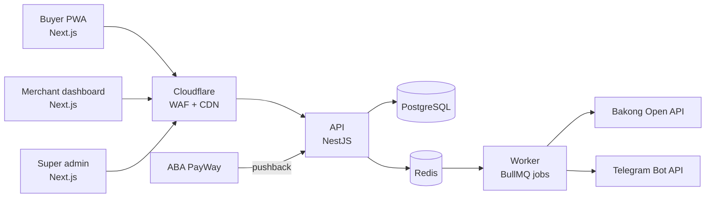
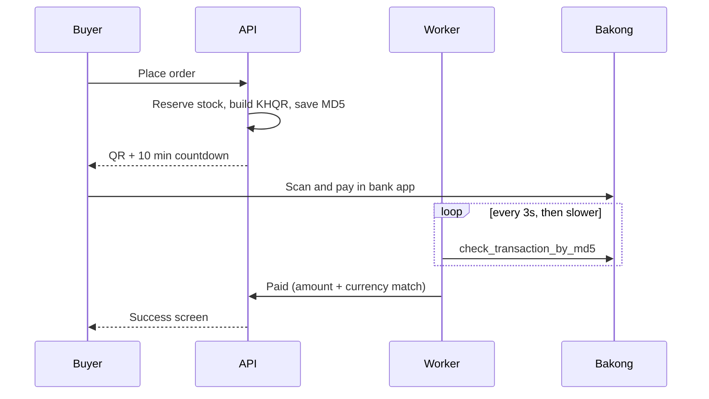
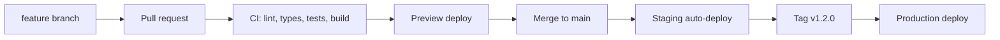
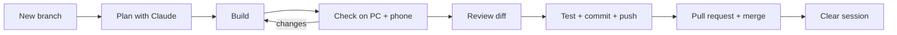

# Khmer Micro-Store — Project Blueprint

As of 2026-09-23

## Overview

Khmer Micro-Store lets a Telegram or Facebook seller open a mobile shop in under 10 minutes, get paid by KHQR or ABA PayWay, and manage every order from Telegram. Money goes straight to the merchant's own account; the platform earns from subscriptions.

**Problem.** Small sellers take orders in chat, check payment screenshots by hand, and copy addresses to drivers one by one. This wastes hours and invites fake-payment fraud.

**Users.**

| User | Main job | Device |
| --- | --- | --- |
| Buyer | Browse, order, pay in under 1 minute | Phone, inside Telegram/Facebook browser |
| Merchant (owner) | Add products, see paid orders, dispatch | Phone first, laptop sometimes |
| Merchant staff | Pack and dispatch orders | Phone |
| Super admin (you) | Approve merchants, watch payments and health | Laptop |

**MVP goals.**

1. A buyer can pay by KHQR and the order is marked paid automatically, with no screenshot.
2. The merchant gets a Telegram alert within 10 seconds of payment.
3. 5–10 real Phnom Penh merchants use it for two weeks during beta.

**Not in the MVP:** native iOS/Android apps, delivery-company APIs, marketplace search across stores, loyalty points.

## System architecture

One web app, one API, one background worker, one database. This is a modular monolith: simple to run alone, and each module can be split out later if it needs to scale.



The web app, API and worker are three processes from one Git repo. The worker does everything slow or repeated: checking KHQR payments, renewing the Bakong token, sending Telegram messages, and expiring unpaid orders.

**Order flow in one line:** buyer checks out → API reserves stock and creates a payment → buyer pays → worker (KHQR) or PayWay callback confirms → order becomes Paid → Telegram alert → merchant packs and dispatches.

## Tech stack and repo structure

TypeScript everywhere, one monorepo. One language for frontend, backend and shared rules keeps the project easy to customize for years, and AI coding tools handle it very well.

| Layer | Choice | Why |
| --- | --- | --- |
| Repo | pnpm workspaces + Turborepo | Web, API, worker and shared code in one place |
| Web (buyer + merchant + admin) | Next.js App Router + Tailwind + shadcn/ui | Fast in in-app browsers, ready-made accessible components |
| API | NestJS | Clear modules, built on Express, easy to extend |
| Worker | BullMQ on Redis | Retries, schedules, never blocks checkout |
| Database | PostgreSQL + Prisma | Typed queries, safe migrations |
| Validation | Zod, shared by web and API | One rule set for every form field |
| Forms | React Hook Form + Zod | Instant field errors, little re-rendering on cheap phones |
| Language | next-intl (km, en) | All text in translation files |
| Errors/logs | Sentry + pino | See problems before merchants do |

```
khmer-micro-store/
├── apps/
│   ├── web/        # Next.js: /s/[slug] storefront, /m merchant, /admin
│   ├── api/        # NestJS: modules below
│   └── worker/     # BullMQ jobs
├── packages/
│   ├── shared/     # Zod schemas, money + phone helpers, types
│   ├── payments/   # provider adapters: bakong-khqr, aba-payway
│   ├── db/         # Prisma schema, migrations, seed
│   └── ui/         # shared components + Khmer font setup
├── infra/          # docker-compose, Caddy/Nginx, backup scripts
├── .github/workflows/ci.yml
└── CLAUDE.md
```

**API modules:** auth, merchants, stores, catalog, orders, payments, delivery, notifications, admin.

**Coding rules (put these in CLAUDE.md):**

- Every price is saved as a whole number: USD in cents ($8.50 is saved as 850), KHR in riel (34,850 is saved as 34850). A product can have a USD price, a KHR price, or both.
- Every merchant query filters by `store_id`; PostgreSQL Row-Level Security backs this up.
- No `any`. Every API input is parsed with a Zod schema from `packages/shared`.
- No text in components; every label lives in `messages/km.json` and `messages/en.json`.
- Payment providers are only called through the adapter interface in `packages/payments`.

## UX/UI principles

Design for a cheap Android phone, one thumb, inside the Telegram or Facebook in-app browser, on 4G that drops sometimes. If it works there, it works everywhere.

**Layout and touch**

- Design at 360 px wide first; desktop is the bonus.
- Tap targets at least 44 × 44 px; the main button is full-width and sticks to the bottom of the screen.
- One main action per screen. Checkout is one page, never a multi-step wizard.
- Icons always have a text label under them; icons alone confuse first-time users.

**Khmer and English**

- Khmer is the default for buyers; the toggle (ខ្មែរ / EN) sits in the header and is remembered.
- Load a Khmer web font (Kantumruy Pro or Noto Sans Khmer) with a system fallback. Khmer script needs about 1.5× line height and 16 px minimum, or vowels above and below get cut off.
- Numbers and prices use Western digits by default (most sellers already do); allow Khmer digits as a store setting.
- Leave 30–40% extra space in buttons: Khmer labels are often longer than English.

**Speed**

- Storefront first load under 150 KB of JavaScript; images served as WebP, resized to 800 px.
- Show skeleton placeholders, not spinners. Cache the catalog so a refresh is instant.
- Every button shows a loading state and cannot be double-tapped (prevents double orders).

**Trust**

- Show store logo, name, phone and a "Verified merchant" badge after KYC.
- The KHQR screen follows the official NBC KHQR card design and shows amount, merchant name and a countdown.
- Error messages say what to do: "Phone number needs 9–10 digits", never "Invalid input".

**Design system:** one brand colour, one accent for success (paid), one for danger; 8 px spacing grid; 12 px rounded corners; built from shadcn/ui so every screen looks consistent. Support dark mode from the start using colour tokens.

## User-friendly data input

Ask for the fewest fields possible, fill in everything you can guess, and check each field the moment the user leaves it. The same Zod schema checks the field in the browser and again on the server.

### Buyer checkout (one page, 3 required fields)

| Field | Input style | Rule | Friendly help |
| --- | --- | --- | --- |
| Name | Text, autofill on | 2–60 characters, Khmer or Latin | "Name for the delivery driver" |
| Phone | Fixed `+855` prefix, number keypad (`inputmode="tel"`) | Accept any of: `097 123 4567`, `012 345 678`, `+855 97 123 4567`, `855971234567`. Remove spaces, dashes, `+855`/`855` and the first `0`; the rest must be 8 or 9 digits. Save as `855971234567` | Auto-format while typing: 9-digit numbers as `012 345 678`, 10-digit numbers as `097 123 4567` |
| Pay in | Two toggle buttons: USD ($) or KHR (៛) | Only currencies the product has a price in; default = store default | Total updates instantly when switched |
| Delivery location | Map pin ("Use my location" button) + Province → Khan → Sangkat dropdowns | Pin inside Cambodia; province required | Many streets have no numbers, so the pin matters most |
| Landmark / note | Optional text | Max 200 characters | Example: "Opposite Wat Phnom, blue gate" |
| Delivery or pickup | Two large toggle cards | One required | Shows fee next to each option |
| Payment method | Cards: KHQR, ABA PayWay, Cash on delivery (if merchant allows) | One required | Logos with names |

After the first order, save name, phone and address on the device (with the buyer's consent) so the next checkout is one tap. Buyers who open the shop from the Telegram bot can share their contact with one button, which fills the phone number for them.

### Merchant onboarding (5 short steps, progress bar)

1. **Log in with Telegram** — no password to forget.
2. **Shop name and link** — type the name; the link slug is suggested automatically (`sokha-coffee`) and checked live for availability.
3. **Logo** — optional; if skipped, show a coloured circle with the first letter.
4. **Get paid** — enter Bakong account ID (for example `name@aclb`); the app checks it exists with Bakong's account-check API and shows a green tick. ABA PayWay is added later in Settings once the merchant has PayWay keys.
5. **Connect Telegram group** — "Add the bot to your group" button with a 3-screenshot guide; the app detects the group automatically.

The merchant can skip steps 3 and 5 and finish later; a checklist on the dashboard reminds them.

### Adding a product (target: under 60 seconds)

- Photos first: take or pick up to 6, compressed in the browser before upload.
- Title in Khmer; English optional with an "Auto-translate" button the merchant can edit.
- Two price boxes side by side: USD and KHR. The merchant can fill one or both. If only one is filled, the "Auto-fill" button suggests the other from the store's exchange rate, and the merchant can change it. Each variant (size, colour) has its own two prices.
- Stock: a − / + stepper, not a blank box.
- Variants hidden behind "Add sizes or colours"; when opened, type values as chips (S, M, L) and a price/stock grid is generated.
- "Save as draft" is automatic every few seconds, so a dropped connection loses nothing.

### Validation behaviour

- Check when the field loses focus, not on every keystroke; clear the error as soon as it is fixed.
- Show the error under the field in red text plus an icon (not colour alone).
- On submit, scroll to the first error and focus it.
- Server errors come back as field-level messages in the user's language, using the same error codes as the browser.

## Payments

Launch with Bakong KHQR for every merchant, then add ABA PayWay as an upgrade for merchants who have a PayWay account. Every provider sits behind one adapter interface, so adding Wing, ACLEDA or cards later means one new file, not a rewrite.

### Options compared

| Option | Buyer can pay with | How you learn it's paid | Merchant needs | When to use |
| --- | --- | --- | --- | --- |
| Bakong KHQR (dynamic) | Any KHQR bank app (ABA, ACLEDA, Wing, Canadia…) | Your worker polls Bakong by MD5; no callback | A Bakong account ID; you need a Bakong Open API token | MVP, every merchant |
| ABA PayWay eCommerce Checkout | Cards, ABA Pay, KHQR, WeChat Pay, Alipay, Google Pay | Signed callback + Check Transaction API | Own PayWay merchant ID and API key from ABA | Merchants selling to tourists or wanting card payments |
| ABA PayWay Payment Link | Same as checkout | Callback + status API | PayWay account | Sending a pay link inside Telegram chat |
| Cash on delivery | Cash | Driver/merchant marks it collected | Nothing | Merchant setting, off by default |

Sources: [PayWay eCommerce Checkout](https://developer.payway.com.kh/ecommerce-checkout-3158159f0), [NBC QR Payment Integration](https://bakong.nbc.gov.kh/download/QR%20Payment%20Integration.pdf), [Bakong Open API document](https://bakong.nbc.gov.kh/download/KHQR/integration/Bakong%20Open%20API%20Document.pdf).

### The adapter interface

```ts
// packages/payments/src/provider.ts
export interface PaymentProvider {
  code: 'bakong_khqr' | 'aba_payway' | 'cod';
  createPayment(input: { orderId: string; amountMinor: number;
    currency: 'USD' | 'KHR'; store: StorePaymentConfig }): Promise<CreatedPayment>;
  checkStatus(ref: string, store: StorePaymentConfig): Promise<'pending' | 'paid' | 'failed' | 'expired'>;
  verifyCallback?(headers: Record<string, string>, body: unknown,
    store: StorePaymentConfig): boolean; // PayWay only
}
```

The orders module only calls this interface. It never knows which bank is behind it.

### Flow A: Bakong KHQR



- QR expires after 10 minutes (NBC's maximum); expired orders release stock.
- The worker renews the Bakong token on a schedule and alerts you if renewal fails.
- Test Bakong API access from your real server in week 1: servers outside Cambodia often get HTTP 403.

### Flow B: ABA PayWay

1. Buyer picks "ABA PayWay"; the API creates a PayWay purchase using **that merchant's** PayWay keys and a unique `tran_id`.
2. The PayWay checkout opens as a bottom sheet on mobile.
3. PayWay posts the result to your callback URL. The domain must be whitelisted in the merchant's PayWay profile.
4. Verify the `X-PayWay-HMAC-SHA512` header signature. Reject if wrong.
5. Always confirm with the Check Transaction API before marking the order paid; a callback alone is never trusted. The worker also runs Check Transaction for any PayWay order still pending after a few minutes, in case the callback was lost.

### Rules for every provider

- One order can have several payment attempts; only one can become `paid`.
- Mark paid only if provider amount and currency are an **exact integer match** to the order's stored `total_minor` and `currency` — never re-convert currency to compare (see "Multi-currency pricing and totals" above).
- Processing is idempotent: the same callback or poll result twice changes nothing.
- Merchant PayWay API keys are encrypted in the database (AES-256-GCM, key held outside the database) and never sent to the browser.
- Money goes straight to the merchant. The platform never holds buyer funds, which keeps licensing simple.

## Database schema

Keep your original tables, with these fixes: money as integers, a payments table that supports several providers, staff roles, audit logs, and a store-level exchange rate.

| Table | Purpose | Key changes from the first draft |
| --- | --- | --- |
| merchants | Person who owns stores | Add `telegram_username`, `kyc_status` |
| store_members | Who can manage a store | New: `store_id`, `merchant_id`, `role` (owner, staff) |
| stores | A shop | Add `usd_to_khr_rate`, `default_currency`, `allow_cod`, `languages`; move payment settings out |
| store_payment_configs | Provider settings per store | New: `provider`, `bakong_account_id`, encrypted PayWay keys, `enabled` |
| products / product_variants | Catalog | `price_usd_cents` and `price_khr` (either can be empty, not both); `stock_reserved` next to `stock_quantity`; soft delete |
| customers | Buyer per store | New: phone, name, Telegram ID, saved address |
| orders | An order | `currency` (USD or KHR) chosen by buyer, `total_minor` in that currency, `exchange_rate_used`, `payment_method`, `delivery_fee_minor`, address fields, `idempotency_key` |
| order_items | Lines | Snapshot of title and price at time of order |
| payment_attempts | Every try to pay | Replaces payments: `provider`, `provider_ref` (MD5 or tran_id), `amount_minor`, `currency`, `status`, `expires_at`, `raw_response` |
| delivery_dispatches | Delivery | Unchanged, plus `driver_name`, `driver_phone` |
| audit_logs | Who changed what | New: actor, action, entity, before/after JSON, time |
| outbox_events | Reliable messages | New: events written in the same transaction, sent by the worker |

**Money:** save prices as whole numbers so sums are always exact (computers make small mistakes with decimals, like 0.1 + 0.2 = 0.30000000000000004). USD is saved in cents (`$8.50` → `850`), KHR in riel (`៛34,850` → `34850`). The screen still shows $8.50 and 34,850៛. An order uses one currency, picked by the buyer; KHQR and PayWay both accept USD and KHR.

**Multi-currency pricing and totals.** A product must have at least one of `price_usd_cents` / `price_khr` set; either can be empty, never both. The buyer's checkout picks **one currency for the whole order**, never per item — a KHQR or PayWay payment request is always exactly one currency and one amount.

- If a cart line's product has no price in the chosen order currency, convert that line using the store's `usd_to_khr_rate` at checkout time.
- **Round each line first, then sum the rounded lines for the order total** — never convert-then-round the grand total alone. This keeps the receipt honest: the total on screen always equals the sum of the visible lines, even though it may differ from a raw currency conversion by a riel or two. That tiny difference is expected and standard practice; do not "fix" it by rounding the total separately.
- Freeze the rate actually used onto the order (`exchange_rate_used`) at the moment the order is created. The order stays reproducible and auditable even after the store's rate changes later; never recompute an old order with today's rate.
- Show both currencies wherever a price appears: the buyer's chosen currency large/primary, the other currency as a small "≈" reference, computed with the same rate and the same round-then-sum rule everywhere it's shown (cart, checkout, KHQR screen, order success) so the numbers never disagree with each other.
- The merchant sets `usd_to_khr_rate` in Settings; the platform clamps it to a sane band around the market rate (for example ±5%, exact band TBD) so a mistyped rate can't badly misprice an order. Reject or clamp on save, not silently at checkout.
- **Payment verification never re-converts currency.** The order is created with one fixed `currency` and `total_minor`; the provider (Bakong or PayWay) is asked for exactly that currency and amount; a callback or poll result is accepted only when the provider's reported currency *and* amount are an exact integer match to the order's stored total. Cross-currency comparison must never happen at this layer — a rate change or rounding difference must never be able to mark the wrong amount as paid. (This sharpens the existing "Rules for every provider" rule below — it's the same rule, stated precisely for the multi-currency case.)

**Stock without overselling:** at checkout, one statement reserves stock only if enough is free:

```sql
UPDATE product_variants
SET stock_reserved = stock_reserved + $1
WHERE id = $2 AND stock_quantity - stock_reserved >= $1;
-- 0 rows updated = sold out, tell the buyer
```

On payment, move the reserved amount out of stock; on expiry, release it.

**Multi-tenant safety:** every tenant table carries `store_id`, and PostgreSQL Row-Level Security allows a query only for stores the logged-in merchant belongs to. A test in CI proves merchant A cannot read merchant B's orders.

## Security

The three things that matter most: nobody can fake a payment, no merchant can see another's data, and you can restore the database if something breaks.

| Area | Rule |
| --- | --- |
| Merchant login | Telegram Login Widget; verify its hash with the bot token on the server and reject logins older than 24 hours |
| Sessions | Access token 15 min, refresh token 30 days in an httpOnly, Secure, SameSite cookie; logout revokes it |
| Super admin | Separate login with 2FA (TOTP); admin routes on their own path, IP-limited if possible |
| Roles | Owner and staff per store; staff cannot change payment settings or delete products |
| Payments | KHQR: trust only your own MD5 poll. PayWay: verify HMAC-SHA512 header, then Check Transaction API. Match amount and currency. Idempotent processing |
| Telegram webhook | `secret_token` header checked on every request; button presses checked against store membership |
| Input | Zod on every endpoint; Prisma parameterised queries; image uploads limited to JPEG/PNG/WebP, 5 MB, re-encoded |
| Abuse | Cloudflare WAF + Turnstile on checkout; limits per phone and device, not only per IP (mobile users share IPs) |
| Secrets | Only in the hosting provider's environment settings; `.env` never in Git; PayWay keys encrypted at rest |
| Headers | HTTPS only, HSTS, CSP, no framing of admin pages |
| Privacy | Buyer phone and address visible only to that store; masked in logs |
| Backups | Daily automatic backups, kept 14 days, plus a monthly restore test |
| Dependencies | Dependabot + `pnpm audit` in CI; pin versions |

## Deployment

Recommended: Next.js on Vercel Pro, and the API, worker, PostgreSQL and Redis on Railway. Both deploy automatically on every `git push`. Decide this finally after the week-1 Bakong test: if Bakong blocks your server's location, use Option B.

Vercel alone cannot run the whole system. Its functions start per request and stop, so it cannot keep a BullMQ worker running to poll Bakong every few seconds. The worker needs an always-on host.

### Options compared

| Option | Where things run | Update method | Approx. cost/month | Good | Watch out |
| --- | --- | --- | --- | --- | --- |
| A. Vercel + Railway (recommended) | Web on Vercel; API, worker, Postgres, Redis on Railway | Push to GitHub → both redeploy; preview link per pull request | Vercel Pro $20 + Railway ~$20–40 | Easiest, instant rollback, no server to maintain | Two dashboards; servers are outside Cambodia |
| B. One VPS + Coolify | Everything in Docker on one server (Cambodian provider or Singapore) | Coolify watches GitHub and redeploys on push | ~$12–30 | Cheapest, Cambodian IP works with Bakong, full control | You handle updates, backups, monitoring |
| C. Render or DigitalOcean App Platform | Web, API, worker, managed DB in one place (Singapore region) | Push to GitHub | ~$40–70 | One dashboard | Fewer Next.js extras than Vercel |

Vercel's free Hobby plan is for personal, non-commercial use only, so a business platform needs Pro; Pro developer seats cost $20 per user per month ([Vercel Hobby plan docs](https://vercel.com/docs/plans/hobby)). Costs for Railway, Render, DigitalOcean and VPS are approximate; check each pricing page before signing up.

**If Bakong blocks Option A's servers:** keep A, and add a tiny "payment checker" service on a Cambodian VPS that only calls Bakong and reports back to the API over an authenticated private connection. Or move everything to Option B.

### Environments

| Environment | Branch | Payments | Purpose |
| --- | --- | --- | --- |
| Local | any | Sandbox | Your laptop, Docker Compose |
| Preview | each pull request | Sandbox | Check a feature on your phone before merging |
| Staging | `main` before release | Sandbox | Final test with real Telegram bot (test bot) |
| Production | release tag or `main` | Live | Real merchants |

Each environment has its own database, Redis, Telegram bot token and payment keys. Never share keys between staging and production.

### Git workflow for easy, safe updates



One feature per branch (`feat/payway-checkout`). CI must pass before merge. Database migrations run automatically at deploy with `prisma migrate deploy`; only ever add columns first and remove old ones in a later release, so a rollback never breaks. To undo a bad release, use Vercel's instant rollback and redeploy the previous tag on Railway.

## Budget

Expect about **$45–60 per month** with the recommended setup (Option A), or **$15–35 per month** with one VPS (Option B), during development and beta. Most other tools you need are free at this size. All prices in USD, before tax.

### Monthly costs (development, beta, up to about 50 merchants)

| Item | Option A: Vercel + Railway | Option B: One VPS + Coolify | Notes |
| --- | --- | --- | --- |
| Web hosting (Next.js) | $20 (Vercel Pro, 1 seat) | included in VPS | Vercel Hobby is not allowed for business use |
| API + worker + PostgreSQL + Redis | $20–35 (Railway Pro: $20 fee includes $20 of usage) | $12–30 (one 4 GB VPS) | Railway usage estimate: 4 small always-on services |
| Staging environment | $5–10 extra Railway usage | $0 (same VPS) | Can turn off staging when not testing |
| Database backups storage | included in Railway | $0–2 (Cloudflare R2 or similar) | |
| Cloudflare (DNS, WAF, Turnstile) | $0 (free plan) | $0 | Upgrade to Pro ($25) only if attacked often |
| Image storage | $0 (Cloudflare R2 free tier) | $0 | Paid only after ~10 GB of photos |
| Maps | $0 (OpenStreetMap + Leaflet) | $0 | Google Maps has a free monthly allowance if you prefer it |
| Error tracking (Sentry) | $0 (free tier) | $0 | |
| Telegram Bot API | $0 | $0 | Free |
| Bakong Open API | $0 | $0 | No fee known; confirm when you register |
| **Total per month** | **~$45–60** | **~$15–35** | |

### One-time and yearly costs

| Item | Cost | Notes |
| --- | --- | --- |
| Domain name (.com) | ~$10–15 per year | Buy through Cloudflare for no mark-up |
| Company registration + e-commerce permit | Ask a local advisor | Depends on company type |
| Design (Figma) | $0 | Free plan is enough for one designer |
| App store accounts | $0 | Not needed: it is a PWA |
| Claude plan for Claude Code | Your current Claude subscription | Check the current price on Anthropic's pricing page |

### Costs you do not pay

- **ABA PayWay fees** are charged by ABA to each merchant per transaction; confirm the rate with ABA.
- **Buyer KHQR transfers** between Cambodian banks are normally free for the buyer.

### When you grow (100–500 merchants)

| Stage | Option A per month | What changes |
| --- | --- | --- |
| 100 merchants | ~$60–90 | Bigger database, more worker memory |
| 500 merchants | ~$120–200 | Second API instance, read replica, Cloudflare Pro |

Plan your subscription price so that **10–15 paying merchants cover all hosting**. For example, at $5 per merchant per month, 12 merchants pay for Option A.

Prices checked on 2026-09-23: [Vercel Hobby plan](https://vercel.com/docs/plans/hobby), [Railway pricing plans](https://docs.railway.com/pricing/plans). VPS, domain and growth figures are approximate estimates.

## Roadmap: zero to live

About 16 weeks working solo with Claude Code. Do not start a phase until the previous one's "Done when" is true.

| Phase | Weeks | Build | Done when |
| --- | --- | --- | --- |
| 0. Validate and prepare | 1–2 | Interview 15–20 sellers; register Bakong Open API token and PayWay sandbox; create Telegram bots (test + live); buy domain, set up Cloudflare; check company and e-commerce permit needs | 5 merchants agree to beta; one real KHQR payment verified by MD5 from your chosen host |
| 1. Foundations | 3–4 | Monorepo, Docker Compose, CI, Vercel + Railway projects, staging environment, CLAUDE.md, Figma screens for checkout and product entry | A pull request shows a working preview link and CI is green |
| 2. Data and login | 5–6 | Prisma schema and migrations, RLS, Telegram login, roles, merchant onboarding flow | Merchant can sign up in 5 steps; test proves stores are isolated |
| 3. Catalog and checkout | 7–8 | Product entry, storefront, cart, one-page checkout, stock reservation, Khmer/English | 50 simulated buyers on 10 items never oversell |
| 4. KHQR payments | 9–10 | Provider adapter, Bakong KHQR, worker polling, token renewal, expiry job | Real USD and KHR payments auto-confirm; expired orders free stock |
| 5. ABA PayWay | 11 | PayWay adapter, per-store encrypted keys, callback signature check, status check job | Sandbox card and ABA Pay payments confirm; a fake callback is rejected |
| 6. Telegram and dashboard | 12–13 | Order alerts with buttons, order queue, simple stats, manual delivery with tracking link | A merchant runs a full day of orders from their phone |
| 7. Security and ops | 14 | WAF, Turnstile, headers, Sentry, backups, restore test, admin 2FA | Backup restored successfully; OWASP Top 10 checklist done |
| 8. Beta | 15–16 | 5–10 real merchants, Khmer video tutorials, daily fixes | Two weeks of real orders; merchants say they would pay |
| 9. Public launch | 17+ | Subscription plans, KYC review in admin, terms and privacy policy, status page | First paying merchants |

**After launch, scale only when numbers say so:** add PgBouncer or a read replica when database CPU stays high; a second API instance when response times climb; delivery-company APIs when a partner gives you access.

## Working with Claude Code

One small feature per session, on its own branch, reviewed by you before merge. Install Claude Code using the current official instructions; setup steps change over time.

**Keep CLAUDE.md as the project's memory.** Put in it: the stack table, the folder map, the coding rules from this doc, the commands (`pnpm dev`, `pnpm test`, `pnpm db:migrate`), and a short "never do" list (never log phone numbers, never call a payment provider outside `packages/payments`, never edit an old migration).

**Prompt pattern for each feature:**

1. "Read CLAUDE.md and the section of the blueprint about X. Propose a plan and the files you will change. Don't write code yet."
2. Review the plan; correct it.
3. "Implement step 1 with tests. Run lint, typecheck and tests, and fix failures."
4. Review the diff in VS Code's Source Control tab.
5. "Commit with message `feat: …`, push the branch, open a pull request."

**Example prompts per phase:**

- Phase 2: "Create the Prisma schema for stores, store_members and products following CLAUDE.md money rules, add RLS policies, and a test that merchant A cannot read merchant B's products."
- Phase 3: "Build the checkout page with React Hook Form and the shared Zod schema. Phone field: fixed +855 prefix, auto-format `012 345 678` and `097 123 4567`, store as `855…`."
- Phase 4: "Implement `BakongKhqrProvider` for the PaymentProvider interface, plus a BullMQ job that checks pending MD5s with backoff and stops at `expires_at`."
- Phase 5: "Implement `AbaPaywayProvider`: purchase request, HMAC-SHA512 callback verification, Check Transaction confirmation. Write tests for a valid callback, a tampered callback, and a wrong amount."

**Review extra carefully:** anything in auth, payments, RLS policies and migrations. Ask Claude Code to explain those diffs line by line before you merge.

## Build guide: zero to live with Claude Code in VS Code

Follow these parts in order. Everything up to Part 7 runs on your own PC for free; you buy a domain and hosting only in Stage I.

### Part 1: Install once (Day 1)

| # | Tool | How | Check it works |
| --- | --- | --- | --- |
| 1 | WSL2 + Ubuntu (Windows only) | PowerShell as admin: `wsl --install`, restart | `wsl -l -v` shows Ubuntu, version 2 |
| 2 | Node.js 22 LTS | Inside Ubuntu, install with nvm: `nvm install 22` | `node -v` shows v22 |
| 3 | pnpm | `corepack enable` | `pnpm -v` |
| 4 | Git | `sudo apt install git`, then set `user.name` and `user.email` | `git --version` |
| 5 | Docker Desktop | Install on Windows; Settings → Resources → WSL integration → on for Ubuntu | `docker run hello-world` |
| 6 | VS Code | Install on Windows, plus extensions: WSL, ESLint, Prettier, Prisma, Tailwind CSS IntelliSense, Docker | From Ubuntu, `code .` opens VS Code |
| 7 | Claude Code | Follow the current official install guide at docs.claude.com | `claude` starts and asks you to log in |
| 8 | GitHub CLI | `sudo apt install gh`, then `gh auth login` | `gh auth status` |
| 9 | cloudflared (later, Stage F) | Install from Cloudflare's docs | `cloudflared --version` |

Work inside the Ubuntu (WSL) file system, for example `~/projects/`, not in `C:\Users`. It is much faster and avoids file-permission errors.

### Part 2: Create the project (Day 1)

This starter kit already contains the folders and files. Copy the whole `khmer-micro-store` folder to `~/projects/`, then:

```bash
cd ~/projects/khmer-micro-store
git init -b main
git add . && git commit -m "initial commit: project context"
gh repo create khmer-micro-store --private --source=. --push
code .
```

The repo must be **private**. In VS Code, open the terminal with Ctrl + backtick (the key under Esc). This is where you run `claude` every day.

### Part 3: Give Claude your workflow (Day 1–2)

Claude Code does not remember past sessions. **Files in the project are its memory**, so everything it must know lives in these files (all included in this kit):

| File | What it holds |
| --- | --- |
| `CLAUDE.md` | Your workflow, stack, commands, rules. Read automatically every session |
| `docs/blueprint.md` | This whole blueprint |
| `design/screens.md` | Text spec for all 12 screens |
| `.claude/settings.json` | Stops Claude reading secret files (`.env`) |
| `.claude/commands/screen.md` | Saved prompt you run as `/screen <name>` |

When a rule changes later, update `CLAUDE.md` first, then tell Claude.

### Part 4: Screen specs and the /screen command (Day 2)

Write each screen as text: Claude builds from words far more accurately than from pictures. Edit `design/screens.md` to your taste before building.

Instead of typing the whole build prompt each time, type `/screen checkout` (the prompt lives in `.claude/commands/screen.md`).

**Playwright (lets Claude open and check pages itself):** run once in the project:

```bash
claude mcp add playwright npx @playwright/mcp@latest
```

### Part 5: How to talk to Claude in the terminal

| You want to | Do this |
| --- | --- |
| Start Claude | Type `claude` in the VS Code terminal, inside the project folder |
| Point Claude at a file or image | Type `@` and the path: `@design/screens.md`, `@design/feedback/checkout-1.png` |
| Plan before coding | Press Shift+Tab to switch to plan mode, or say "plan only, don't code yet" |
| Stop Claude mid-task | Press Esc |
| Start fresh for a new feature | `/clear` |
| Shorten a long session | `/compact` |
| See all commands | `/help` |
| Run a saved prompt | `/screen checkout` |

Claude asks permission before running commands or editing files. Approve only what matches the task you gave. If it asks to run something you don't understand, ask "what does this command do?" first.

**Good prompts are specific.** Compare:

- Weak: "make checkout better"
- Strong: "On /mockup/checkout, move the Pay in USD/KHR toggle above the payment cards, make the Place order button sticky, and show the total in the button."

**Feedback with pictures:** take a screenshot, draw red circles on problems, save it to `design/feedback/`, then write "fix the issues marked in @design/feedback/checkout-1.png".

### Part 6: The daily loop (repeat for every feature)



```bash
git switch main && git pull
git switch -c feat/checkout-screen
docker compose up -d
claude
```

1. **Plan:** "Read CLAUDE.md. Today: build the checkout mockup from @design/screens.md. Propose a plan."
2. **Correct the plan** if anything is wrong, then say "go".
3. **Check it yourself** on your PC and on your phone (`http://<PC-IP>:3000` on the same Wi-Fi). Give feedback in words or with a marked-up screenshot.
4. **Review the diff** in VS Code Source Control (Ctrl+Shift+G). Ask "explain this change" for anything unclear.
5. **Save:** "Run lint, typecheck and tests, then commit with message 'feat: checkout mockup' and push."
6. **Merge:** `gh pr create --fill`, wait for CI to pass on GitHub, then `gh pr merge --squash`.
7. **Reset:** `/clear` before the next feature.

One branch = one feature = one day or less. Small tasks are where Claude works best.

### Part 7: Stages A–I with the first prompt for each

| Stage | Weeks | First prompt to Claude | Done when |
| --- | --- | --- | --- |
| A. Foundation | 1 | "Create the monorepo from CLAUDE.md: empty apps that each start, docker-compose with Postgres and Redis, .env.example, .gitignore, GitHub Actions CI. `pnpm dev` must start everything." | `pnpm dev` works; CI green |
| B. Design in code | 2–3 | "Build /styleguide: colours, Kantumruy Pro, buttons, inputs, cards, USD/KHR price display." Then `/screen` for each of the 12 screens, then "Link all mockups into clickable buyer and merchant journeys." | 3–5 sellers click through on their phones without getting stuck |
| C. Data and login | 4–5 | "From docs/blueprint.md Database section, create the Prisma schema and migration with RLS, plus a test proving merchant A can't read merchant B's orders. Then add Telegram Login with server-side hash check." | Isolation test passes; you can log in |
| D. Catalog and checkout | 6–7 | "Connect /mockup/product-form and /mockup/checkout to the real API. Checkout reserves stock in a transaction with an idempotency key. Add a test with 50 parallel buyers on 10 items." | No overselling |
| E. KHQR | 8–9 | "Implement BakongKhqrProvider in packages/payments and a worker job that checks pending MD5s with backoff, confirms amount and currency, and expires orders after 10 minutes." | Real $0.01 USD and 100៛ KHR payments auto-confirm |
| F. ABA PayWay | 10 | "Implement AbaPaywayProvider: purchase, HMAC-SHA512 callback check, Check Transaction confirmation. Tests for valid, tampered and wrong-amount callbacks." | Sandbox payments confirm; fake callback rejected |
| G. Telegram + dashboard | 11–12 | "Telegram bot in long-polling mode for development: order alerts with Preparing and Dispatched buttons, checked against store membership. Connect the merchant order screens." | A full day of test orders run from your phone |
| H. Security | 13 | "Review the codebase against docs/blueprint.md Security section and OWASP Top 10. List problems first, then fix them one at a time." | Checklist done; backup restore tested |
| I. Go live | 14+ | "Prepare deployment for [Option A or B] from the blueprint: environment variables list, build settings, migration step, health checks." | Staging works; launch checklist complete |

**Testing on your PC without a domain**

- **Bakong:** your home connection is in Cambodia, so Bakong's API accepts it. Register the Open API token and pay real $0.01 test orders to your own account.
- **Telegram:** create a separate test bot with BotFather and use long polling in development, so no public URL is needed.
- **ABA PayWay callbacks:** run `cloudflared tunnel --url http://localhost:4000` for a free temporary public link, and use it as the sandbox callback URL.
- **Phone testing in Telegram's browser:** send yourself the tunnel link in Telegram and open it there.

### Part 8: When something goes wrong

| Problem | What to do |
| --- | --- |
| Error in terminal or browser | Copy the full error (or screenshot it) and say "fix this: …" |
| Claude went the wrong direction | Press Esc, run `git checkout .` to drop uncommitted changes, `/clear`, restart with a clearer prompt |
| A commit was bad | `git revert <commit-id>` creates a safe undo commit |
| Claude forgets a rule | Add it to CLAUDE.md so every future session knows it |
| You repeat the same instruction | Save it as a command in `.claude/commands/` |
| Session feels slow or confused | `/compact`, or `/clear` and start the task again |
| Docker database acting strange | `docker compose down` then `docker compose up -d`; reset data with `pnpm db:reset` (local only; created in Stage A) |
| Not sure a change is safe | "Explain this diff line by line and list the risks" before merging |

**Three rules keep this safe:** plan before coding, keep every task small, and review every diff yourself before committing, especially anything touching payments, login or migrations.

## Launch checklist and open questions

**Before going live**

- [ ] Live Bakong token works from the production host, and renewal job has run once
- [ ] PayWay production keys for at least one merchant; callback domain whitelisted
- [ ] A real $0.10 payment tested end to end with KHQR and with PayWay
- [ ] Fake PayWay callback and replayed callback both rejected
- [ ] Store isolation test passing in CI
- [ ] Backup restored into a fresh database
- [ ] Sentry alerts reach your Telegram
- [ ] Khmer text checked by a native reader on a cheap Android phone
- [ ] Terms of service and privacy policy published
- [ ] Company registration and e-commerce permit confirmed with a local advisor

**Open questions**

- [ ] Does Bakong's API accept calls from Railway/Vercel regions, or do we need a Cambodian host?
- [ ] How will merchants get PayWay accounts: each applies to ABA directly, or can ABA offer a platform/partner arrangement?
- [ ] Subscription price: flat monthly fee, or tiers by number of orders?
- [ ] Cash on delivery at launch, or later?
- [ ] Which delivery partner will talk to us first about API access?

## Sources

- [ABA PayWay eCommerce Checkout](https://developer.payway.com.kh/ecommerce-checkout-3158159f0)
- [NBC Bakong QR Payment Integration (PDF)](https://bakong.nbc.gov.kh/download/QR%20Payment%20Integration.pdf)
- [NBC Bakong Open API Document (PDF)](https://bakong.nbc.gov.kh/download/KHQR/integration/Bakong%20Open%20API%20Document.pdf)
- [Vercel Hobby plan](https://vercel.com/docs/plans/hobby)
- [Railway pricing plans](https://docs.railway.com/pricing/plans)
