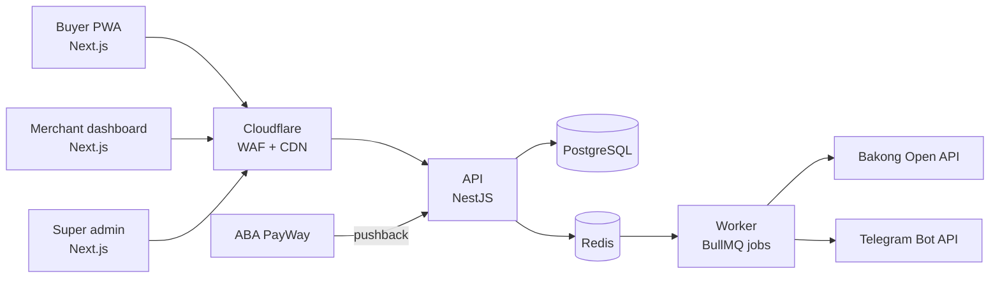
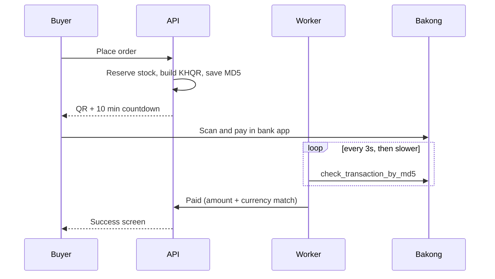
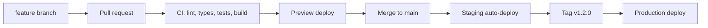
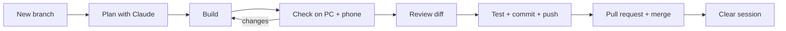

# Khmer Micro-Store — Project Blueprint

As of 2026-09-23

## Overview

Khmer Micro-Store lets a Telegram or Facebook seller open a mobile shop in under 10 minutes, get paid by KHQR or ABA PayWay, and manage every order from Telegram. Money goes straight to the merchant's own account; the platform earns from subscriptions.

**Problem.** Small sellers take orders in chat, check payment screenshots by hand, and copy addresses to drivers one by one. This wastes hours and invites fake-payment fraud.

**Users.**

| User | Main job | Device |
| --- | --- | --- |
| Buyer | Browse, order, pay in under 1 minute | Phone, inside Telegram/Facebook browser |
| Merchant (owner) | Add products, see paid orders, dispatch | Phone first, laptop sometimes |
| Merchant staff | Pack and dispatch orders | Phone |
| Super admin (you) | Approve merchants, watch payments and health | Laptop |

**MVP goals.**

1. A buyer can pay by KHQR and the order is marked paid automatically, with no screenshot.
2. The merchant gets a Telegram alert within 10 seconds of payment.
3. 5–10 real Phnom Penh merchants use it for two weeks during beta.

**Not in the MVP:** native iOS/Android apps, delivery-company APIs, marketplace search across stores, loyalty points.

## Subscription tiers

The platform earns from subscriptions (see Overview above), and four tiers gate which merchant features a store can use. A store's tier lives on `subscriptions.plan` and nowhere else (see Database schema). This project builds every merchant screen at full (Advance) capability first — locking/hiding features per plan and upgrade prompts are a separate pass, added once all tiers' features exist in the UI.

| Tier | Business use | Products & pricing | Stock | Wholesale price | Warehouse / branch |
| --- | --- | --- | --- | --- | --- |
| Free | Trial/evaluation | Limited product count, single price | No | No | No |
| Basic | Any business — shop, restaurant, other | Full catalog, single price | No | No | No |
| Pro | Same, ready to scale | Full catalog | Single stock number per product/variant | Yes | No |
| Advance | Multi-location | Full catalog | Location-tracked, per branch/warehouse | Yes | Yes — plus purchase (stock in) and sale (stock out) transactions |

- **Free and Basic never show a stock number.** The buyer-facing storefront always allows ordering — there is no "sold out" state at these tiers. The buyer reaches the storefront via the seller's own shop link.
- **Pro and Advance storefronts follow stock** (`getBuyerStockState` in `packages/shared/stock.ts`): "Sold out" at 0, "Only N left" at 5 or fewer, and the buyer can't put more in the cart than is on hand. A cart that no longer fits (stock ran out meanwhile) is reduced with a notice. Online orders take stock from one location: the main branch on Pro, or the location chosen in Store settings on Advance. A paid order writes a `sale` movement there, in the same transaction that marks it paid.
- **Wholesale pricing** (a second price alongside retail, on the product form) is a **Pro+** feature.
- **Warehouse/branch stock tracking and the purchase/sale transaction ledger** are **Advance-only**.

### Plan rules live in one place

Every plan's limits and features are defined once, in `packages/shared/plans.ts`, and nothing else decides what a plan allows:

- The **merchant dashboard** reads it to hide or lock features and show an upgrade prompt.
- The **API** enforces the same rule on every request — a locked feature is rejected server-side even if someone calls the API directly. The screen is never the only check.
- The **buyer storefront** reads the store's plan to decide what buyers see (for example, "Sold out" appears only on Pro and Advance stores).
- The **admin panel** changes a store's plan; all three sides pick it up immediately.

Adding a plan or changing a limit means editing that one file (plus a migration only if a new plan name is added).

### Prices (proposed — adjust before launch)

Prices are set by the platform in **both currencies as fixed integers** (not converted at runtime), so an invoice never has rounding surprises. The seller pays in whichever one they choose.

| Plan | Monthly USD | Monthly KHR | Product limit | Length |
| --- | --- | --- | --- | --- |
| Free | $0 | 0៛ | 10 products | 14-day trial, once per store |
| Basic | $5 | 20,000៛ | Unlimited | Monthly |
| Pro | $12 | 48,000៛ | Unlimited | Monthly |
| Advance | $29 | 116,000៛ | Unlimited | Monthly |

### Subscription life cycle

```
New store → Free trial (14 days) → Active (paid plan) → Payment due → Grace (7 days) → Paused
```

- **New store:** starts on Free — up to 10 products, 14 days. It can upgrade to any paid plan at any time.
- **Trial ends without a paid plan:** the store is **paused**. Buyers opening the shop link see "This shop is temporarily closed"; the merchant can still log in, see all their data, and upgrade. Free cannot be restarted.
- **Billing:** monthly. The platform creates an invoice 7 days before the period ends and sends it to the merchant's Telegram. The merchant pays by **KHQR** into the platform's own Bakong account, confirmed the same way as buyer payments (worker checks the MD5, exact amount and currency — see Payments). No card billing at launch.
- **Payment due, not paid:** a **7-day grace period** — everything keeps working, with a dashboard banner and a daily Telegram reminder. After 7 days unpaid, the store is paused exactly like an expired trial. Paying the invoice reactivates it immediately.
- **Leaving the Free trial:** the first payment is the full monthly price of the chosen plan (there's no paid period to prorate against); the plan and a new 30-day period start once it's paid.
- **Upgrade:** takes effect immediately. The merchant pays the difference for the days left in the current period (`(new price − old price) × days left ÷ 30`, rounded to a whole cent or riel).
- **Downgrade:** takes effect at the end of the current paid period, never mid-period. Paid stores can't downgrade to Free; Basic is the lowest paid plan.
- **Never delete on downgrade or pause — lock instead.** Warehouses, branches, stock history and wholesale prices stay in the database, hidden and read-only. Upgrading again brings them all back exactly as they were.
- **Admin override:** the super admin can change any store's plan or extend its period (for example, a free month for beta merchants). No invoice is created, and every change is written to `audit_logs`. Changing plan: paid plans only; a trialing or paused store starts a fresh 30-day period on the new plan, while an active or overdue store keeps its current period and status. Extending: adds 1–365 days; a paused or overdue store reopens for exactly the added days.

### Business types

The platform serves any business with **one** product model (categories, variants, unit of measure, brand) — there is no separate code path for a café, a shop or a restaurant. During onboarding the merchant picks a business type (`shop`, `restaurant`, `service`, `other`), stored on `stores.business_type`. It only pre-fills starting defaults — for example, the default unit of measure (Piece for a shop, Cup/Plate for a restaurant) and suggested first categories. The merchant can change any of these afterwards, and every feature works the same way for every business type.

## System architecture

One web app, one API, one background worker, one database. This is a modular monolith: simple to run alone, and each module can be split out later if it needs to scale.



The web app, API and worker are three processes from one Git repo. The worker does everything slow or repeated: checking KHQR payments, renewing the Bakong token, sending Telegram messages, and expiring unpaid orders.

**Order flow in one line:** buyer checks out → API reserves stock and creates a payment → buyer pays → worker (KHQR) or PayWay callback confirms → order becomes Paid → Telegram alert → merchant packs and dispatches.

## Tech stack and repo structure

TypeScript everywhere, one monorepo. One language for frontend, backend and shared rules keeps the project easy to customize for years, and AI coding tools handle it very well.

| Layer | Choice | Why |
| --- | --- | --- |
| Repo | pnpm workspaces + Turborepo | Web, API, worker and shared code in one place |
| Web (buyer + merchant + admin) | Next.js App Router + Tailwind + shadcn/ui | Fast in in-app browsers, ready-made accessible components |
| API | NestJS | Clear modules, built on Express, easy to extend |
| Worker | BullMQ on Redis | Retries, schedules, never blocks checkout |
| Database | PostgreSQL + Prisma | Typed queries, safe migrations |
| Validation | Zod, shared by web and API | One rule set for every form field |
| Forms | React Hook Form + Zod | Instant field errors, little re-rendering on cheap phones |
| Language | next-intl (km, en) | All text in translation files |
| Errors/logs | Sentry + pino | See problems before merchants do |

```
khmer-micro-store/
├── apps/
│   ├── web/        # Next.js: /s/[slug] storefront, /m merchant, /admin
│   ├── api/        # NestJS: modules below
│   └── worker/     # BullMQ jobs
├── packages/
│   ├── shared/     # Zod schemas, money + phone helpers, types
│   ├── payments/   # provider adapters: bakong-khqr, aba-payway
│   ├── db/         # Prisma schema, migrations, seed
│   └── ui/         # shared components + Khmer font setup
├── infra/          # docker-compose, Caddy/Nginx, backup scripts
├── .github/workflows/ci.yml
└── CLAUDE.md
```

**API modules:** auth, merchants, stores, catalog, orders, payments, delivery, notifications, admin.

**Coding rules (put these in CLAUDE.md):**

- Every price is saved as a whole number: USD in cents ($8.50 is saved as 850), KHR in riel (34,850 is saved as 34850). A product can have a USD price, a KHR price, or both.
- Every merchant query filters by `store_id`; PostgreSQL Row-Level Security backs this up.
- No `any`. Every API input is parsed with a Zod schema from `packages/shared`.
- No text in components; every label lives in `messages/km.json` and `messages/en.json`.
- Payment providers are only called through the adapter interface in `packages/payments`.

## UX/UI principles

Design for a cheap Android phone, one thumb, inside the Telegram or Facebook in-app browser, on 4G that drops sometimes. If it works there, it works everywhere.

**Layout and touch**

- Design at 360 px wide first; desktop is the bonus.
- Tap targets at least 44 × 44 px; the main button is full-width and sticks to the bottom of the screen.
- One main action per screen. Checkout is one page, never a multi-step wizard.
- Icons always have a text label under them; icons alone confuse first-time users.

**Khmer and English**

- Khmer is the default for buyers; the toggle (ខ្មែរ / EN) sits in the header and is remembered.
- Load a Khmer web font (Kantumruy Pro or Noto Sans Khmer) with a system fallback. Khmer script needs about 1.5× line height and 16 px minimum, or vowels above and below get cut off.
- Numbers and prices use Western digits by default (most sellers already do); allow Khmer digits as a store setting.
- Leave 30–40% extra space in buttons: Khmer labels are often longer than English.

**Speed**

- Storefront first load under 150 KB of JavaScript; images served as WebP, resized to 800 px.
- Show skeleton placeholders, not spinners. Cache the catalog so a refresh is instant.
- Every button shows a loading state and cannot be double-tapped (prevents double orders).

**Trust**

- Show store logo, name, phone and a "Verified merchant" badge after KYC.
- The KHQR screen follows the official NBC KHQR card design and shows amount, merchant name and a countdown.
- Error messages say what to do: "Phone number needs 9–10 digits", never "Invalid input".

**Design system:** one brand colour, one accent for success (paid), one for danger; 8 px spacing grid; 12 px rounded corners; built from shadcn/ui so every screen looks consistent. Support dark mode from the start using colour tokens.

### Admin area standards

The super-admin area (laptop-first, still usable on a phone) grows by adding pages, so every page follows the same frame:

- **Menu:** defined once in `admin/admin-nav.ts` — grouped sections, each item a label, icon, route and optional badge count. Adding a page = one entry there plus the page folder. Unbuilt entries set `comingSoon` and show a standard placeholder until built. Laptop: a sidebar that collapses to icons; phone/tablet: the same menu in a drawer (a bottom tab bar can't hold 10+ items). Groups fold open/closed (remembered per viewer; the group holding the current page always opens), one highlight slides to the current page, only the menu scrolls (logo and collapse button stay put) and keeps the current page in view, and pages fade in on change. All motion is off for viewers who ask for reduced motion.
- **Every page** starts with a page header (title, one-line description, actions) and uses the shared blocks in `admin/admin-ui.tsx`: stat cards, status pills, data toolbar (search + filter chips), table on laptop / cards below, empty state, pagination, side detail panel, and a confirm dialog for risky actions.
- **Every form** — admin, merchant and buyer — follows one standard (`mockup/form-ui.tsx`): form sections (title and help beside the fields on laptop, above them on narrow merchant forms), edits kept in a draft until Save, a sticky Save/Cancel bar that's only active once something changed, and a Zod schema from `packages/shared` (`product.ts`, `store.ts`, `checkout.ts`, `stock.ts`, `admin-settings.ts`) — the same schema the API validates with. Schemas report problems as error codes (`form-errors.ts`), never English text; the screen shows each code in the viewer's language from the `FormErrors` messages, and the API returns the same codes per field. Price and quantity boxes are read with `parseUsdInput` / `parseKhrInput` / `parseQuantityInput`, so a typo is rejected, never silently rounded. Values owned by code (like plan rules) are shown read-only, never edited in the UI.
- **Every admin change** is written to the audit log.

### Theme and lists (all screens)

- **Colours only through tokens** (`brand`, `on-brand`, `success`, `warning`, `info`, `danger`, `bg`, `canvas`, `fg`, `muted`, `border`, `nav-*` in `packages/ui/src/globals.css`) — never raw Tailwind colours like `amber-500` or `text-white` on a brand background. That's what lets every viewer switch Light / Dark / Device mode and one of 5 accent colours (the palette button on every screen), saved per viewer and applied before first paint.
- **Every list uses the shared data grid** (`mockup/data-grid.tsx`): search, quick-filter chips with counts, a filter panel, sortable columns, row selection with bulk actions, CSV export (UTF-8 with BOM so Excel reads Khmer), show/hide columns, row density and page size remembered per viewer. Laptop shows a table; phones and tablets show cards with a sort menu. Risky bulk actions go through the shared confirm dialog.

## User-friendly data input

Ask for the fewest fields possible, fill in everything you can guess, and check each field the moment the user leaves it. The same Zod schema checks the field in the browser and again on the server.

### Buyer checkout (one page, 3 required fields)

| Field | Input style | Rule | Friendly help |
| --- | --- | --- | --- |
| Name | Text, autofill on | 2–60 characters, Khmer or Latin | "Name for the delivery driver" |
| Phone | Fixed `+855` prefix, number keypad (`inputmode="tel"`) | Accept any of: `097 123 4567`, `012 345 678`, `+855 97 123 4567`, `855971234567`. Remove spaces, dashes, `+855`/`855` and the first `0`; the rest must be 8 or 9 digits. Save as `855971234567` | Auto-format while typing: 9-digit numbers as `012 345 678`, 10-digit numbers as `097 123 4567` |
| Pay in | Two toggle buttons: USD ($) or KHR (៛) | Only currencies the product has a price in; default = store default | Total updates instantly when switched |
| Delivery location | Map pin ("Use my location" button) + Province → Khan → Sangkat dropdowns | Pin inside Cambodia; province required | Many streets have no numbers, so the pin matters most |
| Landmark / note | Optional text | Max 200 characters | Example: "Opposite Wat Phnom, blue gate" |
| Delivery or pickup | Two large toggle cards | One required | Shows fee next to each option |
| Payment method | Cards: KHQR, ABA PayWay, Cash on delivery (if merchant allows) | One required | Logos with names |

After the first order, save name, phone and address on the device (with the buyer's consent) so the next checkout is one tap. Buyers who open the shop from the Telegram bot can share their contact with one button, which fills the phone number for them.

### Merchant sign-up and login (one screen, no password)

Sign-up and login are the same flow: the first verified login creates the account; returning merchants go to the dashboard, new ones to onboarding. Rules live in `packages/shared/auth.ts`.

| Method | Status | Notes |
| --- | --- | --- |
| **Continue with Telegram** (main button) | Launch | One tap via the Telegram Login Widget (hash checked with the bot token, rejected if older than 24 hours). Also turns on order alerts in the merchant's private chat with the bot — no setup. |
| **Continue with phone** (SMS code) | Launch | For sellers without Telegram. 6-digit code, valid 5 minutes, 5 wrong tries then a new code is needed, resend after 60 seconds, limits per phone and per device, bot check (Turnstile) before any SMS is sent to stop SMS-pumping fraud. One code box with `autocomplete="one-time-code"` so phones fill it from the SMS. |
| Continue with Google | Later | Free; handy on laptops. Add to `ENABLED_LOGIN_METHODS` when it ships. |
| Facebook, email + password | Not planned | Facebook Login needs Meta business verification and app review; passwords mean forgotten passwords and reset emails. |

- **One account, several ways in** (`merchant_identities`: `merchant_id`, `method`, `provider_account_id`, `verified_at`). A merchant can link Telegram and phone in Profile → Login methods; the last method can't be removed, and adding a phone needs its SMS code, exactly like logging in.
- **Staff** are invited by phone number and log in with an SMS code.
- Sessions as in Security below: stay signed in for 30 days on that device; logging out ends it.

### Merchant onboarding (2 quick questions, then the shop is live)

1. **Business type** — only pre-fills defaults (units, starting categories).
2. **Shop name and link**, with an optional logo on the same screen — the link slug is suggested automatically (`sokha-coffee`) and checked live for availability.

Then the "Your shop is ready" screen: shop QR code, copy/share link, and a reminder to add the Bakong ID. Nothing else blocks a new seller:

- **Getting paid** (Bakong account ID, checked with Bakong's account-check API) is added from the dashboard. Until then the dashboard shows a banner, and checkout offers only the payment methods the shop has set up (`getAvailablePaymentMethods`): no KHQR without a Bakong ID, no ABA PayWay without PayWay keys; if cash on delivery isn't possible either, buyers see "This shop isn't taking orders online yet".
- **Order alerts** already work for Telegram sign-ins (private chat). Adding the bot to a staff group is optional, from Profile.
- A **setup checklist** on the dashboard home tracks: Bakong ID (first, highlighted), first product, order alerts, logo, identity verification — and disappears when all are done.

### Adding a product (target: under 60 seconds)

- Photos first: take or pick up to 6, compressed in the browser before upload.
- Title in Khmer; English optional with an "Auto-translate" button the merchant can edit.
- Two price boxes side by side: USD and KHR. The merchant can fill one or both. If only one is filled, the "Auto-fill" button suggests the other from the store's exchange rate, and the merchant can change it. Each variant (size, colour) has its own two prices.
- Stock: a − / + stepper, not a blank box.
- Variants hidden behind "Add sizes or colours"; when opened, type values as chips (S, M, L) and a price/stock grid is generated.
- "Save as draft" is automatic every few seconds, so a dropped connection loses nothing.

### Validation behaviour

- Check when the field loses focus, not on every keystroke; clear the error as soon as it is fixed.
- Show the error under the field in red text plus an icon (not colour alone).
- On submit, scroll to the first error and focus it.
- Server errors come back as field-level messages in the user's language, using the same error codes as the browser.

## Payments

Launch with Bakong KHQR for every merchant, then add ABA PayWay as an upgrade for merchants who have a PayWay account. Every provider sits behind one adapter interface, so adding Wing, ACLEDA or cards later means one new file, not a rewrite.

### Options compared

| Option | Buyer can pay with | How you learn it's paid | Merchant needs | When to use |
| --- | --- | --- | --- | --- |
| Bakong KHQR (dynamic) | Any KHQR bank app (ABA, ACLEDA, Wing, Canadia…) | Your worker polls Bakong by MD5; no callback | A Bakong account ID; you need a Bakong Open API token | MVP, every merchant |
| ABA PayWay eCommerce Checkout | Cards, ABA Pay, KHQR, WeChat Pay, Alipay, Google Pay | Signed callback + Check Transaction API | Own PayWay merchant ID and API key from ABA | Merchants selling to tourists or wanting card payments |
| ABA PayWay Payment Link | Same as checkout | Callback + status API | PayWay account | Sending a pay link inside Telegram chat |
| Cash on delivery | Cash | Driver/merchant marks it collected | Nothing | Merchant setting, off by default |

Sources: [PayWay eCommerce Checkout](https://developer.payway.com.kh/ecommerce-checkout-3158159f0), [NBC QR Payment Integration](https://bakong.nbc.gov.kh/download/QR%20Payment%20Integration.pdf), [Bakong Open API document](https://bakong.nbc.gov.kh/download/KHQR/integration/Bakong%20Open%20API%20Document.pdf).

### The adapter interface

```ts
// packages/payments/src/provider.ts
export interface PaymentProvider {
  code: 'bakong_khqr' | 'aba_payway' | 'cod';
  createPayment(input: { orderId: string; amountMinor: number;
    currency: 'USD' | 'KHR'; store: StorePaymentConfig }): Promise<CreatedPayment>;
  checkStatus(ref: string, store: StorePaymentConfig): Promise<'pending' | 'paid' | 'failed' | 'expired'>;
  verifyCallback?(headers: Record<string, string>, body: unknown,
    store: StorePaymentConfig): boolean; // PayWay only
}
```

The orders module only calls this interface. It never knows which bank is behind it.

### Flow A: Bakong KHQR



- QR expires after 10 minutes (NBC's maximum); expired orders release stock.
- The worker renews the Bakong token on a schedule and alerts you if renewal fails.
- Test Bakong API access from your real server in week 1: servers outside Cambodia often get HTTP 403.

### Flow B: ABA PayWay

1. Buyer picks "ABA PayWay"; the API creates a PayWay purchase using **that merchant's** PayWay keys and a unique `tran_id`.
2. The PayWay checkout opens as a bottom sheet on mobile.
3. PayWay posts the result to your callback URL. The domain must be whitelisted in the merchant's PayWay profile.
4. Verify the `X-PayWay-HMAC-SHA512` header signature. Reject if wrong.
5. Always confirm with the Check Transaction API before marking the order paid; a callback alone is never trusted. The worker also runs Check Transaction for any PayWay order still pending after a few minutes, in case the callback was lost.

### Rules for every provider

- One order can have several payment attempts; only one can become `paid`.
- Mark paid only if provider amount and currency are an **exact integer match** to the order's stored `total_minor` and `currency` — never re-convert currency to compare (see "Multi-currency pricing and totals" above).
- Processing is idempotent: the same callback or poll result twice changes nothing.
- Merchant PayWay API keys are encrypted in the database (AES-256-GCM, key held outside the database) and never sent to the browser.
- Money goes straight to the merchant. The platform never holds buyer funds, which keeps licensing simple.

## Database schema

The tables below are what the approved mockups need (design/screens.md). Value lists in brackets — statuses, reasons, roles — are defined once in `packages/shared` and the database uses the same names. Every table has `id`, `created_at` and `updated_at`; they're left out of the lists. Money columns are whole numbers: `_usd_cents`, `_khr`, or `_minor` next to a `currency` column.

**People and login**

| Table | Purpose | Columns |
| --- | --- | --- |
| merchants | A person who owns or works in stores | `first_name`, `last_name`, `kyc_status` (not_submitted, pending, approved, rejected) |
| merchant_identities | How a merchant logs in — one row per method | `merchant_id`, `method` (telegram, phone; google later), `provider_user_id` (Telegram ID or 855… phone), `telegram_username`, `verified_at`. Unique on `method` + `provider_user_id`. A merchant always keeps at least one |
| store_members | Who can manage a store | `store_id`, `merchant_id`, `role` (owner, staff) |
| kyc_submissions | An identity check, one row per attempt | `merchant_id`, `id_type` (national_id, passport), `full_name`, `id_number`, `front_photo_key`, `back_photo_key` (ID card only), `status` (pending, approved, rejected), `reject_reason` (photo_unclear, name_mismatch, document_expired, wrong_document, other), `reject_note`, `reviewed_by` (admin user), `reviewed_at` |

KYC belongs to the person, not the shop: the ID is the owner's. A shop shows "Verified" when its owner's `kyc_status` is approved. Photos are stored in private file storage; the table holds only their keys.

**Shop**

| Table | Purpose | Columns |
| --- | --- | --- |
| stores | A shop | `slug` (unique), `name`, `business_type` (shop, restaurant, service, other), `phone`, `area` (phnom_penh, province), `description`, `logo_key`, `languages`, `default_currency`, `usd_to_khr_rate`, `allow_cod`, `vat_percent` (0–20), `online_stock_location_id` (Advance; empty = main branch), `pickup_enabled`, `pickup_address`, `pickup_hours`, `province_delivery_enabled`, `province_fee_usd_cents`, `province_fee_khr`, `province_note`, `delivery_configured_at`, `link_shared_at` |
| store_payment_configs | Provider settings per store | `store_id`, `provider` (bakong_khqr, aba_payway), `bakong_account_id`, encrypted PayWay keys, `enabled` |

`delivery_configured_at` and `link_shared_at` exist for the setup checklist ("Set your delivery", "Share your shop link"). The plan is **not** on `stores` — see the next table.

**Plan and billing**

| Table | Purpose | Columns |
| --- | --- | --- |
| subscriptions | A store's current plan and period — the only place the plan is stored | `store_id` (unique), `plan` (free, basic, pro, advance), `status` (trialing, active, grace, paused), `current_period_start`, `current_period_end`, `trial_ends_at`, `pending_plan` (downgrade waiting for period end), `billing_currency` |
| subscription_invoices | What a store owes the platform | `store_id`, `number` (INV-1058, unique), `plan`, `reason` (new, renewal, upgrade), `period_start`, `period_end`, `currency`, `amount_minor`, `status` (open, paid, void), `due_at`, `paid_at`, `payment_ref` (KHQR MD5), `manual_bank_reference`, `manual_note`, `marked_paid_by` (admin user), `void_reason`, `voided_by` |

"Overdue" is never stored: it is an open invoice whose `due_at` has passed. An invoice is paid either by KHQR (`payment_ref`) or by hand (`manual_bank_reference`), never both.

**Catalog**

| Table | Purpose | Columns |
| --- | --- | --- |
| categories | A store's product groups | `store_id`, `name_km`, `name_en`, `sort_order` |
| brands | A store's brands | `store_id`, `name_km`, `name_en` |
| units | Units of measure (piece, cup, kg) | `store_id`, `name_km`, `name_en` |
| products | What the shop sells | `store_id`, `category_id`, `brand_id`, `unit_id`, `title_km`, `title_en`, `description_km`, `description_en` (up to 1,000 characters each), `discount_percent` (0–90), `is_visible`, `deleted_at` (soft delete) |
| product_variants | The thing that is priced, stocked and ordered | `store_id`, `product_id`, `sku` (unique per store), `label_km`, `label_en`, `is_default`, `price_usd_cents`, `price_khr` (either can be empty, never both), `wholesale_price_usd_cents`, `wholesale_price_khr` (Pro and Advance), `sort_order`, `deleted_at` |
| product_photos | Up to 6 per product | `store_id`, `product_id`, `file_key`, `sort_order` |

**Every product has at least one variant.** A product with no options gets one default variant (`is_default`, blank label) that the seller never sees. Prices, stock and order lines then always point at a variant — there is no "product or variant" special case anywhere in the code. A hidden product (`is_visible` false) stays in the dashboard, leaves the shop, and is dropped from carts; nothing is deleted.

Promo codes are sample data in the mockups. Their table comes with the Discounts screen (phase 3).

**Stock (Pro and Advance)**

| Table | Purpose | Columns |
| --- | --- | --- |
| stock_locations | A warehouse or a branch | `store_id`, `type` (warehouse, branch), `name_km`, `name_en`, `supplied_by_location_id` (a branch's warehouse), `is_main` |
| stock_levels | How many are there now — one row per variant and location | `store_id`, `variant_id`, `location_id`, `on_hand`, `reserved`. Unique on `variant_id` + `location_id` |
| stock_movements | The history: every change, never edited | `store_id`, `variant_id`, `location_id`, `type` (purchase, sale, transfer_out, transfer_in, adjust_in, adjust_out), `quantity` (always positive), `reason` (count_correction, damaged, lost, returned, other — adjustments only), `transfer_id` (links the out and in halves), `order_id` (sales and returns), `note`, `actor_merchant_id` |

`stock_levels` is the fast number checkout reads; `stock_movements` is the record of why it is what it is. Both are written in the same transaction, so they can't drift apart. A transfer is always two movements with one `transfer_id`, so moving stock never changes the store's total. Pro has one location (the main branch); Advance has several and chooses which one the online shop sells from. Free and Basic don't track stock: no rows, and the shop never shows "Sold out".

**Delivery**

| Table | Purpose | Columns |
| --- | --- | --- |
| delivery_zones | A group of Phnom Penh districts with one fee | `store_id`, `name` (the seller's own label), `fee_usd_cents`, `fee_khr` (both empty = free) |
| delivery_zone_districts | Which districts a zone covers | `zone_id`, `store_id`, `district_id`. Unique on `store_id` + `district_id`, so a district is in one zone only |
| store_drivers | Drivers an order can be handed to | `store_id`, `name`, `phone`, `kind` (own, partner) |
| delivery_dispatches | How one order was sent | `store_id`, `order_id`, `route` (driver, bus, pickup), `driver_id`, `driver_name`, `driver_phone` (copied, so the order keeps them if the driver is removed), `bus_company`, `ticket_number`, `dispatched_at`, `picked_up_at`, `delivered_at`, `failed_at` |

Districts and provinces are fixed lists in `packages/shared/src/locations.ts`, not tables. A district in no zone isn't delivered to. Pickup and province delivery are columns on `stores`.

**Orders and payments**

| Table | Purpose | Columns |
| --- | --- | --- |
| customers | A buyer, per store | `store_id`, `phone` (855…), `name`, `telegram_id`, last delivery choice (`area`, `district_id`, `province_id`, `landmark`) |
| orders | An order | `store_id`, `customer_id`, `order_number` (unique per store), `status` (awaiting_payment, paid, cod_pending, confirmed, packing, waiting_for_driver, out_for_delivery, delivered, completed, cancelled, failed_delivery), `payment_method` (khqr, aba_payway, cod), `currency` chosen by the buyer, `subtotal_minor`, `discount_minor`, `delivery_fee_minor`, `vat_percent`, `vat_minor`, `total_minor`, `exchange_rate_used`, `fulfilment` (delivery, pickup), `area`, `district_id`, `province_id`, `landmark`, `pickup_address`, `pickup_hours` (copied at order time), buyer `name` and `phone` (copied), `cancel_reason` (payment_timeout, buyer_cancelled, out_of_stock, cannot_deliver, other), `cancel_note`, `stock_taken`, `idempotency_key` |
| order_items | Lines | `store_id`, `order_id`, `variant_id`, `title_km`, `title_en`, `variant_label_km`, `variant_label_en`, `unit_price_minor`, `quantity`, `line_total_minor` — a snapshot, so a later rename or price change never alters an old order |
| order_status_events | The order's history | `store_id`, `order_id`, `status`, `actor` (buyer, merchant, system), `actor_merchant_id`, `at` |
| payment_attempts | Every try to pay | `order_id`, `store_id`, `provider`, `provider_ref` (MD5 or tran_id), `amount_minor`, `currency`, `status` (pending, paid, expired, failed), `expires_at`, `check_count`, `raw_response`, `issue` (provider_unreachable, amount_mismatch, currency_mismatch, paid_after_expiry), `issue_status` (open, confirmed, closed), `issue_note`, `issue_closed_by` (admin user) |

Which status may follow which is decided by `applyOrderAction` in `packages/shared/src/orders.ts`; the API runs every change through it. A failed check is a state of a payment attempt, not a table of its own: an attempt with an open `issue` is what the admin's "Failed checks" screen lists. An admin can ask the provider again or close the issue with a note — there is no column an admin can set to make an attempt `paid`.

**Platform**

| Table | Purpose | Columns |
| --- | --- | --- |
| admin_users | Who can use the admin area | `name`, `telegram_id`, `telegram_username` (unique), `role` (owner, support, finance), `disabled_at`, `last_active_at`, `invited_by` |
| platform_settings | One row of platform-wide settings | `platform_name`, `support_telegram`, `usd_to_khr_min`, `usd_to_khr_max` (the band a store's rate must sit in), `alert_chat_id` |
| audit_logs | Who changed what | `actor_type` (admin, merchant, system), `actor_id`, `store_id` (when it concerns one), `action`, `entity`, `entity_id`, `before`, `after` (JSON), `at` |
| outbox_events | Reliable messages | Events written in the same transaction, sent by the worker |

What each admin role may do is in `packages/shared/src/admin-roles.ts` and is enforced by the API on every admin request. Admins are disabled, never deleted, and there is always at least one active owner.

**Money:** save prices as whole numbers so sums are always exact (computers make small mistakes with decimals, like 0.1 + 0.2 = 0.30000000000000004). USD is saved in cents (`$8.50` → `850`), KHR in riel (`៛34,850` → `34850`). The screen still shows $8.50 and 34,850៛. An order uses one currency, picked by the buyer; KHQR and PayWay both accept USD and KHR.

**Multi-currency pricing and totals.** A product must have at least one of `price_usd_cents` / `price_khr` set; either can be empty, never both. The buyer's checkout picks **one currency for the whole order**, never per item — a KHQR or PayWay payment request is always exactly one currency and one amount.

- If a cart line's product has no price in the chosen order currency, convert that line using the store's `usd_to_khr_rate` at checkout time.
- **Round each line first, then sum the rounded lines for the order total** — never convert-then-round the grand total alone. This keeps the receipt honest: the total on screen always equals the sum of the visible lines, even though it may differ from a raw currency conversion by a riel or two. That tiny difference is expected and standard practice; do not "fix" it by rounding the total separately.
- Freeze the rate actually used onto the order (`exchange_rate_used`) at the moment the order is created. The order stays reproducible and auditable even after the store's rate changes later; never recompute an old order with today's rate.
- Show both currencies wherever a price appears: the buyer's chosen currency large/primary, the other currency as a small "≈" reference, computed with the same rate and the same round-then-sum rule everywhere it's shown (cart, checkout, KHQR screen, order success) so the numbers never disagree with each other.
- The merchant sets `usd_to_khr_rate` in Settings; the platform clamps it to a sane band around the market rate (for example ±5%, exact band TBD) so a mistyped rate can't badly misprice an order. Reject or clamp on save, not silently at checkout.
- **Payment verification never re-converts currency.** The order is created with one fixed `currency` and `total_minor`; the provider (Bakong or PayWay) is asked for exactly that currency and amount; a callback or poll result is accepted only when the provider's reported currency *and* amount are an exact integer match to the order's stored total. Cross-currency comparison must never happen at this layer — a rate change or rounding difference must never be able to mark the wrong amount as paid. (This sharpens the existing "Rules for every provider" rule below — it's the same rule, stated precisely for the multi-currency case.)

**Stock without overselling (Pro and Advance):** at checkout, one statement reserves stock at the shop's online location only if enough is free:

```sql
UPDATE stock_levels
SET reserved = reserved + $1
WHERE variant_id = $2 AND location_id = $3 AND on_hand - reserved >= $1;
-- 0 rows updated = sold out, tell the buyer
```

On payment (or when a cash order is placed), take the reserved amount out of `on_hand` and write a `sale` movement; on expiry, release the reservation; on cancel after payment, put it back with an `adjust_in` movement, reason `returned`.

**Multi-tenant safety:** every tenant table carries `store_id`, and PostgreSQL Row-Level Security allows a query only for stores the logged-in merchant belongs to. A test in CI proves merchant A cannot read merchant B's orders.

## Security

The three things that matter most: nobody can fake a payment, no merchant can see another's data, and you can restore the database if something breaks.

| Area | Rule |
| --- | --- |
| Merchant login | Telegram Login Widget; verify its hash with the bot token on the server and reject logins older than 24 hours |
| Sessions | Access token 15 min, refresh token 30 days in an httpOnly, Secure, SameSite cookie; logout revokes it |
| Super admin | Separate login with 2FA (TOTP); admin routes on their own path, IP-limited if possible |
| Roles | Owner and staff per store; staff cannot change payment settings or delete products |
| Payments | KHQR: trust only your own MD5 poll. PayWay: verify HMAC-SHA512 header, then Check Transaction API. Match amount and currency. Idempotent processing |
| Telegram webhook | `secret_token` header checked on every request; button presses checked against store membership |
| Input | Zod on every endpoint; Prisma parameterised queries; image uploads limited to JPEG/PNG/WebP, 5 MB, re-encoded |
| Abuse | Cloudflare WAF + Turnstile on checkout; limits per phone and device, not only per IP (mobile users share IPs) |
| Secrets | Only in the hosting provider's environment settings; `.env` never in Git; PayWay keys encrypted at rest |
| Headers | HTTPS only, HSTS, CSP, no framing of admin pages |
| Privacy | Buyer phone and address visible only to that store; masked in logs |
| Backups | Daily automatic backups, kept 14 days, plus a monthly restore test |
| Dependencies | Dependabot + `pnpm audit` in CI; pin versions |

## Deployment

Recommended: Next.js on Vercel Pro, and the API, worker, PostgreSQL and Redis on Railway. Both deploy automatically on every `git push`. Decide this finally after the Bakong test in roadmap gate G3: if Bakong blocks your server's location, use Option B.

Vercel alone cannot run the whole system. Its functions start per request and stop, so it cannot keep a BullMQ worker running to poll Bakong every few seconds. The worker needs an always-on host.

### Options compared

| Option | Where things run | Update method | Approx. cost/month | Good | Watch out |
| --- | --- | --- | --- | --- | --- |
| A. Vercel + Railway (recommended) | Web on Vercel; API, worker, Postgres, Redis on Railway | Push to GitHub → both redeploy; preview link per pull request | Vercel Pro $20 + Railway ~$20–40 | Easiest, instant rollback, no server to maintain | Two dashboards; servers are outside Cambodia |
| B. One VPS + Coolify | Everything in Docker on one server (Cambodian provider or Singapore) | Coolify watches GitHub and redeploys on push | ~$12–30 | Cheapest, Cambodian IP works with Bakong, full control | You handle updates, backups, monitoring |
| C. Render or DigitalOcean App Platform | Web, API, worker, managed DB in one place (Singapore region) | Push to GitHub | ~$40–70 | One dashboard | Fewer Next.js extras than Vercel |

Vercel's free Hobby plan is for personal, non-commercial use only, so a business platform needs Pro; Pro developer seats cost $20 per user per month ([Vercel Hobby plan docs](https://vercel.com/docs/plans/hobby)). Costs for Railway, Render, DigitalOcean and VPS are approximate; check each pricing page before signing up.

**If Bakong blocks Option A's servers:** keep A, and add a tiny "payment checker" service on a Cambodian VPS that only calls Bakong and reports back to the API over an authenticated private connection. Or move everything to Option B.

### Environments

| Environment | Branch | Payments | Purpose |
| --- | --- | --- | --- |
| Local | any | Sandbox | Your laptop, Docker Compose |
| Preview | each pull request | Sandbox | Check a feature on your phone before merging |
| Staging | `main` before release | Sandbox | Final test with real Telegram bot (test bot) |
| Production | release tag or `main` | Live | Real merchants |

Each environment has its own database, Redis, Telegram bot token and payment keys. Never share keys between staging and production.

### Git workflow for easy, safe updates



One feature per branch (`feat/payway-checkout`). CI must pass before merge. Database migrations run automatically at deploy with `prisma migrate deploy`; only ever add columns first and remove old ones in a later release, so a rollback never breaks. To undo a bad release, use Vercel's instant rollback and redeploy the previous tag on Railway.

## Budget

Expect about **$45–60 per month** with the recommended setup (Option A), or **$15–35 per month** with one VPS (Option B), during development and beta. Most other tools you need are free at this size. All prices in USD, before tax.

### Monthly costs (development, beta, up to about 50 merchants)

| Item | Option A: Vercel + Railway | Option B: One VPS + Coolify | Notes |
| --- | --- | --- | --- |
| Web hosting (Next.js) | $20 (Vercel Pro, 1 seat) | included in VPS | Vercel Hobby is not allowed for business use |
| API + worker + PostgreSQL + Redis | $20–35 (Railway Pro: $20 fee includes $20 of usage) | $12–30 (one 4 GB VPS) | Railway usage estimate: 4 small always-on services |
| Staging environment | $5–10 extra Railway usage | $0 (same VPS) | Can turn off staging when not testing |
| Database backups storage | included in Railway | $0–2 (Cloudflare R2 or similar) | |
| Cloudflare (DNS, WAF, Turnstile) | $0 (free plan) | $0 | Upgrade to Pro ($25) only if attacked often |
| Image storage | $0 (Cloudflare R2 free tier) | $0 | Paid only after ~10 GB of photos |
| Maps | $0 (OpenStreetMap + Leaflet) | $0 | Google Maps has a free monthly allowance if you prefer it |
| Error tracking (Sentry) | $0 (free tier) | $0 | |
| Telegram Bot API | $0 | $0 | Free |
| Bakong Open API | $0 | $0 | No fee known; confirm when you register |
| **Total per month** | **~$45–60** | **~$15–35** | |

### One-time and yearly costs

| Item | Cost | Notes |
| --- | --- | --- |
| Domain name (.com) | ~$10–15 per year | Buy through Cloudflare for no mark-up |
| Company registration + e-commerce permit | Ask a local advisor | Depends on company type |
| Design (Figma) | $0 | Free plan is enough for one designer |
| App store accounts | $0 | Not needed: it is a PWA |
| Claude plan for Claude Code | Your current Claude subscription | Check the current price on Anthropic's pricing page |

### Costs you do not pay

- **ABA PayWay fees** are charged by ABA to each merchant per transaction; confirm the rate with ABA.
- **Buyer KHQR transfers** between Cambodian banks are normally free for the buyer.

### When you grow (100–500 merchants)

| Stage | Option A per month | What changes |
| --- | --- | --- |
| 100 merchants | ~$60–90 | Bigger database, more worker memory |
| 500 merchants | ~$120–200 | Second API instance, read replica, Cloudflare Pro |

Plan your subscription price so that **10–15 paying merchants cover all hosting**. For example, at $5 per merchant per month, 12 merchants pay for Option A.

Prices checked on 2026-09-23: [Vercel Hobby plan](https://vercel.com/docs/plans/hobby), [Railway pricing plans](https://docs.railway.com/pricing/plans). VPS, domain and growth figures are approximate estimates.

## Roadmap: zero to live

One list, in order. Do not start a step until the one before it is "Done when" true. There are no week numbers: a solo build slips, and a date that is already wrong helps nobody — the checks are what matter.

The screens are designed first as working mockups (design/screens.md). That part is finished for every release below, so each backend step replaces a mockup's sample data with the real thing; it does not design anything new.

### Before any backend: three gates

These cost days, not weeks, and each one can change what gets built.

| Gate | Do | Done when |
| --- | --- | --- |
| G1. Save the work | Commit the mockups; from here on, one branch per step, merged when its check passes | Nothing uncommitted on `main` at the end of any day |
| G2. Sellers try the mockups | Sit with 3–5 real sellers. On their own phone, each one: sets up a shop, adds a product, places an order as a buyer, then handles it as the seller. Watch; don't help | Every one finishes without getting stuck. Anything that stopped two or more of them is fixed in the mockup first |
| G3. Bakong from the real host | Register the Bakong Open API token. From the server you plan to host on, create one KHQR and check it by MD5 after paying 100៛ | The check returns "paid" from that host. If Bakong refuses the host, choose Deployment Option B (or the small Cambodian checker) **now**, before payment code exists |

### Release 1 — First orders (free beta, 5–10 sellers)

A seller opens a shop, a buyer orders and pays by KHQR or cash, the seller gets a Telegram alert and moves the order to delivered. Every shop has the same features (the Basic plan's) and nobody is charged yet.

| Step | Build | Done when |
| --- | --- | --- |
| 1. Foundations | CI (lint, types, tests, build) on every pull request; staging environment; error tracking | A pull request shows a preview link and CI is green |
| 2. Data and login | Prisma schema and first migration from "Database schema" (Release 1 tables only), Row-Level Security, Telegram login, 2-question onboarding | A test proves merchant A cannot read merchant B's data; you can sign up and reach the dashboard |
| 3. Catalog | Categories, products with options, photos, description, show/hide; the setup checklist | On a phone, a product with 3 photos is added in under a minute and appears in the shop |
| 4. Shop and checkout | Shop page, product page, cart, one-page checkout; delivery zones, pickup and province settings; orders created with frozen totals and an idempotency key | A cash order lands with the right total in the buyer's currency; sending the same checkout twice makes one order |
| 5. KHQR | `BakongKhqrProvider` in `packages/payments`; worker checks the MD5 every 5 seconds, confirms exact amount and currency, expires after 10 minutes; token renewal | Real 100៛ and $0.01 payments confirm by themselves; an unpaid code cancels the order; a wrong amount is not accepted |
| 6. Orders and Telegram | Seller order list and detail with the 11 statuses; buyer order page; Telegram alerts to the seller with Confirm / Open buttons; status messages to the buyer; send by driver, bus or pickup | A seller runs a full day of test orders from their phone; every status change reaches the buyer's page |
| 7. Admin, the minimum | Merchant list, extend a trial, audit log; failed payment checks alert the admin's Telegram | You can see every shop and unblock one without touching the database |
| 8. Security and go live | Cloudflare WAF and Turnstile, rate limits on login and checkout, security headers, backups and one restore test, deploy | The launch checklist below is ticked; a real KHQR order completes on the live site |
| 9. Beta | 5–10 sellers you onboard yourself; a Telegram group; fix the top three complaints each week | Two weeks of real orders, and sellers say they would pay |

Left out of Release 1 on purpose, although their screens exist: subscription billing, plan limits, KYC, stock, wholesale prices, ABA PayWay, phone-number login, admin roles.

**Who Release 1 is for:** shops that sell physical goods (business types `shop` and `other`). A restaurant or a service business can open a shop, but the product model doesn't fit them yet — see step 14.

### Release 2 — Getting paid (public launch)

| Step | Build | Done when |
| --- | --- | --- |
| 10. Plans and billing | Subscriptions, invoices paid by KHQR to the platform's account, grace and pause, plan limits enforced in the API | A shop pays, its period moves 30 days; an unpaid shop pauses after grace and reopens the moment it pays |
| 11. Admin for money | Subscriptions, invoices (mark paid by hand, void), buyer payments, failed checks | Every screen in the admin "Revenue" and "Payments" groups runs on real data |
| 12. Trust | KYC submission and review, the Verified badge; phone-number login by SMS code | A seller is verified end to end; a seller without Telegram can log in |
| 13. Launch | Terms and privacy in Khmer and English, status page, Khmer video tutorials | First paying merchants |
| 14. Restaurants and services | Up to 3 groups of choices per product ("pick one" or "pick any", each with an optional extra price) for size × colour, sugar and ice levels, add-ons; a note per cart item; a product marked as an item or a service — services have no stock or delivery, and a cart of only services asks for a preferred date and time and "at the shop / at my place" | A café sells an iced coffee with "less sugar, +1 shot"; a salon takes a booking for a haircut without any delivery question |

### Release 3 — Bigger shops

Build in the order sellers ask for them, one at a time: stock with "Sold out" (Pro); wholesale prices; warehouses and branches (Advance); ABA PayWay; admin users and roles with 2FA; customers, discounts, staff and reports (screens S14–S17); link previews for Facebook and TikTok; CSV product import; cash owed per driver; delivery-company APIs; the AI product writer.

**After launch, scale only when numbers say so:** add PgBouncer or a read replica when database CPU stays high; a second API instance when response times climb.

## Working with Claude Code

One small feature per session, on its own branch, reviewed by you before merge. Install Claude Code using the current official instructions; setup steps change over time.

**Keep CLAUDE.md as the project's memory.** Put in it: the stack table, the folder map, the coding rules from this doc, the commands (`pnpm dev`, `pnpm test`, `pnpm db:migrate`), and a short "never do" list (never log phone numbers, never call a payment provider outside `packages/payments`, never edit an old migration).

**Prompt pattern for each feature:**

1. "Read CLAUDE.md and the section of the blueprint about X. Propose a plan and the files you will change. Don't write code yet."
2. Review the plan; correct it.
3. "Implement step 1 with tests. Run lint, typecheck and tests, and fix failures."
4. Review the diff in VS Code's Source Control tab.
5. "Commit with message `feat: …`, push the branch, open a pull request."

The first prompt for each roadmap step is in "Build guide", Part 7.

**Review extra carefully:** anything in auth, payments, RLS policies and migrations. Ask Claude Code to explain those diffs line by line before you merge.

## Build guide: zero to live with Claude Code in VS Code

Follow these parts in order. Everything up to Part 7 runs on your own PC for free; you buy a domain and hosting only at roadmap step 8 (gate G3 needs a server for one afternoon).

### Part 1: Install once (Day 1)

| # | Tool | How | Check it works |
| --- | --- | --- | --- |
| 1 | WSL2 + Ubuntu (Windows only) | PowerShell as admin: `wsl --install`, restart | `wsl -l -v` shows Ubuntu, version 2 |
| 2 | Node.js 22 LTS | Inside Ubuntu, install with nvm: `nvm install 22` | `node -v` shows v22 |
| 3 | pnpm | `corepack enable` | `pnpm -v` |
| 4 | Git | `sudo apt install git`, then set `user.name` and `user.email` | `git --version` |
| 5 | Docker Desktop | Install on Windows; Settings → Resources → WSL integration → on for Ubuntu | `docker run hello-world` |
| 6 | VS Code | Install on Windows, plus extensions: WSL, ESLint, Prettier, Prisma, Tailwind CSS IntelliSense, Docker | From Ubuntu, `code .` opens VS Code |
| 7 | Claude Code | Follow the current official install guide at docs.claude.com | `claude` starts and asks you to log in |
| 8 | GitHub CLI | `sudo apt install gh`, then `gh auth login` | `gh auth status` |
| 9 | cloudflared (later, for ABA PayWay callbacks) | Install from Cloudflare's docs | `cloudflared --version` |

Work inside the Ubuntu (WSL) file system, for example `~/projects/`, not in `C:\Users`. It is much faster and avoids file-permission errors.

### Part 2: Create the project (Day 1)

This starter kit already contains the folders and files. Copy the whole `khmer-micro-store` folder to `~/projects/`, then:

```bash
cd ~/projects/khmer-micro-store
git init -b main
git add . && git commit -m "initial commit: project context"
gh repo create khmer-micro-store --private --source=. --push
code .
```

The repo must be **private**. In VS Code, open the terminal with Ctrl + backtick (the key under Esc). This is where you run `claude` every day.

### Part 3: Give Claude your workflow (Day 1–2)

Claude Code does not remember past sessions. **Files in the project are its memory**, so everything it must know lives in these files (all included in this kit):

| File | What it holds |
| --- | --- |
| `CLAUDE.md` | Your workflow, stack, commands, rules. Read automatically every session |
| `docs/blueprint.md` | This whole blueprint |
| `design/screens.md` | Text spec for every screen, with what is built |
| `design/design-standard.md` | Layout, look and form rules every screen follows |
| `.claude/settings.json` | Stops Claude reading secret files (`.env`) |
| `.claude/commands/screen.md` | Saved prompt you run as `/screen <name>` |

When a rule changes later, update `CLAUDE.md` first, then tell Claude.

### Part 4: Screen specs and the /screen command (Day 2)

Write each screen as text: Claude builds from words far more accurately than from pictures. Edit `design/screens.md` to your taste before building.

Instead of typing the whole build prompt each time, type `/screen checkout` (the prompt lives in `.claude/commands/screen.md`).

**Playwright (lets Claude open and check pages itself):** run once in the project:

```bash
claude mcp add playwright npx @playwright/mcp@latest
```

### Part 5: How to talk to Claude in the terminal

| You want to | Do this |
| --- | --- |
| Start Claude | Type `claude` in the VS Code terminal, inside the project folder |
| Point Claude at a file or image | Type `@` and the path: `@design/screens.md`, `@design/feedback/checkout-1.png` |
| Plan before coding | Press Shift+Tab to switch to plan mode, or say "plan only, don't code yet" |
| Stop Claude mid-task | Press Esc |
| Start fresh for a new feature | `/clear` |
| Shorten a long session | `/compact` |
| See all commands | `/help` |
| Run a saved prompt | `/screen checkout` |

Claude asks permission before running commands or editing files. Approve only what matches the task you gave. If it asks to run something you don't understand, ask "what does this command do?" first.

**Good prompts are specific.** Compare:

- Weak: "make checkout better"
- Strong: "On /mockup/checkout, move the Pay in USD/KHR toggle above the payment cards, make the Place order button sticky, and show the total in the button."

**Feedback with pictures:** take a screenshot, draw red circles on problems, save it to `design/feedback/`, then write "fix the issues marked in @design/feedback/checkout-1.png".

### Part 6: The daily loop (repeat for every feature)



```bash
git switch main && git pull
git switch -c feat/checkout-screen
docker compose up -d
claude
```

1. **Plan:** "Read CLAUDE.md. Today: build the checkout mockup from @design/screens.md. Propose a plan."
2. **Correct the plan** if anything is wrong, then say "go".
3. **Check it yourself** on your PC and on your phone (`http://<PC-IP>:3000` on the same Wi-Fi). Give feedback in words or with a marked-up screenshot.
4. **Review the diff** in VS Code Source Control (Ctrl+Shift+G). Ask "explain this change" for anything unclear.
5. **Save:** "Run lint, typecheck and tests, then commit with message 'feat: checkout mockup' and push."
6. **Merge:** `gh pr create --fill`, wait for CI to pass on GitHub, then `gh pr merge --squash`.
7. **Reset:** `/clear` before the next feature.

One branch = one feature = one day or less. Small tasks are where Claude works best.

### Part 7: The first prompt for each roadmap step

The steps and their "Done when" checks are in "Roadmap: zero to live" above — this is only how to start each one. Every prompt begins with "Read CLAUDE.md and the blueprint section about X. Propose a plan; don't write code yet."

| Roadmap step | First prompt to Claude |
| --- | --- |
| 1. Foundations | "Add a GitHub Actions workflow that runs lint, typecheck, tests and build on every pull request, and set up the staging environment from the Deployment section." |
| 2. Data and login | "From the blueprint's Database schema, create the Prisma schema and first migration for the Release 1 tables, with RLS and a test proving merchant A can't read merchant B's orders. Then add Telegram Login with a server-side hash check." |
| 3. Catalog | "Connect the product form and products list mockups to the real API, using productInputSchema from packages/shared. Photos upload to file storage; the database keeps only their keys." |
| 4. Shop and checkout | "Connect the shop page, cart and checkout mockups to the real API. The order is created in one transaction with an idempotency key, with totals rounded per line and the rate frozen on the order." |
| 5. KHQR | "Implement BakongKhqrProvider in packages/payments and a worker job that checks pending MD5s every 5 seconds, accepts only an exact amount and currency, and expires the order after 10 minutes." |
| 6. Orders and Telegram | "Connect the seller order screens and the buyer order page. Every status change goes through applyOrderAction. Telegram bot in long-polling mode for development: order alerts with Confirm and Open buttons, checked against store membership." |
| 7. Admin, the minimum | "Connect the admin merchants list, the extend-period action and the audit log to real data." |
| 8. Security and go live | "Review the codebase against the blueprint's Security section and OWASP Top 10. List problems first, then fix them one at a time. Then prepare deployment for the chosen option." |

**Testing on your PC without a domain**

- **Bakong:** your home connection is in Cambodia, so Bakong's API accepts it. Register the Open API token and pay real $0.01 test orders to your own account.
- **Telegram:** create a separate test bot with BotFather and use long polling in development, so no public URL is needed.
- **ABA PayWay callbacks:** run `cloudflared tunnel --url http://localhost:4000` for a free temporary public link, and use it as the sandbox callback URL.
- **Phone testing in Telegram's browser:** send yourself the tunnel link in Telegram and open it there.

### Part 8: When something goes wrong

| Problem | What to do |
| --- | --- |
| Error in terminal or browser | Copy the full error (or screenshot it) and say "fix this: …" |
| Claude went the wrong direction | Press Esc, run `git checkout .` to drop uncommitted changes, `/clear`, restart with a clearer prompt |
| A commit was bad | `git revert <commit-id>` creates a safe undo commit |
| Claude forgets a rule | Add it to CLAUDE.md so every future session knows it |
| You repeat the same instruction | Save it as a command in `.claude/commands/` |
| Session feels slow or confused | `/compact`, or `/clear` and start the task again |
| Docker database acting strange | `docker compose down` then `docker compose up -d`; reset data with `pnpm db:reset` (local only; created in roadmap step 2) |
| Not sure a change is safe | "Explain this diff line by line and list the risks" before merging |

**Three rules keep this safe:** plan before coding, keep every task small, and review every diff yourself before committing, especially anything touching payments, login or migrations.

## Launch checklist and open questions

**Before going live (Release 1)** — ABA PayWay's own checks (production keys, fake and replayed callbacks rejected) join this list when PayWay is built in Release 3.

- [ ] Live Bakong token works from the production host, and renewal job has run once
- [ ] A real 100៛ and a real $0.10 payment tested end to end with KHQR
- [ ] A payment for the wrong amount, and the same result delivered twice, both change nothing
- [ ] Store isolation test passing in CI
- [ ] Backup restored into a fresh database
- [ ] Sentry alerts reach your Telegram
- [ ] Khmer text checked by a native reader on a cheap Android phone
- [ ] Terms of service and privacy policy published
- [ ] Company registration and e-commerce permit confirmed with a local advisor

**Open questions**

- [ ] Does Bakong's API accept calls from Railway/Vercel regions, or do we need a Cambodian host? — answered by gate G3, before any payment code
- [ ] How will merchants get PayWay accounts: each applies to ABA directly, or can ABA offer a platform/partner arrangement?
- [x] Subscription price: flat monthly fee per plan — proposed prices in "Subscription tiers"; confirm the numbers with beta merchants before launch
- [x] Cash on delivery at launch, or later? — At launch, for pickup and Phnom Penh delivery; provinces prepay (see `isCodAvailable` in packages/shared)
- [ ] Which delivery partner will talk to us first about API access?

## Sources

- [ABA PayWay eCommerce Checkout](https://developer.payway.com.kh/ecommerce-checkout-3158159f0)
- [NBC Bakong QR Payment Integration (PDF)](https://bakong.nbc.gov.kh/download/QR%20Payment%20Integration.pdf)
- [NBC Bakong Open API Document (PDF)](https://bakong.nbc.gov.kh/download/KHQR/integration/Bakong%20Open%20API%20Document.pdf)
- [Vercel Hobby plan](https://vercel.com/docs/plans/hobby)
- [Railway pricing plans](https://docs.railway.com/pricing/plans)
