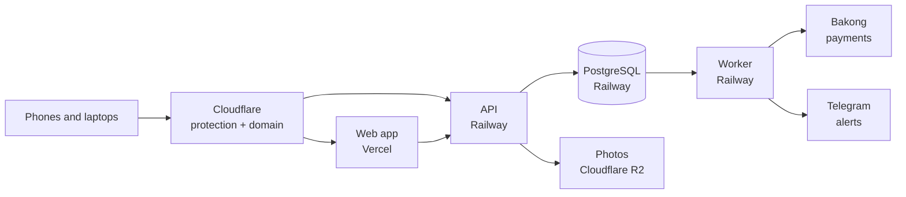

# Khmio Handbook — start here

As of 2026-10-06 · for the owner, written for someone starting from zero: which document answers what, the whole journey from step 0 to a running business, how to work with Claude every day, what to do when something breaks, and how the system stays easy to maintain and grow

This handbook does not repeat the plans; it points to them. When this page and another document disagree, the other document wins (`docs/blueprint.md` above all), and this page gets fixed.

## 1. The map: which document answers what

| Question | Document |
| --- | --- |
| What are we building, why, and in what order? | `docs/blueprint.md` — the main plan |
| What rules must Claude follow in every session? | `CLAUDE.md` — read automatically by Claude |
| Where is the project right now? | `docs/blueprint.md` → "Where we are now" (updated after every step) |
| How do I put it online, click by click? | `docs/go-live.md` |
| Brand, website, social media, the second product — in what order? | `docs/platform-launch-plan.md` |
| How do several products share one login later? | `docs/platform-roadmap.md` |
| What do Khmio's name, logo, Mio, colours and fonts look like everywhere? | `design/brand-guide.md` |
| How must every app screen look and behave? | `design/design-standard.md` |
| What does each screen contain? | `design/screens.md` |
| How do I test the screens with real sellers? | `design/seller-test.md` |

**Golden rule:** when a decision changes, change the document first, then the code. A decision that lives only in a chat is lost.

## 2. Words you will meet

| Word | Meaning in plain words |
| --- | --- |
| Web app (frontend) | The pages people see: the buyer's shop, the seller's dashboard, the admin. Folder `apps/web` |
| API (backend) | The server that checks every request and talks to the database. Folder `apps/api` |
| Worker | A program that runs jobs in the background: payment checks, Telegram messages, backups. Folder `apps/worker` |
| Database | Where shops, products and orders are kept (PostgreSQL) |
| Migration | A small file that changes the database's shape. Never edit an old one; always add a new one |
| Mockup | A screen with sample data, used to agree on the design before real code |
| Token (colour) | A named colour such as `brand` or `danger`. Screens use names, never raw colour codes |
| Branch | A separate copy of the code for one task, so `main` stays safe |
| Commit | A saved checkpoint of changes, with a message saying what changed |
| Push / pull request / merge | Send commits to GitHub / ask to add them to `main` / add them |
| CI | GitHub runs lint, typecheck, tests and build on every push, automatically |
| Deploy | Put a new version online (Vercel for the web app, Railway for API, worker and database) |
| `.env` | The file of secret settings (passwords, tokens). Never shared, never committed, never pasted into chat |
| RLS (row-level security) | The database itself stops one shop from reading another shop's data |
| KHQR / Bakong | Cambodia's national QR payment and the National Bank system that confirms it |
| Rollback | Go back to the previous working version online |
| Backup / restore | A nightly copy of the database / putting that copy back |

## 3. The whole journey, step 0 to the end

Status as of 2026-10-06. The live status is always in `docs/blueprint.md` "Where we are now".

| Phase | Goal | Details in | Status |
| --- | --- | --- | --- |
| 0. Set up the PC | Tools installed, project runs locally | blueprint "Build guide" Parts 1–3 | Done |
| 1. Design every screen | Mockups approved | `design/screens.md`, `/mockup` pages | Done |
| 2. Build Release 1 | Shops, products, checkout, orders, Telegram, admin | blueprint "Roadmap" steps 1–7 | Done, except step 5 KHQR (waits for a Bakong token and gate G3) |
| 3. Brand | Name, domain, mascot, icon, accounts reserved | `docs/platform-launch-plan.md` Stage 1, `design/brand-guide.md` | Decided: Khmio, Mio, icon C. Open: reserve names, trademark search, designer's final artwork |
| 4. Go live | The app online on `khmio.com` | `docs/go-live.md`, blueprint step 8 | Code ready; buying hosting and the domain is next |
| 5. Beta | 5–10 real sellers for two weeks; social media starts | blueprint step 9, launch plan Stage 2 | Next after go-live |
| 6. Platform website | Home, product, pricing pages; waitlist | launch plan Stage 3 | Mockups after the beta starts |
| 7. Getting paid | Subscriptions by KHQR, trust, public launch | blueprint Release 2 (steps 10–13), launch plan Stage 4 | Later |
| 8. Run the platform | Daily, weekly, monthly routine | blueprint "Running the platform after launch" | From go-live on |
| 9. Grow | Bigger-shop features; second product (Class or Rent) | blueprint Release 3, launch plan Stages 5–6, `docs/platform-roadmap.md` | After the public launch |
| 10. Scale | More shops without slowing down | Section 8 below, blueprint "Growth path" | When the numbers say so |

**One phase at a time.** Do not start a phase until the one before it meets its "Done when" check in the linked document. The only thing that runs alongside everything else is social media, from phase 5 on.

## 4. One working day

The full loop is in blueprint "Build guide" Part 6. In short:

1. **Start:** open the project in VS Code, open the terminal (Ctrl + backtick), make a branch for today's task: `git switch -c feat/<short-name>`, then type `claude`.
2. **Ask for a plan, not code:** "Read CLAUDE.md and <the document section>. Propose a plan; don't write code yet."
3. **Read the plan.** Ask about anything unclear. Say "go ahead" only when it matches what you want.
4. **Check the result yourself:** on your PC and on your phone, in Khmer and English.
5. **Review the change** in VS Code Source Control (Ctrl+Shift+G). Ask "explain this change" for anything you don't understand — always for payments, login, database migrations.
6. **Save:** "Run lint, typecheck and tests, then commit." Push and merge when it's good.
7. **Finish:** `/clear` before the next task.

**One task = one branch = one day or less.** Small tasks are where Claude makes the fewest mistakes.

## 5. How to ask Claude — copy these

Replace the parts in `<angle brackets>`.

**A new screen or feature**
```
Read CLAUDE.md and <docs/blueprint.md section / design/screens.md screen>.
Goal: <one sentence>.
Propose a plan and the files you will change. Don't write code yet.
```

**Something is broken** (the most useful template — fill in every line you can)
```
Problem: <one sentence: what is wrong>
Where: <page link, e.g. http://localhost:3000/km/mockup/checkout, or the command>
What I did: <steps, 1, 2, 3>
What I expected: <...>
What happened instead: <...>
Error text: <paste the FULL error from the terminal or browser console>
Screenshot: @design/feedback/<file>.png
Since when: <after which change or commit, if you know>
Find the cause first and explain it. Then propose the fix; don't change code yet.
```

**Explain something**
```
Explain <file / this error / this diff> in simple words. What does it do, and what could go wrong?
```

**Before merging something important**
```
Review the changes on this branch line by line for bugs and security problems,
especially payments, login, row-level security and migrations. List the risks.
```

**A brand or marketing item**
```
Read design/brand-guide.md. Make <a TikTok post idea / a Facebook post text in Khmer and English / a poster layout> about <topic>.
```

**Keep the documents up to date**
```
We decided <decision>. Update the right document (see docs/handbook.md section 1) and tell me what changed.
```

## 6. When something goes wrong

### Step by step

1. **Stop and don't delete anything.** Most problems are small; deleting files or databases makes them big.
2. **Collect the facts.** Where to look:

| Where the problem shows | Where the error text is |
| --- | --- |
| On your PC while developing | The terminal running `pnpm dev` (scroll up to the first red line) |
| A page looks broken or blank | Browser: press F12 → Console tab → copy the red lines |
| A command failed (`pnpm test`, `pnpm db:deploy`) | The terminal: copy from the command down to the end |
| Online: web app | Vercel → the project → Logs |
| Online: API, worker, database | Railway → the service → Logs |
| Online: any error | Sentry, and the admin alerts chat in Telegram |
| A seller complains | Their words, the shop name, the order number, a screenshot |

3. **Ask Claude** with the "Something is broken" template above. Ask for the **cause first**, then the fix.
4. **Fix on a branch**, run the checks, look at the change, then commit — the same loop as any task.
5. **Make it never come back:** ask Claude to add a test that would have caught it.
6. **If it was a rule Claude forgot,** add the rule to `CLAUDE.md`.

### Problems you will probably meet on your PC

More in blueprint "Build guide" Part 8.

| What you see | Usual cause | What to do |
| --- | --- | --- |
| "Port 3000 is already in use" | An old `pnpm dev` is still running | Close the other terminal, or restart VS Code |
| `pnpm install` fails | Network, or a wrong Node version | Check `node -v` shows v22; run it again; paste the error to Claude |
| "Can't reach database server" | PostgreSQL service stopped | Windows: Services → start "postgresql-x64-16" |
| A migration fails | The database is behind or changed by hand | Paste the error to Claude; never edit an old migration |
| Typecheck or lint errors after a change | Code doesn't match the rules | Ask Claude: "run typecheck and lint and fix the errors" |
| Khmer text cut off at the top or bottom | Line height too small | Use 1.5 or more (design standard §3) |
| Works on the PC, not on the phone | Phone not on the same Wi-Fi, or a width problem | Open `http://<PC-IP>:3000`; check at 360 px |
| Claude went the wrong way | Prompt too broad | Press Esc; `git checkout .` drops unsaved changes; `/clear`; ask again with a smaller task |

### Problems online, after go-live

Follow blueprint "Running the platform after launch" → "When something breaks". The first move for a bad release is always the same: **roll back first, fix calmly afterwards.**

### Safety rules, always

- Never paste passwords, tokens or `.env` values into chat, screenshots, documents or social media. If one leaks, replace it at once (the service's dashboard → new key) and update Railway/Vercel.
- Never fix data by editing the database by hand. Use the admin panel; if it can't do the job, that becomes a task.
- Never mark a payment as paid by hand. Only Bakong's answer can confirm a payment.
- Never show a buyer's phone number or address in a screenshot you share.

## 7. How the system is built, in plain words



| Folder | What lives there |
| --- | --- |
| `apps/web` | All screens (buyer, seller, admin, mockups), translations in `messages/` |
| `apps/api` | The server: every rule is checked here, never only on the screen |
| `apps/worker` | Background jobs: payment checks, Telegram, backups |
| `packages/shared` | Rules used by everyone: form checks (Zod), money, phone numbers, plans |
| `packages/db` | Database shape and migrations, row-level security |
| `packages/payments` | The only place that talks to payment providers |
| `packages/ui` | Shared buttons, inputs, cards, Mio, colours |
| `docs/`, `design/` | The plans and the design rules |
| `infra/` | Database setup, Docker files, rehearsal and backup scripts |
| `tests/e2e` | End-to-end checks that run against the built API |

### Why it stays easy to maintain: one rule, one place

| Rule | The one place | So that |
| --- | --- | --- |
| Plan prices and limits | `packages/shared/src/plans.ts` | Pricing page, dashboard and API never disagree |
| Form and input checks | Zod schemas in `packages/shared` | The browser and the server check the same way |
| Colours | Tokens in `packages/ui/src/globals.css` | One change recolours the whole app, light and dark |
| Words on screen | `apps/web/messages/km.json` and `en.json` | Khmer and English stay complete and consistent |
| Payment providers | `packages/payments` | Adding ABA or another bank never touches checkout |
| Mio | `Mio` in `packages/ui` | The final artwork replaces one file |
| One shop can't see another | Row-level security in the database | Even a code mistake can't leak another shop's data |

### Rules that keep it maintainable

- Small tasks, one branch each, every change reviewed before it's committed.
- Every change keeps lint, typecheck and tests green; a fixed bug gets a test.
- No copy-paste of rules: if two screens need the same rule, it moves into `packages/shared`.
- Update dependencies monthly on a branch (blueprint routine), never on the day of a release.
- Add a new database column first and remove an old one only in a later release, so a rollback never breaks.
- Keep `CLAUDE.md` and the documents current: they are the project's memory, for you and for Claude.

## 8. Growing: more shops, more products

The system is a "modular monolith": one web app, one API, one worker, one database, cleanly split inside. That is the cheapest and simplest shape for a small team, and each part can be split out later if it ever needs to be.

| Size | What is needed | Where it's planned |
| --- | --- | --- |
| 0–100 shops | Today's setup: Vercel + Railway, one API, one worker | blueprint "Deployment", "Budget" |
| 100–1,000 shops | Add one thing at a time, only when its sign appears: connection pooling, caching shop pages at Cloudflare, a second API copy, Telegram webhooks | blueprint "Growth path to 1,000+ shops" |
| More products (Class, Rent) | Same login, entitlements, separate data per product, inside this repo | `docs/platform-roadmap.md` Phase 1 |
| Separate services | Only when traffic or a team forces it | `docs/platform-roadmap.md` Phase 2 |
| Partners (delivery companies, accounting tools) | Versioned partner API with keys and webhooks | blueprint "Growth path" |

**Scale when the numbers say so, not before.** The numbers to watch are in blueprint "Numbers to watch"; the cost per shop is in "Budget".

## 9. Your routine after go-live

The full routine is in blueprint "Running the platform after launch". In one line each:

- **Every day (15–30 min):** admin alerts chat, seller support chat, new shops stuck on setup, one social post.
- **Every week (2–4 h):** fix the top three seller complaints, check the backup ran, read the numbers, release the week's changes, plan next week's posts.
- **Every month (half a day):** test a backup restore, update dependencies, check hosting costs.
- **Every quarter (a day):** security review, renewals (domain, tokens), prices and plans.

## 10. Keeping the documents alive

| When this happens | Update |
| --- | --- |
| A roadmap step is finished | blueprint "Where we are now" |
| A new rule for coding | `CLAUDE.md` |
| A screen changes | `design/screens.md` first, then the mockup |
| A look or behaviour rule changes | `design/design-standard.md` |
| Brand, logo, Mio, colours, fonts, social media | `design/brand-guide.md` |
| A go-live step changes | `docs/go-live.md` |
| The order of growth changes | `docs/platform-launch-plan.md` |
