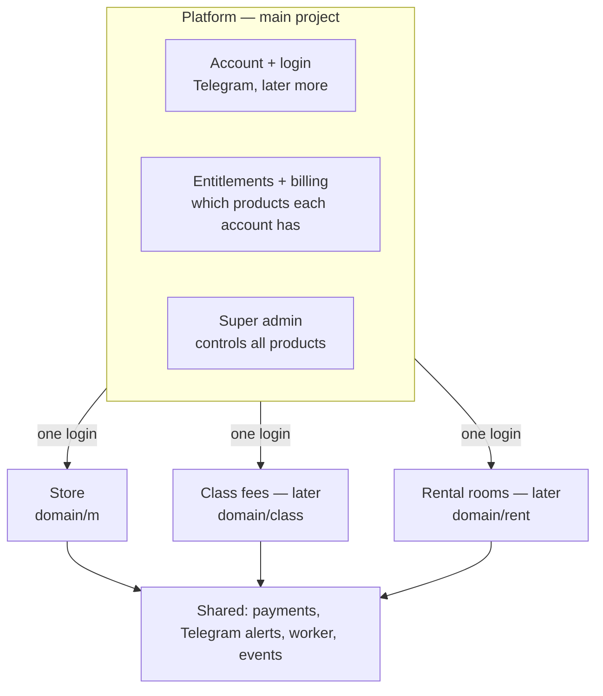

# Platform Roadmap — from one store to many products

As of 2026-10-06 · how Khmer Micro-Store can grow into a main platform that controls several sub-projects with one login, without paying the cost of microservices before it is needed

## Why this document exists

The goal for later: one account and one login (like Netflix or Google) that opens several products — the store today, perhaps booking, POS or accounting later — with the main platform deciding who may use which product and on which plan.

This is **not** a decision to build microservices. Microservices solve a team-size and scaling problem (many teams deploying separately); they do not make features easier to build. For a small team they add hosting cost, slower debugging, and data spread across services. The plan below gets shared login and central control first, and splits into services only when a clear trigger says so.

`docs/blueprint.md` stays the main plan. This document only covers growth beyond the store, after go-live.

## What we want, and what it really needs

| Goal | Technical name | Needs microservices? |
| --- | --- | --- |
| One login for all our apps | Shared identity / single sign-on (SSO) | No |
| Main platform controls which products a user can open | Platform + entitlements | No |
| Each product deployed and scaled on its own | Microservices | Yes |
| Other people's apps use our login | OpenID Connect (OIDC) provider | Only the identity part |

## What the store already has that helps

| Already in the code | Why it matters later |
| --- | --- |
| `Merchant` + `MerchantIdentity` (packages/db) | The account is separate from the login method (Telegram). One account can later have many login methods and open many products. |
| `Session` table + `kms_session` HttpOnly cookie (apps/api/src/auth) | Server-side sessions are easy to share across products on the same domain, and easy to revoke everywhere at once. |
| `OutboxEvent` + pg-boss worker | An event system already exists. Products can later talk by events ("order paid", "account created") instead of calling each other. |
| `packages/payments`, `packages/shared`, `packages/db` | Reusable building blocks for every future product. |
| `Subscription` + `packages/shared/plans.ts` | The start of "what each customer pays for" — the base for entitlements. |
| Modular monolith (blueprint "System architecture") | Each API module can be split out later if it needs to. |

## Target shape

## Phases

Each phase starts only when its trigger happens. Skipping ahead adds cost with no benefit.

### Phase 0 — During go-live (now)

**Trigger:** none — these are free decisions that keep the door open.

| Do | Why |
| --- | --- |
| Use the platform brand's domain — decided: **Khmio**, `khmio.com` — and put future products under paths on it (`khmio.com/class`, `khmio.com/rent`), not on new subdomains | One origin keeps one host-only login cookie for every product. Subdomains for other products are ruled out by blueprint "Running other projects": the whole domain is one site to the browser, which weakens the cookie's protection. |
| Keep login on `Merchant`, never on `Store` | One account → many stores → many products. Already true today. |
| Keep writing important events to `OutboxEvent` with ids only | Future products listen to these instead of reading store tables. |
| Do not add product-specific fields to `Merchant` | The account stays product-neutral. |

**Done when:** go-live finished with the domain plan written in `docs/go-live.md`.

### Phase 1 — Second product inside this monorepo

**Trigger:** a real second product is decided (with real users who want it).

1. **New app, same repo:** `apps/<product>-web` for the screens, a new module folder in `apps/api` (for example `apps/api/src/booking/`). Same rules as the store: Zod on every input, `withContext()` and RLS, text in `messages/*.json`, design-first mockups.
2. **Shared login:** every product is served on the same origin under its own path — in the same Next.js app, or as a separate app joined by path with Vercel multi-zones — so the existing host-only session cookie already covers all of them. Never widen the cookie with `Domain=`. The `Session` table stays the single source of truth. A product on a **different domain** waits for the Phase 2 identity service.
3. **Entitlements table** in the platform: which account may use which product, on which plan. Each product's API checks it with a guard — enforced in the API, not just the UI, same rule as `plans.ts`.
4. **Product plans** live in `packages/shared` next to `plans.ts`, one file per product, so the admin can see and change everything in one place.
5. **Separate data per product:** each product gets its own PostgreSQL schema (`store.*`, `booking.*`) or a clear table prefix. Products never read each other's tables. They share data only through events or a small internal API.
6. **Platform screens:** an "apps" switcher for the account, and a super-admin view of all products and entitlements.

**Rules that make Phase 2 possible later:**
- Product A never joins or queries product B's tables.
- Cross-product effects go through `OutboxEvent` (or a later events table), never direct calls inside a transaction.
- Payments for every product still go only through `packages/payments`.
- Every new table with `store_id` (or a new tenant id) enables RLS in its migration.

**Done when:** one login opens both products, the admin can grant/remove a product per account, and no product touches another product's tables.

### Phase 2 — Split one product into its own service

**Trigger** — at least one of these, measured, not guessed:
- One product's traffic or jobs slow down the others.
- A separate team works on a product and blocks or is blocked by others.
- A product must be deployed without any risk to payments.

Steps:
1. **Identity service:** move account, login and sessions out into their own service that acts as an **OpenID Connect provider**. Apps redirect there to log in and receive a short-lived signed token (JWT) plus a refresh session. The Telegram login and admin TOTP rules from `CLAUDE.md` move with it unchanged — never log either.
2. **Move the product:** its API module plus its own database schema become a separate service. Because of the Phase 1 rules, this is mostly moving code, not untangling data.
3. **Events across services:** the outbox keeps publishing; the new service has its own worker and consumes the events it needs. Each event is handled idempotently (safe to receive twice).
4. **Gateway:** Cloudflare (already in front) routes `api.<domain>/<product>/…` to the right service. Login now goes through the identity service's tokens, so a product may also move to its own domain.
5. **Observability:** one Sentry project per service, a request id passed through every call.

**Done when:** the split service deploys alone, logs in through the identity service, and the store and payments keep running if it is down.

### Phase 3 — Other people's apps use our login

**Trigger:** outside developers or partners ask for it.

- Register client apps in the identity service (client id, allowed redirect URLs, scopes).
- Consent screen in Khmer and English: "App X wants to see your name and shop".
- Limit scopes: an outside app never receives payment keys, phone numbers or other stores' data by default.

**Done when:** an outside app logs a user in with "Login with <platform>" and only receives the scopes the user approved.

## Cost and risk at each phase

| Phase | Extra hosting | Main risk |
| --- | --- | --- |
| 0 | None | None |
| 1 | Small: one more Next.js app on Vercel | Products reading each other's tables — blocked by the rules above |
| 2 | One more Railway service + worker per split product | Data out of sync between services; harder debugging |
| 3 | Small | Leaking user data to outside apps — limited by scopes and consent |

Check `docs/blueprint.md` "Budget" before each phase.

## Mistakes to avoid

| Mistake | Result |
| --- | --- |
| Splitting into microservices before there are two products | Several times the cost and work, no gain |
| Each product with its own login | Users annoyed; the platform cannot control products |
| Products sharing database tables | They can never be separated later |
| Calling payment providers outside `packages/payments` | Breaks the payment safety rules |
| Putting the account on `Store` instead of `Merchant` | One person cannot use several products or stores |

## Second product shortlist

Desk research only (2026-10-06) — no interviews yet. Validate before building, the same way as `design/seller-test.md`.

**What the market data says:**
- 70% of microenterprises and 83% of SMEs already take payments by mobile banking such as KHQR; microenterprises mostly run on a smartphone only ([ADB Brief 370](https://www.adb.org/sites/default/files/publication/1104476/adb-brief-370-digital-adoption-cambodian-msmes.pdf)).
- Only 12% of SMEs use accounting software; 74% use paper or no records ([CamFinTech](https://www.camfintech.com/insights/sme-digital-readiness)).
- About 4.5 million merchants accept Bakong/KHQR; KHQR was 47.2% of transactions in 2025 ([Kapronasia](https://kapronasia.com/insight/blogs/payments-research/asia-payments-research/cambodia-s-bakong-goes-from-strength-to-strength)).
- Facebook, TikTok and Telegram are where selling happens ([VietnamPlus](https://en.vietnamplus.vn/social-media-platforms-take-over-e-commerce-in-cambodia-post266032.vnp)).

Our strengths — KHQR, Telegram alerts, Khmer first, mobile first — match how micro-businesses already work.

| # | Product | Who pays monthly | Reuses | Competition found |
| --- | --- | --- | --- | --- |
| 1 | **Class fee manager** for extra-class (rean kour) teachers and small language/IT schools | Teachers, small schools | KHQR, Telegram, worker, RLS per tenant | FindTutor is a tutor marketplace; school ERPs are large one-time licences. Little for small teachers. |
| 2 | **Rental room manager** for rooms, dorms, small apartments (rent + electricity/water meter) | Landlords | Same as #1 | Nothing local found; KhmerHome only lists properties. |
| 3 | **Booking and appointments** for salons, spas, barbers, nail shops, small clinics | Shop owners | Catalog as services, KHQR deposits, Telegram reminders | Global apps (Fresha, Salonist) without Khmer or KHQR. |
| 4 | **Debt and sales book** (who owes me, today's sales) | Micro merchants | `Customer`, phone rules, Telegram | MAQSU, BanhJi aim at larger SMEs. Best as a cheap add-on inside the store. |
| 5 | QR menu and table ordering | Restaurants | Catalog, cart, KHQR | Nham24 already offers a QR menu — hard to win. |

**Recommendation:** #1 and #2 share one **monthly billing engine** — customer list → automatic monthly bill → KHQR link sent by Telegram → paid/unpaid tracked by the worker. Build the engine once and it powers both, and later memberships (gyms, clubs). Extra classes cost families around $20 per subject per month and up to 500,000 riel in total ([Cambodianess](https://cambodianess.com/article/cost-of-extra-classes-hits-students-parents)), and landlords chase rent and utilities monthly, so the pain is real and recurring. #3 is the next choice; #4 is an add-on to bring sellers into the store.

**Watch:** CamInvoice e-invoicing launched May 2025; B2B is voluntary now with a mandatory schedule planned ([VATupdate](https://www.vatupdate.com/2025/05/21/cambodias-new-era-of-e-invoicing-inside-the-caminvoice-mandate/)). When it becomes mandatory, "issue a CamInvoice" can be a paid feature.

**Before building:** finish go-live; interview 5 extra-class teachers and 5 landlords (how they collect today, what goes wrong, would they pay about $3–5/month — a guess to test against "Budget" in `docs/blueprint.md`); then mockups first, per `CLAUDE.md`.

## Open questions

- Which second product comes first? Shortlist above — class fee manager or rental room manager is the current favourite, pending interviews. This decides the first entitlements and events.
- One bill for all products, or a separate subscription per product?
- Do buyers (`Customer`) also get a platform account later, or only merchants?
- Final main domain name.
